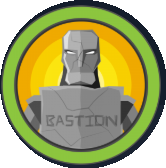

---

# HTB: Bastion (Windows)

### 📊 Difficulty: **Easy**
### 📁 Category: Privilege Escalation

---

🔎 Bastion is an Easy level WIndows box which contains a VHD ( Virtual Hard Disk ) image from which credentials can be extracted. After logging in,
the software MRemoteNG is found to be installed which stores passwords insecurely, and from which credentials can be extracted.

---

> 💡 **Skills Required**
- Basic Windows Enumeration

> 🛠️ **Skills Learned**
- Exploitation mRemoteNG
