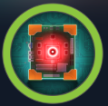

# BoardLight - Linux

## Difficulty - Easy

---

> BoardLight is an easy difficulty Linux machine that features a `Dolibarr` instance vulnerable to
> [CVE-2023-30253](https://nvd.nist.gov/vuln/detail/CVE-2023-30253). This vulnerability is leveraged
> to gain access as `www-data`. After enumerating and dumping the web configuration file contents,
> plaintext credentials lead to `SSH` access to the machine. Enumerating the system, a `SUID` binary
> related to `enlightenment` is identified which is vulnerable to privilege escalation via [CVE-2022-37706]
> (https://nvd.nist.gov/vuln/detail/CVE-2022-37706) and can be abused to leverage a root shell.

---

> Skill required:

- Web enumeration
- Basic knowledge of Linux system (command line, enumeration, tools, etc)

> Skill learned:

- improve Linux skills (enlightenment graphical shell)
- exploitation Dolibarr and SUID file
- improve web enumeration

